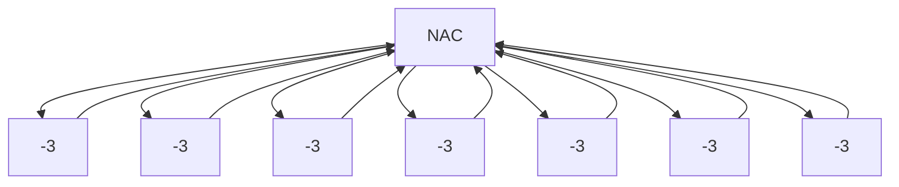

Large

{} Top
↓
{a}, {b} {c}
↓
{ab}, {bc} {ca}
↓
{abc} Bottom

Small

distributive なら mop = mfp

iterative solution

input (フレームワーク)
1. data-flow graph
2. direction
3. data-flow value の型
4. meet operator
5. 転送関数
6. 初期値

output
- 各 BB の入り口・出口における data-flow value

性質 :
1. 収束したらそれがデータフロー方程式の解
2. フレームワークが単調なら，得られる解は MFP (最大不動点)
3. semilattice が単調で有限の高さなら，収束する

解の意味
- 理想解 : feasible なパスのみを解析した結果


# 9.4 定数伝播・畳み込み
## (復習) 定数伝播とは
```c
int foo(void) {
    int n = 10;
    n *= 2;
    return n;
}
```

```c
int foo(void) {
    return 20;
}
```

## データフローフレームワークの構築
今まで扱った DFA との違い :
- Data-flow value の定義域が (ほぼ) 無限．
- Non-distributive.
    - distributive : $f(x \land y) = f(x) \land f(y)$

次の穴を埋めていく :
| 項目               |定義|
|:------------------:|:--:|
|解析の向き          | 前向き |
|Data-flow value の型| ?  |
|Data-flow graph     | ?  |
|Meet 演算子         | ?  |
|Transfer function   | ?  |
|初期値              | ?  |

## Data-flow value の定義
次の semi-lattice を使う．



- Undef : 定義が (まだ) 1つも到達していない．
- 数値 : 1種類の定義しか到達していない．
- NAC : 複数の定義が到達している．

## 転送関数
問題を単純化するため，基本ブロックは1つの文しか持たないとする．

## データフロー値
- `Map<変数名, Value>`

## 初期値
全部 undef

↑ 実行前は全部 undef なので (グローバル変数の初期化は？)

## 転送関数
$f_s$ : 文 $s$ の転送関数
$m' = f_s(m)$

1. $s$ が代入でないなら，何もしない
2. $x$ への代入なら，$x$ のみ更新．

更新の一例 (`x = y + z`) :

// 教科書
| y\z   |Undef|定数 Z  |NAC |
|:-----:|:---:|:------:|:--:|
|Undef  |Undef|Undef   |NAC |
|定数 Y |Undef|定数 Y+Z|NAC |
|NAC    |NAC  |NAC     |NAC |

Q. この関数は単調か？
Q. この関数は distributive か？

### 9.4.4 単調性 $x < y → f(x) < f(y)$
ある変数のみに着目して，それが単調なら良い．

### 9.4.5 非分配性 (Nondistributivity)
distributive : $f(a ^ b) = f(a) ^ f(b)$

a : { x -> 2, y -> 3}
b : { x -> 3, y -> 2}
a ^ b : { x -> NOC, y -> NOC }
f(a ^ b) : {x -> NOC, y -> NOC, z -> NOC }
f(a) : {x -> 2, y -> 3, z -> 5}
f(b) : {x -> 3, y -> 2, z -> 5}
f(a) ^ f(b) : { x -> NOC, y -> NOC, z -> 5 }

## 9.4.6 結果の解釈
Undef の用途 :

本は Undef が異なる 2 つの異なる意味合いで使われているとしているが，これは考察が甘い．
1. エントリーノードの初期化
    - 未初期化の意．
2. イテレーション前の確変スの初期化 (?)
    - 情報不足で到達する定義が一つもない

これらは同じことを言っているでしょ．
「本質 : 到達する定義が一つもない．」

### meet operator
Undef なパスと constant なパスを meet すると constant になるのマズくね？
ま，どうせ未定義なんで constant でうめていいっしょ @ 多くの言語

## 9.4.7 演習
1. 未初期化変数を検出するフレームワークを作れ
2. 制約を集める．
    - a) meet operator を定義せよ
        - 変数名に順序を付けて，正規化かな．
    - b) データフロー値のデータ構造を定義せよ
    - c) 転送関数を定義せよ
    - d) これは monotone か？ distributive か？

```rust
struct Variable(String);

enum Value {
    Undef,
    SumOf(Vec<Variable>),
}

struct DataFlowValue(Map<Variable, Value>);
impl DataFlowValue {
    fn meet(&self, other: &Self) -> Self {

    }
}
```
