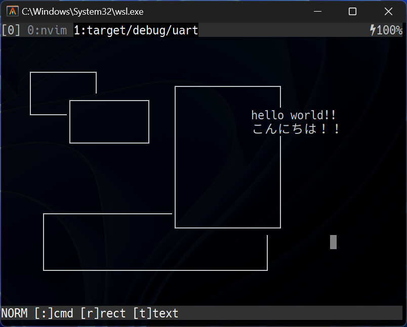

# ターミナルでも図を書きたい！！
最近作り始めたアプリの話．

図形描画ソフトは色々あるが…
- WISYWIG 図形描画ソフト (パワポ, [draw.io](https://app.diagrams.net), [ascii-flow](https://asciiflow.com/legacy/), ...)
    - 問題点 : 操作がキーボードで完結しない．
- その他の図形描画ソフト (gnuplot, mermaid, ...)
    - 問題点 : 記法おぼえられない (WISYWIG じゃない)．

→ **WISYWIG で操作がキーボードで完結するソフトが欲しい．**

## 作っているもの
::: {.flex55}
:::::: {.flex-left}
[uart](https://github.com/sinotca529/uart) : ターミナルで動く図形描画ソフト

現状できること :
- 四角形の作成
- テキストの挿入

これからやりたいこと :
- 図形の種類を増やす
- 線のスタイル変更
- 保存・読み込み
- その他色々

原理的に厳しいこと :
- 斜めの線・曲線の描画
    - [sixel](https://en.wikipedia.org/wiki/Sixel) 使えば良いのだが， tmux が sixel 非対応なのでモチベ低し．

既知のバグ :
- カーソルを画面外に動かすと落ちる．
    - スクロール機能を開発中．
::::::
:::::: {.flex-right}
::::::::: {.sticky}

:::::::::
::::::
:::
---

みんなのコントリビュート待ってるぜ！！ 
(ドキュメントないし設計が頻繁に変わるけど…)
