# Mark-Sweep Garbage Collection (GC Sec.4)
Mark-Sweep の使用メモリ量・時間オーバヘッドを改善する手法を見ていく。

## 4.1 Comparisons with reference counting
改善の前に、Mark-Sweep の立ち位置を確認しておく。<br>
ここでは、Reference counting と比較する。

|                                              |       Mark-sweep       |                Reference Count                 |
| -------------------------------------------: | :--------------------: | :--------------------------------------------: |
|                        Cyclic data structure | 特殊な処理なしで扱える | 特殊な処理が必要<br>限られた条件下でのみ扱える |
|                          collectのタイミング |   メモリが不足したら   |          メモリが不要になったら直ちに          |
|                   プログラムへの長い割り込み |          あり          |                      なし                      |
|                       update時のオーバヘッド |          なし          |                      あり                      |
|                                         実装 |       比較的複雑       |                   比較的単純                   |
|                                   扱いやすさ |        比較的楽        |    参照カウントの不変条件を壊さぬよう要注意    |
|                メモリオーバヘッド (実装依存) |     1 \[bit/node\]     |             $\geq$ 1 \[bit/node\]              |
| ヒープの大半を使うプログラムでのオーバヘッド |      比較的大きい      |                  比較的小さい                  |

## 以降の流れ
1. Mark の改善
   - 再帰をやめてスタックを使う
   - スタックが深くならないよう工夫する
   - スタックオーバーフロー対策をする
   - スタックの利用もやめて、メモリ使用量を定数にする
2. Mark-bit を置く位置の改善
3. Sweep の改善
   - Lazy に sweep する


<!--
1. Mark が再帰的である問題について
   - Stack overflow の発生確率を下げる方法
   - Stack overflow から回復する方法
   - 決まったメモリ使用量でグラフに mark する方法
2.  Sweep について
3.  仮想メモリの扱いを改善について -->

## (4.2) Mark の改善 | 再帰をやめてスタックを使う
2章での mark は次のようなものであった。<br>
関数呼び出しは時間がかかる上、スタックフレームの確保が必要。<br>
よって、この手法は時間・空間ともに効率が悪い。

```txt {caption="2章での mark"}
mark(N) =
    if mark_bit(N) == unmarked
        mark_bit(N) = marked
        for M in Children(N)
            mark(*M)
```

そこで、スタック (!= スタック領域) を使った探索を使う。
```txt
mark_heap() =
    mark_stack = empty
    for R in Roots
        mark_bit(R) = marked
        push(R,mark_stack)
        mark()

mark() =
    while mark_stack != empty
        N = pop(mark_stack)
        for M in Children(N)
            if mark_bit(*M) == unmarked
                mark_bit(*M) = marked
                if not atom(*M)
                    push(*M, mark_stack)
```

## (4.2) Mark の改善 | スタックの深さを減らす工夫
スタックを使う場合、スタックオーバーフローの対策が必要になる。<br>
まずは、スタックの深さを減らす工夫を見る。

### 工夫1 : 訪問の対象
先程のアルゴリズムは、各ノードを訪問するものであった。<br>
これと各エッジを訪問するアルゴリズムを比較する。

各ノードを訪問する場合、スタックの最大の深さは、最大でノードの数Nになる。<br>
一方、各エッジを方もする場合、スタックの最大の深さは、最大でエッジの数Eになる。

木においては $E = N - 1$ となるため、エッジを訪問するほうが有利である。<br>
しかし、一般のグラフでは $E > N$ となることが多いため、ノードを訪問するほうが有利である。<br>

::: {.flex}
:::::: {.flex-left}
```txt {caption=全ノードを訪問}
mark_heap() =
    mark_stack = empty
    for R in Roots
        mark_bit(R) = marked
        push(R,mark_stack)
        mark()

mark() =
    while mark_stack != empty
        N = pop(mark_stack)
        for M in Children(N)
            if mark_bit(*M) == unmarked
                mark_bit(*M) = marked
                if not atom(*M)
                    push(*M, mark_stack)
```
::::::
:::::: {.flex-right}
```txt {caption=全エッジを訪問}
mark_heap() =
    mark_stack = empty
    for R in Roots
        push(R,mark_stack)
        mark()

mark() =
    while mark_stack != empty
        N = pop(mark_stack)
        if mark_bit(N) == unmarked
            mark_bit(N) = marked
            for M in Children(N)
                push(*M, mark_stack)
```
::::::
:::

### 工夫2 : `push` 後に即 `pop` するのは無駄なのでやめる
今のアルゴリズムで、`Children(N)` の最後の非アトミックな要素は `push` された後 即 `pop` される。

```txt {caption=全ノードを訪問}
mark() =
    while mark_stack != empty
        N = pop(mark_stack)
        for M in Children(N)
            if mark_bit(*M) == unmarked
                mark_bit(*M) = marked
                if not atom(*M)
                    push(*M, mark_stack)
```

最後の子を `push` せずに処理することで、この無駄を回避できる。<br>
これは、スタックの最大の深さの削減につながる。

```txt {caption=最後の子をpushしない}
mark() =
    while mark_stack != empty
        N = pop(mark_stack)
        LABEL:
        children = Children(N)
        if children.len() == 0
            continue

        for M in children[:-1]
            if mark_bit(*M) == unmarked
                mark_bit(*M) = marked
                if not atom(*M)
                    push(*M, mark_stack)

        M = children[-1]
        if mark_bit(*M) == unmarked
            mark_bit(*M) = marked
            if not atom(*M)
                N = *M
                goto LABEL
```

### 工夫3 : 訪問順の工夫
リスト `Chidren(N)` の子の訪問順を工夫する。<br>
子ノードのうち、非アトミックな子を持つものを後回しにしたほうが、スタックは浅くなる。

consリストについては、`cdr` の方が `car` より2倍ほど非アトミックな子を持ちやすいことが経験的に知られている。<br>
そのため、`cdr`をスタックに積み、`car` を積まずに処理する (工夫2) ことで、スタックを浅くできる可能性がある。

### 工夫4 : 大量の子を持つノードの対処
処理中のノードが大量の子を保つ場合、それを全て `push` するとスタックが深くなる。<br>
この問題に対処した手法に、Boehm-Demers-Weiser mark-sweeping がある。<br>
この手法は、ノードの代わりに (ノードが始まるアドレス, 終わるアドレス) をスタックに積む。<br>
そして、各イテレーションでは、スタックトップにあるノードの頭128-wordのみを処理する。<br>
(ノードの残りの部分はスタックに戻す。)

## (4.2) Mark の改善 | スタックオーバーフロー時の対処
スタックを浅く保つ工夫をしても、オーバーフローする確率は0にならない。<br>
そのため、オーバーフローしても上手く動く機構が必要。

### スタックオーバーフローの検知
オーバーフローを検知する方法として、次の2つがある。

|                        |                                    境界チェック                                    |                                                        Guard page                                                        |
| ---------------------: | :--------------------------------------------------------------------------------: | :----------------------------------------------------------------------------------------------------------------------: |
|                   手法 |                           `push`の度に境界チェックする。                           | スタックの終わりに書き込み禁止なページを置く。<br>オーバーフロー時には書き込み禁止なメモリへの書き込みで例外が発生する。 |
| オーバヘッドの発生頻度 | `push`ごと。<br>(子ノードの数を数えることで、頻度を各イテレーション毎に減らせる。) |                                          オーバーフロー時以外はオーバヘッド無し                                          |
|   オーバヘッドの大きさ |                          1回のチェックは低オーバヘッド。                           |                        例外処理をするため、1回のチェックは高オーバヘッド (境界チェックの数万倍)。                        |

### Knuth の方法
Knuth は、スタックの代わりにリングバッファを使うことでオーバーフローに対処した。<br>
リングバッファを使うと、オーバーフローが起きない代わりに、未処理のノードの上書きが起こりうる。<br>
そこで、バッファが空になったらヒープを走査して、マーク済みのノードのうち子ノードにマークの付いていないものを探す。

なお、常にヒープの底から走査する必要はない。<br>
前回までの処理でマークを付けたノードのアドレスの最小値から走査すれば良い。

### Boehm-Demers-Weiser の方法
BDW (と勝手に呼ぶ) の方法はスタックを使う。<br>
スタックが満杯になったら、そのことを覚えておく。<br>
以降、新たなエントリは単に捨てられる。<br>
その後、スタックが空になった際、
- もしもスタックが満杯になっていたなら、スタックのサイズを2倍にし、ヒープを走査
- 満杯になっていなかったなら、終了

### Kurokawa の方法
Kurokawa の方法はスタックを使う。<br>
スタックが満杯になったら、スタック上にある未マークの子が0または1個のノードを見つけて処理する。

子が0 : 抜去
子が1 : その子をマークし、そのノードを起点に、子を2個以上もつ子孫ノードが見つかるまで探索する。見つかったら、元々ノードがあったエントリをそのノードで上書きする。

この手法の問題は、スタック中に子が0or1なノードが見つからなかった場合機能しない点である。
経験的に、共有されるノードが少数であることが分かっている。
つまり、あるノードの子がマーク済みであることは少ない。

## (4.3) Mark の改善 | スタックを使わない手法
Mark の使用メモリ量が定数になるアルゴリズムを考えたい。<br>
そのためには、今までスタックが持っていた情報を各ノードに持たせる他ない。<br>
そこで、ノードが持つポインタ値を上書きする形で情報をもたせ、後に値を復元する方法を考える。

### Deutsch-Schorr-Waite のアルゴリズム (2分木の場合)
まずは、データ構造が2分木の場合を考える。<br>
ノードの探索は、①, ②, ③の順に進むものとする。



Deutsch-Schorr-Waite のアルゴリズムは、次のようにポインタ値の張り替えが起きる。
この挙動から、このアルゴリズムは pointer-reversal と呼ばれる。
::: {.flex}
:::::: {.flex-left}
::::::::: {.sticky}
1. (初期状態)
2. 左の要素を親への参照で上書きし、左の部分木へ
   - ①で親から自身への参照がなかったのはこのため
3. 左の子ノードから、自身に参照が貼られる
4. 左の部分木の探索を終え、右の部分木へ
   - 左の要素をもとに戻し、右の要素を親への参照で上書き
5. 右の部分木の探索を終え、親へ
    - 右の要素をもとに戻す
    - この直後、親は部分木の探索を終えるため、親から自分への参照が戻る
:::::::::
::::::

:::::: {.flex-right}

::::::
:::

これをコードにしたものを下に示す。<br>
このアルゴリズムの使用するメモリ (ローカル変数) のサイズは定数。<br>
なお、コード中の `flag_bit` は、左右どちらの部分木を探索中なのかを表すフラグ。
```txt {caption="DSWのアルゴリズム (2分木の場合)"}
mark(R) =
    prev = nil
    current = R
    while true
        -- follow left pointers
        while (current != nil) && (mark_bit(current) == unmarked)
            mark_bit(current) = marked
            if not atom(current)
                (left(current), prev, current) = (prev, current, left(current))

        -- retreat
        while (prev != nil) && (flag_bit(prev) == set)
            flag_bit(prev) = unset
            (right(prev), current, prev) = (current, prev, right(prev))

        if prev == nil
            return
        else
            -- switch to right subgraph
            flag_bit(prev) = set
            (left(prev), current, right(prev)) = (current, right(prev), left(prev))
```

### Deutsch-Schorr-Waite のアルゴリズム (一般の場合)
子ノードが2個とは限らない一般の場合を考える。<br>
基本方針は2分木と変わらず、ポインタを張り替えつつグラフを探索する。<br>
この際、2分木の場合と同様、現在どの部分木を探索中かを記憶する必要がある。<br>
そこで、各ノードには
- そのノードが持つ子ノードの数 $n$
- 現在どの部分木を探索中かを示すデータ ($\geq \log_2 n$-bit)
を持たせる。

### Pointer-reversal のコスト (メモリ使用量)
- 利点 : Mark のメモリ使用量が定数
- 欠点 : 各ノードに追加のフィールドが必要

`flag-bit` が必要になるのは、トレースが延期されるノードだけ。
Wegbreit は、`flag-bit` をノードに埋め込まずスタックで管理する手法を提案した。
この手法を使えば、使用メモリ量は実用上減少する。
しかし、代わりに、スタックオーバーフローのリスクがある。
スタックオーバーフローを避けるには、普通の pointer-reversal と同じメモリ使用量になる。

また pointer-reversal は、pointer stack をノード内に移動しただけ、つまりメモリ使用量の総量は減っていない、ということが知られている。
(この事実は program proving techniques の例題としてよく使用される。)

### Pointer-reversal のコスト (実行速度)
Pointer-reversal の実行速度は、 pointer-stack を使う場合に比べて遅い。<br>

|                  |   Pointer-stack    |          Pointer-reversal          |
| ---------------: | :----------------: | :--------------------------------: |
| ノードの訪問回数 |     最低 2 回      |     最低 (子ノードの数) + 1 回     |
|     訪問時の処理 | 軽い<br>(push/pop) | 重い<br>(複数のポインタの張り替え) |

ノードの訪問回数が増えると、メモリアクセスの回数が増える。<br>
→ キャッシュミス・ページフォルトが起きやすくなる。

こうした欠点から、Schorr, Waite 曰く、この手法は苦肉の策。<br>
しかし、Miranda言語や組み込みのGCでの利用例がある。

## (4.4) Mark-bit の持ち方の工夫
Mark-bit を保持する場所を改善する。<br>
今までは各ノードに mark-bit を持たせていた。<br>
しかし、この手法ではメモリ効率が悪くなる場合がある。

### Bitmap による管理
この節では代わりに、ノードとは分離された bitmap による mark-bit の管理を考える。

`bitmap` は例えば、bit の配列として実装される。<br>
ノードの最小サイズが 64-bit で、各ノードが 64-bit 境界にあるとすると、<br>
アドレス `p` に対応する mark-bit は `bitmap[p>>3]` である。

ノードのサイズ毎に異なる bitmap を用意することで、メモリ使用量を更に削減できる。

### Bitmap の利点と欠点
**利点1 : Bitmap が小さければ RAM に乗る。** <br>
→ ページフォルトしない。

**利点2 : Mark 時にノードへの書き込みが不要。**<br>
→ ノードがあるページへの書き込みが起きない。<br>
→ そのページが取り除かれる際の、swap領域 への書き込みは不要。

**欠点 : ノードに mark-bit を埋める場合に比べ、mark-bit の取得にコストがかかる。**

## (4.5) Sweep の改善 | Lazy sweeping
Mark-sweep と copying の時間オーバヘッドは、長期的に見れば大差ないことを示す。


sweep は sequencial なので キャッシュを有効に使える。

木にしているのはpage fault。
bitmap を走査し、解放すべきノードを見つける処理ではlive objectへのアクセスが不要。
しかし、解放すべきノードをfree-listに戻すには、ヒープを触る必要あり。

ノードは集団で作られ、集団で不要になる傾向にあることが知られている。
その場合、


## 4.6 Issues to consider
## 4.7 Notes
