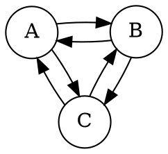
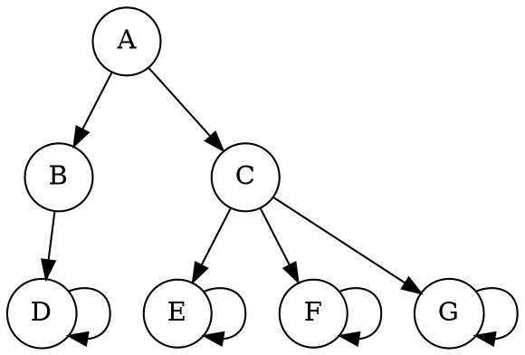

# Mark-Sweep Garbage Collection (GC Sec.4)
Mark-Sweep の使用メモリ量・時間オーバヘッドを改善する手法を見ていく。

## 流れ
- Mark-Sweep vs RC
- Mark の改善
   - 再帰をやめてスタックを使う
   - スタックが浅くなるよう工夫する
   - スタックオーバーフロー対策をする
   - スタックの利用もやめて、メモリ使用量を定数にする
- Mark-bit を置く位置の改善
   - Bitmap の利用
- Sweep の改善
   - Lazy に sweep する
- Mark-Sweep vs Copy

## (4.1) Mark-sweep と RC の比較
Mark-Sweep の立ち位置を確認しておく。<br>
ここでは、Reference Count (RC) と比較する。

|                                                  | Mark-Sweep<br>(non-incrementa, non-generational) |              Reference Count               |
| -----------------------------------------------: | :----------------------------------------------: | :----------------------------------------: |
|                     Cyclic data structure の対応 |                 特殊な処理は不要                 | 特殊な処理が必要<br>限られた条件下で対応可 |
|                              Collectのタイミング |                メモリが不足したら                |        メモリが不要になったら直ちに        |
|                         オーバヘッドの時間的分散 |         局所的<br>(アプリに長く割り込む)         |                分散している                |
|                            Update のオーバヘッド |                       なし                       |                    あり                    |
|                                             実装 |                       複雑                       |                    単純                    |
|                                       扱いやすさ |                        楽                        |  参照カウントの不変条件を破らぬよう要注意  |
|                                 空間オーバヘッド |            1 \[bit/node\] (実装依存)             |      $\geq$ 1 \[bit/node\] (実装依存)      |
| ヒープの大半を使う<br>プログラムでのオーバヘッド |                      大きい                      |                   小さい                   |

ちなみに...
- 仮想メモリを大量に確保すれば、mark-sweep / copy が起こる頻度を減らせる。
- ただし、データが多くのページに分散することになるので非効率。

## (4.2) Mark の改善 | 再帰をやめてスタックを使う
2章での mark は再帰関数だったが、これは効率が悪い。<br>
なぜなら :
- → 大量の関数呼び出しで時間を浪費
- → スタックフレームが大量に積まれ、メモリを浪費

```txt {caption="2章での mark"}
mark(N) =
    if mark_bit(N) == unmarked
        mark_bit(N) = marked
        for M in Children(N)
            mark(*M)
```

そこで、再帰の代わりにスタックを使うようにする。
```txt {caption="スタックを使う"}
mark_heap() =
    mark_stack = empty
    for R in Roots
        mark_bit(R) = marked
        push(R,mark_stack)
        mark()

mark() =
    while mark_stack != empty
        N = pop(mark_stack)
        for M in Children(N)
            if mark_bit(*M) == unmarked
                mark_bit(*M) = marked
                if not atom(*M)
                    push(*M, mark_stack)
```

## (4.2) Mark の改善 | スタックを浅くする工夫
スタックを使う場合、スタックオーバーフローの対策が必要になる。<br>
まずは、スタックの浅くする工夫を見る。

### 工夫1 : 訪問の対象
グラフ$(V, E)$の探索の戦略として、次の2つを考える :

\[戦略1\] 全ノードを訪問 (先程のアルゴリズム)
: スタックの最大の深さは $|V|$。

\[戦略2\] 全エッジを訪問
: スタックの最大の深さは $|E|$。

**グラフが木の場合 :**<br>
→ $|E| = |V| - 1$ なので、エッジを訪問するほうが有利。

**グラフ一般の場合 :**<br>
→ 多くの場合 $|E| > |V|$ なので、ノードを訪問するほうが有利。

::: {.flex55}
:::::: {.flex-left}
```txt {caption=全ノードを訪問}
mark_heap() =
    mark_stack = empty
    for R in Roots
        mark_bit(R) = marked
        push(R,mark_stack)
        mark()

mark() =
    while mark_stack != empty
        N = pop(mark_stack)
        for M in Children(N)
            if mark_bit(*M) == unmarked
                mark_bit(*M) = marked
                if not atom(*M)
                    push(*M, mark_stack)
```
::::::
:::::: {.flex-right}
```txt {caption=全エッジを訪問}
mark_heap() =
    mark_stack = empty
    for R in Roots
        push(R,mark_stack)
        mark()

mark() =
    while mark_stack != empty
        N = pop(mark_stack)
        if mark_bit(N) == unmarked
            mark_bit(N) = marked
            for M in Children(N)
                push(*M, mark_stack)
```
::::::
:::

#### 具体例
::: {.flex55}
:::::: {.flex-left}
::::::::: {.sticky}
次のグラフの探索を考える。<br>
$A$ はルートだとする。

:::::::::
::::::
:::::: {.flex-right}
##### 全ノードを訪問する場合のスタック
`push` 時にマークする。
- \[$\bot$, A\] (marked : A)
- \[$\bot$, B, C\] (marked : A, B, C)
- \[$\bot$, B\] (marked : A, B, C)
- \[$\bot$, \] (marked : A, B, C)

##### 全エッジを訪問する場合のスタック
`pop` 時にマークする。
- \[$\bot$, A\] (marked : )
- \[$\bot$, B, C\] (marked : A)
- \[$\bot$, B, A, B\] (marked : A, C)
- \[$\bot$, B, A, A, C\] (marked : A, C, B)
- \[$\bot$, B, A, A\] (marked : A, C, B)
- \[$\bot$, B, A\] (marked : A, C, B)
- \[$\bot$, B\] (marked : A, C, B)
- \[$\bot$, \]
::::::
:::


### 工夫2 : `push` 後に即 `pop` するのは無駄なのでやめる
::: {.flex55}
:::::: {.flex-left}
着目する問題 :
- 現状、`Children(N)` の最後の非アトミックな要素は `push` された後 即 `pop` される。
- これは無駄。

解決策 :
- 最後の子を `push` せずに処理する。
- → スタックが浅くなる。

最後の子を `push` せずに処理する。<br>
→ スタックが浅くなる。
::::::
:::::: {.flex-right}
```txt {caption="最後の子を push しない (渡辺の解釈)"}
mark() =
    while mark_stack != empty
        N = pop(mark_stack)
        LABEL:
        children = Children(N)
        if children.is_empty()
            continue

        -- 最後の子以外を処理
        for M in children[:-1]
            if mark_bit(*M) == unmarked
                mark_bit(*M) = marked
                if not atom(*M)
                    push(*M, mark_stack)

        -- 最後の子を push せずに処理
        M = children[-1]
        if mark_bit(*M) == unmarked
            mark_bit(*M) = marked
            if not atom(*M)
                N = *M
                goto LABEL
```
::::::
:::

### 工夫3 : 子ノードの訪問順の工夫
非アトミックな子を多くもつノードの訪問を後回しにする。<br>
→ スタックが浅くなりやすい。

#### 具体例
::: {.flex55}
:::::: {.flex-left}
::::::::: {.sticky}
次のグラフの探索を考える。<br>
$A$ はルートだとする。

:::::::::
::::::
:::::: {.flex-right}
非アトミックな子ノードの多い <quiz>$C$</quiz> を優先した場合。
- \[$\bot$, A\]
- \[$\bot$, A, B, C\]
- \[$\bot$, A, B, E, F, G \]
- ...

非アトミックな子ノードの少ない <quiz>$B$</quiz> を優先した場合。
- \[$\bot$, A, C, B\]
- \[$\bot$, A, C, D \]
- \[$\bot$, A, C\]
- \[$\bot$, A, E, F, G\]
- ...
::::::
:::

#### Consリストの場合
Consリストについては、経験的に次が分かっている :
- `cdr` の方が `car` より2倍ほど非アトミックな子を持ちやすい

そのため、
- <quiz>`cdr`</quiz>をスタックに積み、
- <quiz>`car`</quiz>はスタックに積まずに処理する (工夫2)

ことで、スタックを浅くできる可能性がある。

### 工夫4 : 大量の子を持つノードの対処
::: {.flex55}
:::::: {.flex-left}
::::::::: {.sticky}
着目する問題 :
- 大量の子を持つノードについて、全ての子を `push` するとスタックが深くなる。<br>

解決策 (Boehm-Demers-Weiser mark-sweep) :
- スタックには、ノードの代わりに (ノードが始まるアドレス, 終わるアドレス) を積む。
- 各イテレーションでは、スタックトップにあるノードの頭128-wordのみを処理する。
- ノードの残りの部分はスタックに戻す。
:::::::::
::::::
:::::: {.flex-right}

::::::
:::

```txt {caption=擬似コード}
Stack<(void*, void*)> mark_stack;

fn mark():
  while !mark_stack.is_empty():
    (obj_begin, obj_end) = mark_stack.pop();
    if (obj_end - obj_begin > 128-word):
      for c in (obj_begin, obj_begin+128-word).children():
          if !c.is_marked():
            mark(c);
            if !c.is_atom():
              mark_stack.push((c.begin, c.end));
      mark_stack.push((obj_begin+128-word, obj_end));
    else:
      ...
```

#### 工夫4が効く例
::: {.flex55}
:::::: {.flex-left}
```cpp
struct Node {
    Node children = Node[1000];
    Node() { children = {0}; }
}

void foo(void) {
    Node *root = new Node;
    for (i in 0..1000) {
        root->children[i] = new Node;
    }
    // root, children はここでゴミになる.
}
```
::::::
:::::: {.flex-right}
工夫2 あり, 工夫4 なしの場合 : 深さ9999
```txt
[⊥, root]
[⊥, c0, ..., c9998]
...
```

工夫2 あり, 工夫4 ありの場合 : 深さ128
```txt
[⊥, (root.begin, root.end)]
[⊥, (root.begin+128-word, root.end), (c0.begin, c0.end), ..., (c62.begin, c62.end)]
...
```
::::::
:::


#### 工夫4が効かない例

## 流れ (再掲)
- <span style="color:#dfdfdf">Mark-Sweep vs Copy<span style="color:red">
- Mark の改善
   - <span style="color:#dfdfdf">再帰をやめてスタックを使う<span style="color:red">
   - <span style="color:#dfdfdf">スタックが浅くなるよう工夫する<span style="color:red">
   - <span style="color:red">スタックオーバーフロー対策をする</span>
   - スタックの利用もやめて、メモリ使用量を定数にする
- Mark-bit を置く位置の改善
   - Bitmap の利用
- Sweep の改善
   - Lazy に sweep する
- Mark-Sweep vs Copy

## (4.2) Mark の改善 | スタックオーバーフロー時の対処
スタックを浅く保つ工夫をしても、オーバーフローする確率は0にならない。<br>
→ オーバーフローしても上手く動く機構が必要。

### スタックオーバーフローの検知
オーバーフローを検知する方法として、次の2つがある。

|                                           |        境界チェック        |                                             Guard page                                             |
| ----------------------------------------: | :------------------------: | :------------------------------------------------------------------------------------------------: |
|                                      処理 | `push`の度に境界チェック。 | スタックの直後に書き込み禁止なページを置く。<br>オーバーフロー時には書き込み違反で例外が発生する。 |
|                    オーバヘッドの発生頻度 |      `push`ごと。(\*)      |                                       オーバーフロー時のみ。                                       |
| オーバヘッドの大きさ<br>(1チェックあたり) |      低オーバヘッド。      |                         境界チェックの数万倍。<br> (例外処理をするため。)                          |

(\*) 子ノードの数を数えることで、頻度を各イテレーション毎に減らせる。

### オーバーフローの対処 | Knuth の方法
スタックの代わりにリングバッファを使う。

#### オーバーフロー時の処理
- 何もしない。
- 未処理のノードが上書きされる。

#### スタックが空になった際の処理 (未処理ノードの処理)
- ヒープを走査して次を満たすノードを探し、バッファに積む。
  - マーク済み。
  - 子ノードにマークが付いていない。
- バッファが空なら終了。
- バッファが空でないなら、処理を再開。

なお、常にヒープの底から走査する必要はない。<br>
前回までの処理でマークを付けたノードのアドレスの最小値から走査すれば良い。

### オーバーフローの対処 | Boehm-Demers-Weiser の方法
スタックを使う。

#### オーバーフロー時の処理
- オーバーフローしたことを覚えておく。
- 新たに来たノードは push せず放置。

#### スタックが空になった際の処理 (未処理ノードの処理)
- オーバーフローが起きていない場合は終了。
- それ以外は次を実行。
  - スタックのサイズを2倍にする (オーバーフローの頻度を減らすため)。
  - ヒープを走査して次を満たすノードを探し、スタックに積む。
    - マーク済み。
    - 子ノードにマークが付いていない。
  - 処理を再開。

### オーバーフローの対処 | Kurokawa の方法
スタックを使う。

#### オーバーフロー時の処理
- スタック上のノードのうち、未マークの子を0 or 1個しか持たないものについて処理。
- 処理後は、スタック上の全ノードが未マークの子を2個以上持つようになる。

未マークの子が0個なノードについて :
- そのノードは処理しなくてよいので、抜去。

未マークの子が1個なノードについて :
- その子ノード (C と置く) をマーク。
- C を起点に、未マークの子を2つ以上持つノードが見つかるまで探索。
- 見つかった場合、ノードで元のノードがあったエントリを上書き。
- 見つからなかった場合は、エントリを空にする。

#### この手法の問題点
- スタック中に、子が 0 or 1 個なノードが無い場合に機能しない。
- そのような状況は多々起きる。
  - (経験的に、共有されるノードは少数)

→ Kurokawa の手法を用いるのは苦肉の策。

## 流れ (再掲)
- <span style="color:#dfdfdf">Mark-Sweep vs Copy<span style="color:red">
- Mark の改善
   - <span style="color:#dfdfdf">再帰をやめてスタックを使う<span style="color:red">
   - <span style="color:#dfdfdf">スタックが浅くなるよう工夫する<span style="color:red">
   - <span style="color:#dfdfdf">スタックオーバーフロー対策をする</span>
   - <span style="color:red">スタックの利用もやめて、メモリ使用量を定数にする</span>
- Mark-bit を置く位置の改善
   - Bitmap の利用
- Sweep の改善
   - Lazy に sweep する
- Mark-Sweep vs Copy

## (4.3) Mark の改善 | スタックを使わない手法
目的 : Mark の使用メモリ量を定数にすること。<br>
→ 今までスタックが持っていた情報を各ノードに持たせる他ない。<br>
→ ノードが持つポインタ値を上書きする形で情報をもたせ、後に値を復元する方法を考える。

### Pointer-reversal | Deutsch-Schorr-Waite のアルゴリズム (2分木の場合)
まずは、データ構造が2分木の場合を考える。<br>
ノードの探索は、①, ②, ③の順に進むものとする。


#### Flag-bit
::: {.flex}
:::::: {.flex-left}
各ノードについて、自身の探索状況を記憶するために `flag-bit` を用意する。
- セットされていないとき : 左の部分木を探索中 or 探索終了
- セットされているとき : 左の部分木の探索が終了。右の部分木探索中。
::::::

:::::: {.flex-right}

::::::
:::

#### アルゴリズムの流れ
::: {.flex}
:::::: {.flex-left}
::::::::: {.sticky}
1. (初期状態)
2. 左の要素を親への参照で上書きし、左の部分木へ進む
   - 1 で親から自身への参照がなかったのはこのため
3. 左の子ノードから、自身に参照が貼られる
4. (左の部分木を探索)
5. 左の部分木の探索を終え、右の部分木へ
   - Flag-bit を立てる
   - 左の要素をもとに戻し、右の要素を親への参照で上書き
6. (右の部分木を探索)
7. 親へ戻る
    - 右の要素をもとに戻す
    - この直後、親は部分木の探索を終えるため、親から自分への参照が戻る
:::::::::
::::::

:::::: {.flex-right}

::::::
:::

#### 擬似コード
使用メモリ (ローカル変数) のサイズは定数。<br>

```txt {caption="DSWのアルゴリズム (2分木の場合)"}
mark(R) =
    prev = nil
    current = R
    while true
        -- follow left pointers
        while (current != nil) && (mark_bit(current) == unmarked)
            mark_bit(current) = marked
            if not atom(current)
                (left(current), prev, current) = (prev, current, left(current))

        -- retreat
        while (prev != nil) && (flag_bit(prev) == set)
            flag_bit(prev) = unset
            (right(prev), current, prev) = (current, prev, right(prev))

        if prev == nil
            return
        else
            -- switch to right subgraph
            flag_bit(prev) = set
            (left(prev), current, right(prev)) = (current, right(prev), left(prev))
```

### Pointer-reversal | Deutsch-Schorr-Waite のアルゴリズム (一般の場合)
子ノードが2個とは限らない一般の場合を考える。<br>

::: {.flex}
:::::: {.flex-left}
基本方針 : ポインタを張り替えつつグラフを探索。
- → 現在どの部分木を探索中かを記憶する必要あり。
- → 各ノードに、`flag-bit` 的なものを持たせる必要あり。
  - `n-field` : ノード内にあるポインタの数
  - `i-field` : どの部分木を探索中か ($\geq \log_2 n$-bit)
::::::

:::::: {.flex-right}

::::::
:::

### Pointer-reversal | Wegbreit による最適化
着目した性質 :
- `flag-bit` が必要なのは、再訪問が必要なノードだけ。

手法 :
- `flag-bit` をノードに埋め込まずに、スタックで管理する。
- → メモリ使用量減少。

この手法の問題点 :
- スタックオーバーフローのリスクがある。
- リスクを完全に避けるには、普通の pointer-reversal と同じメモリ量が必要。

### Pointer-reversal の評価
Weibreit の最適化をしない場合 :
- 利点 : (Mark の) メモリ使用量が定数
- 欠点 : 各ノードに追加のフィールドが必要

#### メモリ総使用量
Pointer-reversal はスタックをノード内に移動しただけ、ということが示されている。
- = メモリの総使用量はどちらも同じ。
- この事実は program proving techniques の例題としてよく使用される。

#### 実行速度
Pointer-reversal の実行速度は、 スタックを使う場合に比べて遅い。<br>

|                      |       Stack        |          Pointer-reversal          |
| -------------------: | :----------------: | :--------------------------------: |
| ノードの最低訪問回数 |        2 回        |       (子ノードの数) + 1 回        |
|         訪問時の処理 | 軽い<br>(push/pop) | 重い<br>(複数のポインタの張り替え) |

ノードの訪問回数が増えると、メモリアクセスの回数が増える。<br>
→ キャッシュミス・ページフォルトが起きやすくなる。

---
こうした欠点から、Schorr, Waite 曰く、この手法は苦肉の策。<br>
しかし、Miranda言語や組み込みのGCでの利用例がある。

## 流れ (再掲)
- <span style="color:#dfdfdf">Mark-Sweep vs Copy<span style="color:red">
- <span style="color:#dfdfdf">Mark の改善</span>
   - <span style="color:#dfdfdf">再帰をやめてスタックを使う<span style="color:red">
   - <span style="color:#dfdfdf">スタックが浅くなるよう工夫する<span style="color:red">
   - <span style="color:#dfdfdf">スタックオーバーフロー対策をする</span>
   - <span style="color:#dfdfdf">スタックの利用もやめて、メモリ使用量を定数にする</span>
- <span style="color:red">Mark-bit を置く位置の改善</span>
   - Bitmap の利用
- Sweep の改善
   - Lazy に sweep する
- Mark-Sweep vs Copy

## (4.4) Mark-bit の持ち方の工夫
今までは各ノードに mark-bit を持たせていた。<br>
しかし、この手法ではメモリ効率が悪くなる場合がある。

(悪くならない場合 : ポインタ変数から未使用の 1-bit を借りる場合等。)

### Bitmap による管理
ノードとは分離された bitmap による mark-bit の管理を考える。

`bitmap` は例えば、bit の配列として実装される。<br>
ノードの最小サイズが 64-bit で、各ノードが 64-bit 境界にあるとすると、<br>
アドレス `p` に対応する mark-bit は `bitmap[p>>3]` である。

### Bitmap の利点と欠点
#### 利点
**・ Bitmap が小さければ RAM に乗る。** <br>
→ ページフォルトしない。

**・ Mark 時にノードへの書き込みが不要。**<br>
→ ノードがあるページへの書き込みが起きない。<br>
→ そのページが取り除かれる際の、swap領域 への書き込みは不要。

**・ Sweep 時に生きてるノードを触らなくて良い**<br>

#### 欠点
**・ ノードに mark-bit を埋める場合に比べ、mark-bit の取得にコストがかかる。**

### Bitmap の最適化
#### オブジェクトの種別ごとに異なる bitmap を用意
一部のアドレス (オブジェクトの内部等) には mark-bit を用意しなくて良い。<br>
→ メモリ使用量の削減に繋がる。

#### 解放処理の最適化
ノードは集団で作られ、集団で不要になる傾向にあることが知られている。<br>
そこで、
- Bitmap 中の 1-word に対応するノードを1つの集団とみなす。
- 1-word 全てが 0 なら、対応するノードの集団をまとめて開放する。

ことで、高速化が図れる。

## 流れ (再掲)
- <span style="color:#dfdfdf">Mark-Sweep vs Copy<span style="color:red">
- <span style="color:#dfdfdf">Mark の改善</span>
   - <span style="color:#dfdfdf">再帰をやめてスタックを使う<span style="color:red">
   - <span style="color:#dfdfdf">スタックが浅くなるよう工夫する<span style="color:red">
   - <span style="color:#dfdfdf">スタックオーバーフロー対策をする</span>
   - <span style="color:#dfdfdf">スタックの利用もやめて、メモリ使用量を定数にする</span>
- <span style="color:#dfdfdf">Mark-bit を置く位置の改善</span>
   - <span style="color:#dfdfdf">Bitmap の利用</span>
- <span style="color:red">Sweep の改善</span>
   - Lazy に sweep する
- Mark-Sweep vs Copy

## (4.5) Sweep の改善 | Lazy sweep
目的 : ユーザプログラムへの割り込み時間を減らすこと。

**方法1 : 少しずつ Mark (Incremental Collector)**
- 難しい。
- ユーザプログラムは、mark 済のグラフの構造を変えられる。

(詳しくは8章)

**方法2 : 少しずつ (lazy に) Sweep**
- 比較的簡単。
- ユーザプログラムは、sweep の対象 (= ゴミ) を触れない。

ここでは、lazy な sweep に着目する。

### Hughes の lazy sweep アルゴリズム
::: {.flex64}
:::::: {.flex-left}
::::::::: {.sticky}
**メモリを必要な分だけ、sweep 可能なメモリから探す。**
- 解放済みメモリを管理するリスト (`free-list`) が不要。

<!-- メモリを確保する際、次回の sweep 開始位置をそのアドレスの後ろに設定する。<br>
→ 新たに割り当てられた(未マークの)メモリがfreeされることはない。 -->

**しかし、bitmap と相性が悪い。**
- Bitmap を効率良く扱うには word 単位での sweep が好ましい。
- →「解放したが割り当てに使わなかった」という状況になりうる。
- → `free-list` が必要になる。
:::::::::
::::::
:::::: {.flex-right}
```txt {caption="Hughes's lazy sweep"}
alloc() =
    -- try finding free-able memory
    while sweep < Heap_top
        if mark_bit(sweep) == marked
            mark_bit(sweep) = unmarked
            sweep += size(sweep)
        else
            result = sweep
            sweep += size(sweep)
            return result

    -- mark unmarked dead node
    mark_heap()
    sweep = Heap_bottom
    while sweep

    -- try again
    while sweep < Heap_top
    if mark_bit(sweep) == marked
        mark_bit(sweep) = unmarked
        sweep += size(sweep)
    else
        result = sweep
        sweep += size(sweep)
        return result

    abort "Memory exhausted"
```
::::::
:::

### Boehm-Demers-Weiser sweeper
2段階で割り当てる。

- **Low-level alloc** : GC失敗時等に、空き領域を確保するためにおこなう。
  - OSから決まったサイズの Block をもらう。
  - Block は、オブジェクトのサイズごとに管理する。
- **High-level alloc** : ユーザプログラムがメモリを必要とした際におこなう。
  - Block から必要な分メモリを割り当てるする。




各ブロックには、対応するヘッダが別途用意される。<br>
ヘッダには、ブロック内のメモリについての bitmap がある。

- **High-level free** : free-list が空になったら、ブロックを順次 mark-sweep して free-list を伸ばす。
- **Low-level free** : ヘッダの bitmap が全て 0 なら、そのブロックは不要なので OS に返す。

### Zorn の lazy sweeper
**特徴 :**
- Alloc も sweep も高速な GC。
- Lispに 特化した SPARC プロセッサのお陰で、`cons` を高速に扱える。
  - 他のオブジェクトについても、`cons` には劣るが高速に扱える。

**動作 :**
- `free-list` の代わりに、オブジェクトのサイズ毎に用意された固定長の cache vector を使う。
- 所望の cache vector が空なら、sweep して空き領域を確保する。
- Sweep の各イテレーションでは :
    - Bitmap 内の 1-word を検査。
    - 解放できるノードを cache vector に加える。

**Alloc のコスト :**
- (Alloc 時に sweep するため、sweep のコストは alloc のコストに含まれる。)
- 10 ~ 12 サイクルで済む。

## 流れ (再掲)
- <span style="color:#dfdfdf">Mark-Sweep vs Copy<span style="color:red">
- <span style="color:#dfdfdf">Mark の改善</span>
   - <span style="color:#dfdfdf">再帰をやめてスタックを使う<span style="color:red">
   - <span style="color:#dfdfdf">スタックが浅くなるよう工夫する<span style="color:red">
   - <span style="color:#dfdfdf">スタックオーバーフロー対策をする</span>
   - <span style="color:#dfdfdf">スタックの利用もやめて、メモリ使用量を定数にする</span>
- <span style="color:#dfdfdf">Mark-bit を置く位置の改善</span>
   - <span style="color:#dfdfdf">Bitmap の利用</span>
- <span style="color:#dfdfdf">Sweep の改善</span>
   - <span style="color:#dfdfdf">Lazy に sweep する</span>
- <span style="color:red">Mark-Sweep vs Copy</span>

## (4.6) Mark-sweep と Copy の比較
### Space and locality
<table>
    <thead>
        <tr class="header">
            <th style="text-align: right;"></th>
            <th style="text-align: center;">Mark-sweep<br>(bitmap, lazy-sweep)</th>
            <th style="text-align: center;">Copy</th>
        </tr>
    </thead>
    <tbody>
        <tr class="odd">
            <td style="text-align: right;">アクセスする<br>アドレス空間</td>
            <td style="text-align: center;">狭い</td>
            <td style="text-align: center;">広い</td>
        </tr>
        <tr class="even">
            <td style="text-align: right;">特色</td>
            <td style="text-align: left;">
                <ul>
                    <li>Sweep 時に生きているノードを触らない。</li>
                    <li>1-word に対応するノード集合の死を1命令で判定可能。</li>
                </ul>
            </td>
            <td style="text-align: left;">
                <ul>
                    <li>生きてる全ノードについて、forwarding address 等のポインタの書き換えが必要。</li>
                </ul>
            </td>
        </tr>
        <tr class="odd">
            <td style="text-align: right;">キャッシュ・仮想メモリとの相性</td>
            <td style="text-align: center;">良い</td>
            <td style="text-align: center;">悪い</td>
        </tr>
    </tbody>
</table>

ちなみに :
- Mark-sweep は、garbage を `free-list` に戻す必要があるかもしれない。
- その際、キャッシュミス/ページフォルトが起きるかもしれない。

しかし、これらは問題にならない。なぜなら :
- Lazy sweep する場合、`free-list` に戻したメモリは、直ぐに再利用 (再割当て) する可能性が高い。
  - → 再利用の際にキャッシュヒットする可能性が高い。
  - (この場合、そのノードについてのキャッシュミス回数は合計1回。)
- 手法を問わず、ノードへの最初のアクセスはキャッシュミスする。

### Time complexity
- $M$ : ヒープ全体の大きさ
- $R$ : 生存しているノード全体の大きさ

|                           |      Mark-sweep (bitmap, lazy-sweep)       |                    Copy                     |
| ------------------------: | :----------------------------------------: | :-----------------------------------------: |
|                    前準備 |  Mark-bit のクリア<br>(実用上無視できる)   | Semi-space の入れ替え<br>(実用上無視できる) |
|          グラフのトレース |     生存しているノードの探索<br>$O(R)$     |     生存しているノードの探索<br>$O(R)$      |
|                     Sweep |     Alloc 時にするので考慮しない<br>-      |                  なし<br>-                  |
|                     Alloc | $\geq$ 10 ~ 12 **cycles**<br>(Zorn の手法) | $\geq$ 5 **instructions**<br>(Zorn の手法)  |
| Alloc + Init alloced data |                 $O(M - R)$                 |                 $O(M - R)$                  |

オーダーは同じだが、定数・係数は違う。

例えば、
- ノード訪問時の処理 :
  - Mark-sweep は mark をつけるだけ。
  - Copy は forwarding address の編集とノードのコピーが必要
  - → (扱うオブジェクトが非常に小さい場合を除き) Mark-sweep が有利
- Alloc について :
  - 何も考えず from-space のトップから確保すれば良いので、Copy の方が有利。

また、
- Alloc が頻繁、あるいは、各ノードの寿命が短いなら、copy が有利。
  - その他はどちらが有利とも言えない。
- 実装は copy の方が簡単。


**最終的には、ユーザプログラムのヒープの使い方を解析して、どちらのGCを使うか判断するしか無い。**


### Object mobility
Mark-sweep の方が適している環境 (Copy GC が使えない環境) もある。<br>
例 :
- オブジェクトのアドレスが不変であることを仮定した言語での利用。
- デバッグをする場合。
- Conservative GC (コンパイラの助けを借りない GC )を作る場合。
    - あるメモリがポインタか非ポインタか区別がつかない。
    - → 非ポインタをポインタと誤認して処理すると、copy 前後で<quiz>非ポインタ値が変化してしまう</quiz>。

Copy GC を使うとノードのアドレスがGC前後で変化するため、これらの環境には適さない。

## まとめ
### Mark の工夫について
- 関数の再帰呼び出しをやめ、 ① を用いたものに変更。
- ① を浅くする工夫。
- ① が溢れた際の対処法。

を見た。

さらに、Mark のメモリ使用量を定数にする方法 (pointer-reversal) を見た。<br>
ただし、この手法は各ノードに情報を持たせる必要があり、全体としてのメモリ使用量は、① を用いる場合と ② であった。

---
① <quiz>スタック</quiz><br>
② <quiz>同じ</quiz>

### Mark-bit の管理
Mark-bit を効率よく管理する手法として、 ③ を見た。<br>
③ を使うと、
- Mark 時にヒープに書き込まなくて良い。
- Sweep 時に生きているノードにアクセスしなくて良い。

---
③ <quiz>Bitmap</quiz>

### Sweep の工夫
Sweep を実装する上での工夫として、④ を見た。

---
④ <quiz>Lazy sweep</quiz>

### Mark-sweep と Copy の比較
- アクセスするメモリの局所性は、⑤ の方が優れていた。
- 計算量のオーダーは ⑥ だが、実装・環境依存な部分も多く、一概にどちらが良いとはいえない。

---
⑤ <quiz>Mark-sweep</quiz><br>
⑥ <quiz>同じ</quiz>
