# \[WIP\] Mark-Sweep Garbage Collection (GC Sec.4)
Mark-Sweep の使用メモリ量・時間オーバヘッドを改善する手法を見ていく。

## 4.1 Comparisons with reference counting
改善の前に、Mark-Sweep の立ち位置を確認しておく。<br>
ここでは、Reference counting と比較する。

|                                                  |                  Mark-sweep                  |                Reference Count                 |
| -----------------------------------------------: | :------------------------------------------: | :--------------------------------------------: |
|                            Cyclic data structure |            特殊な処理なしで扱える            | 特殊な処理が必要<br>限られた条件下でのみ扱える |
|                              Collectのタイミング |              メモリが不足したら              |          メモリが不要になったら直ちに          |
|                         オーバヘッドの時間的分散 |       局所的<br>(アプリに長く割り込む)       |                      分散                      |
|                            Update のオーバヘッド | Non-incremental, non-generational なら、なし |                      あり                      |
|                                             実装 |                     複雑                     |                      単純                      |
|                                       扱いやすさ |           Non-incremental なら、楽           |    参照カウントの不変条件を壊さぬよう要注意    |
|                      空間オーバヘッド (実装依存) |                1 \[bit/node\]                |             $\geq$ 1 \[bit/node\]              |
| ヒープの大半を使う<br>プログラムでのオーバヘッド |                 比較的大きい                 |                  比較的小さい                  |

ちなみに...
- 仮想メモリを大量に確保すれば、mark-sweep / copy が起こる頻度を減らせる。
- ただし、データが多くのページに分散することになるので非効率。


## 以降の流れ
1. Mark の改善
   - 再帰をやめてスタックを使う
   - スタックが深くならないよう工夫する
   - スタックオーバーフロー対策をする
   - スタックの利用もやめて、メモリ使用量を定数にする
2. Mark-bit を置く位置の改善
3. Sweep の改善
   - Lazy に sweep する


<!--
1. Mark が再帰的である問題について
   - Stack overflow の発生確率を下げる方法
   - Stack overflow から回復する方法
   - 決まったメモリ使用量でグラフに mark する方法
2.  Sweep について
3.  仮想メモリの扱いを改善について -->

## (4.2) Mark の改善 | 再帰をやめてスタックを使う
2章での mark は再帰関数だったが、これは効率が悪い。<br>
なぜなら :
- → 関数呼び出しで時間を浪費
- → スタックフレームが大量に積まれ、メモリを浪費

```txt {caption="2章での mark"}
mark(N) =
    if mark_bit(N) == unmarked
        mark_bit(N) = marked
        for M in Children(N)
            mark(*M)
```

そこで、再帰の代わりにスタックを使うようにする。
```txt
mark_heap() =
    mark_stack = empty
    for R in Roots
        mark_bit(R) = marked
        push(R,mark_stack)
        mark()

mark() =
    while mark_stack != empty
        N = pop(mark_stack)
        for M in Children(N)
            if mark_bit(*M) == unmarked
                mark_bit(*M) = marked
                if not atom(*M)
                    push(*M, mark_stack)
```

## (4.2) Mark の改善 | スタックの浅くする工夫
スタックを使う場合、スタックオーバーフローの対策が必要になる。<br>
まずは、スタックの浅くする工夫を見る。

### 工夫1 : 訪問の対象
グラフ$(V, E)$の探索の戦略として、次の2つを考える :

\[戦略1\] 全ノードを訪問 (先程のアルゴリズム)
: スタックの最大の深さは、最大で $|V|$。

\[戦略2\] 全エッジを訪問
: スタックの最大の深さは、$|E|$。

**グラフが木の場合 :**<br>
→ $|E| = |V| - 1$ なので、エッジを訪問するほうが有利。

**グラフ一般の場合 :**<br>
→ 多くの場合 $|E| > |V|$ なので、ノードを訪問するほうが有利。

::: {.flex}
:::::: {.flex-left}
```txt {caption=全ノードを訪問}
mark_heap() =
    mark_stack = empty
    for R in Roots
        mark_bit(R) = marked
        push(R,mark_stack)
        mark()

mark() =
    while mark_stack != empty
        N = pop(mark_stack)
        for M in Children(N)
            if mark_bit(*M) == unmarked
                mark_bit(*M) = marked
                if not atom(*M)
                    push(*M, mark_stack)
```
::::::
:::::: {.flex-right}
```txt {caption=全エッジを訪問}
mark_heap() =
    mark_stack = empty
    for R in Roots
        push(R,mark_stack)
        mark()

mark() =
    while mark_stack != empty
        N = pop(mark_stack)
        if mark_bit(N) == unmarked
            mark_bit(N) = marked
            for M in Children(N)
                push(*M, mark_stack)
```
::::::
:::

#### 具体例
次のグラフの探索を考える (ルートは $A$ とする)。

::: {.flex}
:::::: {.flex-left}
::::::::: {.sticky}

:::::::::
::::::
:::::: {.flex-right}
##### 全ノードを訪問する場合のスタック
- \[A\] (marked : )
- \[B, C\] (marked : A)
- \[B\] (marked : A, C)
- \[\] (marked : A, C, B)

##### 全エッジを訪問する場合のスタック
- \[A\] (marked : )
- \[B, C\] (marked : A)
- \[B, A, B\] (marked : A, C)
- \[B, A, A, C\] (marked : A, C, B)
- \[B, A, A\] (marked : A, C, B)
- \[B, A\] (marked : A, C, B)
- \[B\] (marked : A, C, B)
- \[\]
::::::
:::


### 工夫2 : `push` 後に即 `pop` するのは無駄なのでやめる
今のアルゴリズムで、`Children(N)` の最後の非アトミックな要素は `push` された後 即 `pop` される。

```txt {caption=全ノードを訪問}
mark() =
    while mark_stack != empty
        N = pop(mark_stack)
        for M in Children(N)
            if mark_bit(*M) == unmarked
                mark_bit(*M) = marked
                if not atom(*M)
                    push(*M, mark_stack)
```

最後の子を `push` せずに処理することで、この無駄を回避できる。<br>
これは、スタックの最大の深さの削減につながる。

```txt {caption="最後の子を push しない (渡辺の解釈)"}
mark() =
    while mark_stack != empty
        N = pop(mark_stack)
        LABEL:
        children = Children(N)
        if children.is_empty()
            continue

        for M in children[:-1]
            if mark_bit(*M) == unmarked
                mark_bit(*M) = marked
                if not atom(*M)
                    push(*M, mark_stack)

        M = children[-1]
        if mark_bit(*M) == unmarked
            mark_bit(*M) = marked
            if not atom(*M)
                N = *M
                goto LABEL
```

### 工夫3 : 訪問順の工夫
リスト `Chidren(N)` の子の訪問順を工夫する。

非アトミックな子を多くもつノードの訪問は後回しにしたほうが、スタックが浅くなりやすい。

Consリストについては、経験的に次が分かっている :
- `cdr` の方が `car` より2倍ほど非アトミックな子を持ちやすい

そのため、
- <quiz>`cdr`</quiz>をスタックに積み、
- <quiz>`car`</quiz>はスタックに積まずに処理する (工夫2)

ことで、スタックを浅くできる可能性がある。

### 工夫4 : 大量の子を持つノードの対処
着目する問題 :
- 大量の子を持つノードについて、全ての子を `push` するとスタックが深くなる。<br>

解決策 (Boehm-Demers-Weiser mark-sweeping) :
- ノードの代わりに (ノードが始まるアドレス, 終わるアドレス) をスタックに積む。
- 各イテレーションでは、スタックトップにあるノードの頭128-wordのみを処理する。
- (ノードの残りの部分はスタックに戻す。)


## (4.2) Mark の改善 | スタックオーバーフロー時の対処
スタックを浅く保つ工夫をしても、オーバーフローする確率は0にならない。<br>
そのため、オーバーフローしても上手く動く機構が必要。

### スタックオーバーフローの検知
オーバーフローを検知する方法として、次の2つがある。

|                        |                                    境界チェック                                    |                                                        Guard page                                                        |
| ---------------------: | :--------------------------------------------------------------------------------: | :----------------------------------------------------------------------------------------------------------------------: |
|                   処理 |                           `push`の度に境界チェックする。                           | スタックの終わりに書き込み禁止なページを置く。<br>オーバーフロー時には書き込み禁止なメモリへの書き込みで例外が発生する。 |
| オーバヘッドの発生頻度 | `push`ごと。<br>(子ノードの数を数えることで、頻度を各イテレーション毎に減らせる。) |                                          オーバーフロー時以外はオーバヘッド無し                                          |
|   オーバヘッドの大きさ |                          1回のチェックは低オーバヘッド。                           |                        例外処理をするため、1回のチェックは高オーバヘッド (境界チェックの数万倍)。                        |

### Knuth の方法
スタックの代わりにリングバッファを使う。

#### オーバーフロー時の処理
- 何もしない。
- 未処理のノードが上書きされる。

#### スタックが空になった際の処理 (未処理ノードの処理)
- ヒープを走査して次を満たすノードを探し、バッファに積む。
  - マーク済み。
  - 子ノードにマークが付いていない。
- バッファが空なら終了。
- バッファが空でないなら、処理を再開。

なお、常にヒープの底から走査する必要はない。<br>
前回までの処理でマークを付けたノードのアドレスの最小値から走査すれば良い。

### Boehm-Demers-Weiser の方法
スタックを使う。

#### オーバーフロー時の処理
- オーバーフローしたことを覚えておく。
- 新たに来たノードは push せず放置。

#### スタックが空になった際の処理 (未処理ノードの処理)
- オーバーフローが起きていない場合は終了。
- それ以外は次を実行。
  - スタックのサイズを2倍に (オーバーフローの頻度を減らすため)
  - ヒープを走査して次を満たすノードを探し、スタックに積む。
    - マーク済み。
    - 子ノードにマークが付いていない。
  - 処理を再開。

### Kurokawa の方法
スタックを使う。

#### オーバーフロー時の処理
- スタック上のノードのうち、未マークの子を0 or 1個しか持たないものについて処理。
- 処理後は、スタック上の全ノードが未マークの子を2個以上持つようになる。

未マークの子が0個なノードについて :
- そのノードは処理しなくてよいので、抜去。

未マークの子が1個なノードについて :
- その子ノード (Cと置く) をマーク。
- ノードCを起点に、未マークの子を2つ以上持つノードが見つかるまで探索。
- 見つかった場合、ノードで元のノードがあったエントリを上書き。
- 見つからなかった場合は、エントリを空にする。

#### この手法の問題点
スタック中に抜去できる子が0 or 1個なノードが見つからなかった場合機能しない。

なお、経験的に、共有されるノードが少数であることが分かっている。<br>
つまり、あるノードの子がマーク済みであることは少ない。<br>
→ Kurokawa の手法を用いるのは苦肉の策。

## (4.3) Mark の改善 | スタックを使わない手法
Mark の使用メモリ量が定数になるアルゴリズムを考える。<br>
そのためには、今までスタックが持っていた情報を各ノードに持たせる他ない。<br>
そこで、ノードが持つポインタ値を上書きする形で情報をもたせ、後に値を復元する方法を考える。

### Pointer-reversal : Deutsch-Schorr-Waite のアルゴリズム (2分木の場合)
まずは、データ構造が2分木の場合を考える。<br>
ノードの探索は、①, ②, ③の順に進むものとする。


#### Flag-bit
::: {.flex}
:::::: {.flex-left}
各ノードのついて、自身の探索状況を記憶するために `flag-bit` を用意する。
- セットされていないとき : 左の部分木を探索中 or 探索終了
- セットされているとき : 左の部分木の探索が終了。右の部分木探索中。
::::::

:::::: {.flex-right}

::::::
:::

#### アルゴリズムの流れ
::: {.flex}
:::::: {.flex-left}
::::::::: {.sticky}
1. (初期状態)
2. 左の要素を親への参照で上書きし、左の部分木へ子へ進む
   - 1 で親から自身への参照がなかったのはこのため
3. 左の子ノードから、自身に参照が貼られる
4. (左の部分木を探索)
5. 左の部分木の探索を終え、右の部分木へ
   - 左の要素をもとに戻し、右の要素を親への参照で上書き
6. (右の部分木を探索)
7. 親へ戻る
    - 右の要素をもとに戻す
    - この直後、親は部分木の探索を終えるため、親から自分への参照が戻る
:::::::::
::::::

:::::: {.flex-right}

::::::
:::

#### 擬似コード
使用メモリ (ローカル変数) のサイズは定数。<br>

```txt {caption="DSWのアルゴリズム (2分木の場合)"}
mark(R) =
    prev = nil
    current = R
    while true
        -- follow left pointers
        while (current != nil) && (mark_bit(current) == unmarked)
            mark_bit(current) = marked
            if not atom(current)
                (left(current), prev, current) = (prev, current, left(current))

        -- retreat
        while (prev != nil) && (flag_bit(prev) == set)
            flag_bit(prev) = unset
            (right(prev), current, prev) = (current, prev, right(prev))

        if prev == nil
            return
        else
            -- switch to right subgraph
            flag_bit(prev) = set
            (left(prev), current, right(prev)) = (current, right(prev), left(prev))
```

### Pointer-reversal : Deutsch-Schorr-Waite のアルゴリズム (一般の場合)
子ノードが2個とは限らない一般の場合を考える。<br>


::: {.flex}
:::::: {.flex-left}
基本方針 : ポインタを張り替えつつグラフを探索。
- → 現在どの部分木を探索中かを記憶する必要あり。
- → 各ノードに、`flag-bit` 的なものを持たせる必要あり。
  - `n-field` : ノード内にあるポインタの数
  - `i-field` : どの部分木を探索中か ($\geq \log_2 n$-bit)
::::::

:::::: {.flex-right}

::::::
:::

### Pointer-reversal の評価 (メモリ使用量)
- 利点 : (Mark の) メモリ使用量が定数
- 欠点 : 各ノードに追加のフィールドが必要

#### 最適化 | Wegbreit の手法
着目した性質 :
- `flag-bit` が必要になるのは、トレースが延期されるノードだけ。

手法 :
- `flag-bit` をノードに埋め込まずに、スタックで管理する。

この手法の問題点 :
- スタックオーバーフローのリスクがある。
- スタックオーバーフローを完全に避けるには、普通の pointer-reversal と同じメモリ量が必要。

#### Pointer stack と pointer-reversal は等価
- pointer-reversal は pointer stack をノード内に移動しただけ、ということが示されている。
  - = メモリの総使用量はどちらも同じ。
- (この事実は program proving techniques の例題としてよく使用される。)

### Pointer-reversal の評価 (実行速度)
Pointer-reversal の実行速度は、 pointer-stack を使う場合に比べて遅い。<br>

|                      |   Pointer-stack    |          Pointer-reversal          |
| -------------------: | :----------------: | :--------------------------------: |
| ノードの最低訪問回数 |        2 回        |       (子ノードの数) + 1 回        |
|         訪問時の処理 | 軽い<br>(push/pop) | 重い<br>(複数のポインタの張り替え) |

ノードの訪問回数が増えると、メモリアクセスの回数が増える。<br>
→ キャッシュミス・ページフォルトが起きやすくなる。

こうした欠点から、Schorr, Waite 曰く、この手法は苦肉の策。<br>
しかし、Miranda言語や組み込みのGCでの利用例がある。

## (4.4) Mark-bit の持ち方の工夫
Mark-bit を保持する場所を改善する。<br>
今までは各ノードに mark-bit を持たせていた。<br>
しかし、この手法ではメモリ効率が悪くなる場合がある。

### Bitmap による管理
この節では代わりに、ノードとは分離された bitmap による mark-bit の管理を考える。

`bitmap` は例えば、bit の配列として実装される。<br>
ノードの最小サイズが 64-bit で、各ノードが 64-bit 境界にあるとすると、<br>
アドレス `p` に対応する mark-bit は `bitmap[p>>3]` である。

ノードのサイズ毎に異なる bitmap を用意することで、メモリ使用量を更に削減できる。

### Bitmap の最適化
ノードは集団で作られ、集団で不要になる傾向にあることが知られている。<br>
そこで、
- Bitmap 中の 1-word に対応するノードを1つの集団とみなす。
- 1-word 全てが 0 なら、対応するノードの集団をまとめて開放する。

ことで、高速化が図れる。

### Bitmap の利点と欠点
**利点1 : Bitmap が小さければ RAM に乗る。** <br>
→ ページフォルトしない。

**利点2 : Mark 時にノードへの書き込みが不要。**<br>
→ ノードがあるページへの書き込みが起きない。<br>
→ そのページが取り除かれる際の、swap領域 への書き込みは不要。

**利点3 : Sweep 時に生きてるノードを触らなくて良い**<br>
- (Garbage ノードは `free-list` 等に戻す必要があるかもしれないが)


**欠点 : ノードに mark-bit を埋める場合に比べ、mark-bit の取得にコストがかかる。**

## (4.5) Sweep の改善 | Lazy sweeping
ユーザプログラムへの割り込み時間を減らしたい。

方法として考えられるのは2つ :
- Allocation 毎に Mark を少しずつする (incremental collector)
- Allocation 毎に Sweep を少しずつする

このうち、Mark を少しずつするのは難しい。<br>
なぜなら、ユーザプログラムによって、mark 済みのグラフの構造が変わりかねないから。<br>
(詳しくは8章)

ここでは、sweep を少しずつ (lazy に) おこなう手法を考える。<br>
ユーザプログラムは sweep 対象に干渉できないため、これは比較的簡単。
- ユーザプログラムは mark-bit を触れない
- sweep対象はルートから辿れない
- → sweep対象の参照を新たに作ることは不可能
- → sweep対象は生き返らない


### Hughes の lazy sweep アルゴリズム
メモリを確保する際、次回の sweep 開始位置をそのアドレスの後ろに設定する。<br>
→ 新たに割り当てられた(未マークの)メモリがfreeされることはない。

この手法は、メモリを必要な分だけ sweep 可能なメモリをから探してくる。<br>
→ 解放済みのメモリを管理するリスト (`free-list`) が不要。

しかし、この手法は bitmap との相性が悪い。
なぜなら、bitmap を効率的に扱うには word単位でのsweepが好ましいから。
word単位でsweepする場合、余ったメモリをリスト等で管理する必要がある。

```txt {caption="Hughes's lazy sweeping"}
allocate() =
    -- try finding free-able memory
    while sweep < Heap_top
        if mark_bit(sweep) == marked
            mark_bit(sweep) = unmarked
            sweep += size(sweep)
        else
            result = sweep
            sweep += size(sweep)
            return result

    -- mark unmarked dead node
    mark_heap()
    sweep = Heap_bottom
    while sweep

    -- try again
    while sweep < Heap_top
    if mark_bit(sweep) == marked
        mark_bit(sweep) = unmarked
        sweep += size(sweep)
    else
        result = sweep
        sweep += size(sweep)
        return result

    abort "Memory exhausted"
```

### Boehm-Demers-Weiser sweeper
2段階で割り当てる。

- low-level alloc : GC失敗時等に、空き領域を確保するためおこなわれる
- high-level alloc : ユーザプログラムがメモリを必要とした際におこなわれる


各ブロックには、対応するヘッダが別途用意される。
ヘッダには、ブロック内のメモリについての bitmap がある。

- high-level free : free-list が空になったら、ブロックを順次 mark-sweep して free-list に戻す
- low-level free : ヘッダの bitmap が全て 0 なら、そのブロックは不要なので OS に返す

### Zorn の lazy sweeper
- SPARC プロセッサ上で動く alloc も sweep も高速な sweeper。
  - SPARC プロセッサのお陰で、`cons` を高速に扱える。
  - 他のオブジェクトについても、`cons` には劣るが高速に扱える。
- `free-list` の代わりに、オブジェクトのサイズ毎に用意された固定長の cache vector を使う。
- 所望の cache vector が空なら、sweep して空き領域を確保する。<br>

sweep の各イテレーションでは、bitmap 内の 1-word を検査し、いらないノードを cache vector に加える。<br>
なお、1-word 内の各bitを走査する処理は、ループ展開されており、非常に高速。

#### Alloc のコスト
Lazy sweep では、sweep を alloc 時におこなう
- → sweep のコストは alloc のコストとみなせる。

- Zorn の手法の alloc は、10 ~ 12 サイクルで済む。
- ちなみに、Zorn が作った copy GC は 5サイクルでallocできる。

- これがセルの初期化コストに比べて小さいなら、mark-sweep と copy の allocation の差を見る意味はさしてない。

## 4.6 Issues to consider | Mark-sweep と copy の比較
### Space and locality
|                              | Mark-sweep (bitmap, lazy-sweep) |  Copying   | 備考                                    |
| ---------------------------: | :-----------------------------: | :--------: | :-------------------------------------- |
| アクセスが必要なアドレス空間 |           比較的狭い            | 比較的広い | 狭いほうがキャッシュ・仮想メモリと相性o |


Mark-sweep において、Garbage ノードは `free-list` 等に戻す必要があるかもしれない。
その際に cache miss が起きるかもしれないが、Lazy-sweep をする場合は直ちにそのアドレスが再度利用される (cache hit 率大) ので、大きな影響はない。
どのみち、オブジェクトを確保するにはどこかで cache miss が起こる。

### time complexity
- $M$ : ヒープ全体の大きさ
- $R$ : 生存しているノード全体の大きさ

|                           |     Mark-sweep (bitmap, lazy-sweep)     |                   Copying                   |
| ------------------------: | :-------------------------------------: | :-----------------------------------------: |
|                    前準備 | Mark-bit のクリア<br>(実用上無視できる) | Semi-space の入れ替え<br>(実用上無視できる) |
|          グラフのトレース |   生存しているノードの探索<br>$O(R)$    |     生存しているノードの探索<br>$O(R)$      |
|                     Sweep |    Alloc 時にするので考慮しない<br>-    |                  なし<br>-                  |
|                     Alloc |   $\geq$ 10 ~ 12 cycles (Zorn の手法)   |       $\geq$ 5 cycles  (Zorn の手法)        |
| Alloc + Init alloced data |               $O(M - R)$                |                 $O(M - R)$                  |

オーダーは同じだが、定数・係数は違う。

Lazy-sweep は、Copy collector と同じく、ヒープがほぼ空のときは高速

例えば

|                    | Mark-sweep (bitmap, lazy-sweep) |                                     Copying                                      |
| -----------------: | :-----------------------------: | :------------------------------------------------------------------------------: |
| ノード訪問時の処理 |        Mark をつけるだけ        | Forwarding address の編集<br>ノードのCopy (ノードのサイズが大きい場合はコスト大) |


ms のallocのコストはinitialising dataが支配的では？ (なんのdata?)

cp の alooc / initialize のコストは O(M - R)

扱うオブジェクトの大きさについて :
- 非常に小さなオブジェクトを扱う : copy が有利
- それ以外のオブジェクトを扱う : mark が有利

copy の alloc のコストはmsより良い

allocが頻繁で、各ノードの寿命が短いなら、copyが有利
その他はどちらが有利とも言えない。
しかし、copying collectorの方が実装は簡単。

最終的には、ユーザプログラムのヒープの使われ方を解析して、どちらのGCを使うか判断するしか無い。

### Object mobility
non-moving collector (!= copy gc) の方が扱いやすい環境もある。
例えば、オブジェクトのアドレスが不変であることを仮定した言語とか。

いわゆる conservative GC は、コンパイラの助けを借りない。
そのため、正確なrootを把握するのが難しい。
しかしこの問題は克服可能。

## (4.5) Sweep の改善 | Lazy sweeping
Mark-sweep と copy の時間オーバヘッドは、長期的に見れば大差ないことを示す。

### ?
(Bitmap を使わない場合、) Sweep はヒープを走査する。
- → Sequential なメモリアクセス。
- → キャッシュ・ページを有効に使える。
