# GCの種別
GC界隈の並列/並行の扱いを整理する．

GCは3種類に分けられる．
- Serial
- Parallel (並列)
- Concurrent (並行)

```
    ----> : ユーザプログラム
    ====> : GC

    Serial                  Parallel                Concurrent
    ----->|      |----->    ----->|=====>|----->    ----->
    ----->|=====>|----->    ----->|=====>|----->    ----->
    ----->|      |----->    ----->|=====>|----->    ----->
                                                    =====>
```

**並行**GCにおいて，GCとユーザプログラムは**並列**に走る．

本章が扱う Incremental GC は恐らく，Serial/Parallel の一種．


本章(前半)では，シングルコアでのコンカレントGCを扱う．
```
    -->|   |   |   |-->|   |   |   |
       |-->|   |   |   |-->|   |   |
       |   |-->|   |   |   |-->|   |
       |   |   |==>|   |   |   |==>|
```

# Incremental and Concurrent Garbage Collection (GC 8.1 - 8.4)
Interactive / real-time システムでは，GCのポーズ時間を減らしたい．

|      | Generational (7章) | Incremental (8章) |
| ---: | :----------------: | :---------------: |
| 目的 |  平均計算量の削減  | 最悪計算量の削減  |

## Generational GC の問題点
GCのポーズ時間を減らす手法として， generational GC (7章) を見た．<br>
しかし， generational GC は "予想" が外れた際のコストが大きい．
- "予想" : 若い世代は短命である．
- 予想が外れると major GC が大量に走る．

## Incremental GC
- GCのポーズ時間を減らす手法．
- 目的 : 最悪計算量の削減．


この章では sequential なマシンにおける parallel な tracing GC を見る．<br>
紹介するアルゴリズムの一部は，マルチプロセッサ用に考案されたものだが，serial machines への応用は容易である．


## いわゆる real-time GC への批判
Real-time システムには２種類ある (by Wikipedia):
- **Hard real-time** システム
  - 遅延よりも誤った応答のほうがマシなシステム．
  - → 最悪ケースを抑えることが重要．
  - e.g. エアバッグ
- **Soft real-time** システム
  - 遅延してでも答えを返すべきシステム．
  - → 平均を抑えることが重要．
  - e.g. ATM

**いわゆる real-time GC は，最悪ケースを見ておらず hard real-time なシステムで使えない．**<br>
GC本筆者は，こうしたシステムを real-time と呼ぶことが許せない様子．

## 8.1 Synchronization
### (復習) Tricolor
概念
- 黒 (Black) : 自身と全ての子に訪問済み
- 灰 (Gray) : 自身は訪問済み．未訪問の子あり．
- 白 (White) : 未訪問 (最後まで白ならゴミ)．

実装手段
- 各セルに2bit割り当てる
- 各セルに1bit割り当て，スタックを併用
  - 黒 :  マークされ，かつ，スタックにない
  - 灰 :  マークされ，かつ，スタックにある
  - 白 :  マークされてない
- Cheny のアルゴリズム (陽には色を塗らない)

### 一貫性の問題
::: {.flex64}
:::::: {.flex-left}
GC と ユーザプログラムが並列 or 並行に動く．
- → **一貫性**に要注意．

**守るべき一貫性 : ある白の親が全て黒になってはならない**
- その白は最後まで訪問されず，誤った解放が起こる．
- **Mutator により，こうしたエッジが貼られかねない．**

Mutator が一貫性を破るには，次の2条件を同時に満たす必要がある．
1. 黒から白へのエッジを貼る．
2. いま貼ったエッジを，白に入る唯一のエッジとする．
::::::
:::::: {.flex-right}

::::::
:::

## 8.2 Barrier methods
「Mutator による一貫性の破壊」を防ぐ手段は2つある．
- 黒 → 白 なエッジができる前に白を訪問 (Read barrier を使う)
- 黒 → 白 なエッジを，それを作った際に覚えておく (Write barrier を使う)

### 手法1 : Mutator に白を見せない (read barrier)
- Mutator が白にアクセスしようとした瞬間にGCが割り込み，そこを訪問．
- Read barrier を用いる．

**実装法 :**<br>
**ハードウェアの助けを借りる :**<br>
- → オーバヘッドは無視できる程度．
- 大昔のハードウェア (e.g Symbolics, Explorer, SPUR) はこれができた．
  - 今('97年)はできない．

**ソフトウェア的にやる :**<br>
- 遅い．
- Q. インライン化すればよいか？
  - A. No．
  - Zorn の調査によれば，ポインタのロードはプログラム全体の 13-15% を占める．
  - inline されるのがたった3命令だとしても40%のコードサイズ増加を招く
  - 命令バッファにも害があるだろう．

**OS の助けを借りる (8.6節) :**<br>
- OSのメモリプロテクションを使う (8.6 で詳しく見る)

### 手法2 : 黒→白 なエッジを覚えておく (write barrier)
Write barrier を使う．<br>
Wilson は write-barrier を2種に分類した :

*Snapshot-at-the-beginning*
: 参照を消す際に，もともと参照されていたノードに訪問．

*Incremental-update*
: 参照を書き込む際に，そのエッジの親 or 子を訪問．



### 保守の度合い
::: {.flex64}
:::::: {.flex-left}

ゴミは3つに分類できる．
- A : サイクル開始時にすでにゴミ
- B : サイクル開始時は生きていたが，サイクルの途中でゴミに
- C : サイクルの途中で作られ，サイクルの途中でゴミに

::::::
:::::: {.flex-right}

::::::
:::

|       |        Snapshot        |       Incremental (子を塗る)       |             Incremental (親を塗る)             |
| :---: | :--------------------: | :--------------------------------: | :--------------------------------------------: |
|   A   |         全回収         |               全回収               |                     全回収                     |
|   B   |       回収しない       | 部分的に回収<br>(回収率は実装依存) | 子を塗る場合より多く回収<br>(回収率は実装依存) |
|   C   | (新規セルの扱いに依存) |       (新規セルの扱いに依存)       |             (新規セルの扱いに依存)             |


<!-- ### Write barrier の オーバヘッドについて
オーバーヘッドは実装に依存する．
- (一時的な)リークをどの程度許容するか．
- バリア検知毎にどの程度処理をするのか．
  - 単一ノードだけ見る？
  - そのノードあるページを全部見る？
- コレクションはどう始まり，どう終わるのか． -->

---

以降では write barrier を使う方法に着目する．

## 8.3 Mark-Sweep collectors
Mark-Sweep は GC 前後でセルのアドレスが変わらない．<br>
→ GCがユーザに与える影響を考えなくて良い．<br>
Read barrier はコストが掛かるので，non-moving なコレクタにはめったに使われない．<br>

よく知られた手法を比較していく．

|                                                   手法 | 色の表現         | Write-barrier の種別                                 | 新規セルの扱い                       | GCサイクルの初期化処理      | GCサイクルの修了判定           |
| -----------------------------------------------------: | :--------------- | :--------------------------------------------------- | :----------------------------------- | :-------------------------- | :----------------------------- |
| Multi-processing, Compactifying algorithm<br>by Steele | Mark-bit + Stack | Incremental<br>(黒 → 白 が貼られたら，親を灰に)      | フェーズごとに細かく分岐             |                             | Mark-stack が空になったら      |
|             On the Fly collector<br>by Dijkstra et al. | 各セルに2-bit    | Incremental<br> (任意色 → 白 が貼られたら，子を灰に) | 黒か灰                               | 全 root を灰に              | ヒープを走査して灰が無かったら |
|                  Four-color method<br>by Kung and Song |                  | Incremental                                          |                                      | 全 root を marking queue へ |                                |
|                       Sequential algorithm<br>by Yuasa | Mark-bit + Stack | Snapshot                                             | スイープ済みなら白．未スイープなら黒 |                             |                                |


## GC の初期化処理
### GC サイクルの開始時期
傾向としては :
- GCが平行に走る場合 : メモリが不足した際に開始
- GCが並列に走る場合 : 前回のサイクルが終わったら即開始

何れにせよ，GC中にメモリが枯渇してはならない．<br>
Incremental の場合は，空き容量が閾値を割った時にサイクルを始めるのが良い．<br>
Yuasa 曰く，通常は閾値を 22% に設定すれば良い．

#### 閾値に関する考察

::: {.flex64}
:::::: {.flex-left}
`alloc`毎に $k$-word 分だけグラフをトレースすることを考える．
- $k$ が小さいほど ポーズ時間は<quiz>短く</quiz>，一時的なメモリリーク量は<quiz>多く</quiz>なる．
- → $k$ はなるべく小さくしたいが，途中でメモリが枯渇してはならない．

<u>Q. $k$ はどこまで小さくできるか？</u>

- あるGCサイクルで，サイズ $R$-word の領域のトレースすることを考える．
- 各 `alloc` では，$1$-word 確保し，$k$-word にマークを付ける．
- ヒープ全体のサイズを $M$-word とする．

このとき，
- トレースは最大 $\dfrac{R}{k}$ 回の `alloc` で終わる．
- その間に最大 $\dfrac{R}{k}$-word 確保される．
- → トレース完了時のヒープ使用量は最大 $R + \dfrac{R}{k}$-word
- メモリが枯渇しないた条件 : $R + \dfrac{R}{k} < M$
- → $k > \dfrac{R}{M-R}$ でなくてはならない．
::::::
:::::: {.flex-right}

::::::
:::

### 初期化処理 | ルートの把握
**最も簡単な方法** :
- レジスタ，グローバル変数，スタック中のポインタ値を 灰に塗る (その間 mutator はサスペンド)

**問題点** :
- 所要時間が unbounded
  - Root set の大きさは unbonded．

**対処** :
- 各手法を見る際に述べる．

## Yuasa の手法
- Write-barrier の種別 : Snapshot
  - 初期化以外の ptr update を trap
  - 古い白セルを gray に． (mark-bitを立て，スタックに積む)
- 新規セルの扱い : スイープ済みなら白，未スイープなら黒．

```
  swept                not swept
|===================XXXXXXXXXXXXXXXX|
  ↑                     ↑ ここから確保するときは黒
  ここから確保するときは白
```

### Free list の利用
- Incremental と lazy sweep の両立は難しい．
- → Yuasa の手法では，free list を使う．
- Free list 上のセルとゴミを区別するため，free list 上のセルには 4つめの色 off-white を塗る．

### 初期化処理
- スタック : ポインタ値か否かにかかわらず，まるごと `saved_stack` にコピー
  - `memcpy` を用いて高速にコピー
  - `saved_stack` は最終的に marking stack に移される．
- レジスタ, グローバル変数 : marking stack に直接コピー
- 巨大な配列 :
  - 手段1 : スタックと同じく `memcpy`
  - 手段2 : ヘッダとボディに分割
    - ヘッダは incremental mark sweep で管理
    - ボディは copy GC で管理 (→ 断片化緩和)．

### リアルタイム性
Yuasa は彼のシステムがreal-timeだと主張する．
- 根拠 : 計算量が定数 k1, k2, k3 の式で抑えられるから．
  - Mark phase :
    - 最大 k1 セルを処理
    - 最大 k2 セルを saved stack から mark stack に移す．
  - Sweep phase :
    -  最大 k3 セルを処理．

しかし，その経験的な証拠は無い．
- 例えば，`saved_stack` の初期化がその時間内に収まるか不明．

---


```cpp {caption="Algo. 8.1 Yuasa's snapshot write-barrier"}
// 白セルが渡されたら灰にする．
void shade(Cell *p) {
  if (p.marked()) return;
  p.mark();
  mark_stack.push(p);
}

// もともと指していた先を灰に塗る
// usage: update(&node_a->child, node_b)
void update(Cell **a, Cell *b) {
  if (phase == MARK_PHASE) shade(*a);
  *a = b;
}
```

```cpp {caption="Algo. 8.2 Auxiliary procedures for Yuasa's algorithm."}
// Move cells from save_stack to mark_stack.
// k2 : Upper bound of #cell to move.
void transfer(int k2) {
  int i = 0;
  while (i < k2 && !save_stack.is_empty()) {
    Cell *p = save_stack.pop();
    if (p != nullptr) mark_stack.push(p);
    i += 1;
  }
}

// k3 : Upper bound of #cell to check.
void sweep(int k3) {
  int i = 0;
  while (i < k3 && sweeper <= Heap_top) {
    if (sweeper.marked()) {
      sweeper.unmark();
      sweeper++;
    } else {
      free(sweeper);
      free_count++;
    }
    i += 1;
  }
}
```

```cpp {caption="Algo. 8.3 Yuasa's allocator."}
// k1 : Upper bound of #cell to trace.
void mark(int k1) {
  int i = 0;
  while (i < k1 && !mark_stack.is_empty()) {
    Cell *p = mark_stack.pop();
    for (Cell *q : p->children()) {
      if (!q->marked()) {
        q->mark();
        mark_stack.push(q);
      }
    }
    i += 1;
  }
}

Cell* New() {
  if (phase == MARK_PHASE) {
    if (!mark_stack.is_empty()) mark(k1);
    if (mark_stack.is_empty() && save_stack.is_empty()) {
      phase = SWEEP_PHASE;
    } else {
      transfer(k2);
    }
  } else if (phase == SWEEP_PHASE) {
      sweep(k3);
      if (sweeper > Heap_top) phase = IDLING
  } else if (free_count < threshold) {
    phase = MARK_PHASE;
    sweeper = Heap_bottom;
    for (Cell* r: roots) mark_stack.push(r);
    block_copy(system_stack, save_stack);
  }
  if (free_count == 0) abort("Heap exhausted.");

  Cell *temp = allocate();
  decrement free_count;

  if (temp >= sweeper) temp->mark();
  else temp->unmark();

  return temp;
}
```

## Dijkstra の方法
- 哲学 : 回収率 << **単純さ (証明の容易さ)**
  - Mutator は update しかできない．
  - free list は到達可能で，Newはupdateの組み合わせ．
  - → free listもマークする必要ある．
- Write-barrier の種別 : Incremental (子を塗る)
  - 最も保守的
  - 任意色 -> 白 が貼られたら，子を灰に
-  Fine-grained parallelism
  - `Update` の各行が atomic であれば良い．
- 新規セルの扱い : free list の先頭要素の色 (灰 or 黒) を引き継ぐ
  - フェーズごとの区別なし．

### 初期化処理
- **対処不要**．
- ユーザプログラムと並列に走るため，初期化処理が長くともユーザプログラムはポーズしない．

### Mark の終了判定
- ヒープを走査し，灰が無かったら終了．
- 灰が見つかったら，そこから mark を再開
  - このmarkはheapを一度も灰色に出会わずにあるき切ったときに終わる．
  - この複雑さは論理的にはアクティブなデータ構造の2上である．
  - さらに悪いことに，2次式になる例は簡単に作れる．

???
```cpp
bool is_finish() {
  for (void *p = HEAP_BOTTOM; p < HEAP_TOP; ++p) {
    if (p->color == GRAY) {
      g_next_to_visit = p;
      return false;
    }
  }
  return true;
}
```

コンスリストの例 :



```cpp {caption="Algo. 8.4 Dijkstra's write-barrier"}
void shade(Cell *p) {
  if (p->color() == WHITE) p->set_color(GRAY);
}

void Update(Cell **a, Cell *b) {
  *a = b;
  shade(b);
}
```

## Steele の方法
- 哲学 : **回収率** >> 単純さ (証明の容易さ)
- Write-barrier の種別 : Incremental (親を塗る)
- 新規セルの扱い : フェーズごとに区別
  - MARK_PHASE : すべての子がマークされていたら黒に，それ以外は灰に
  - SWEEP_PHASE : sweeperがすでに通過していたら白に．それ以外は黒に．
  - それ以外 : 白
- Mark の終了判定 : stack が空になったら．
<!-- - `mark_stack` への同期アクセスは省略 -->

### 初期化処理
- Root から辿れる第1級オブジェクトをマーク．
- 各 root は1つずつ push ・ trace する

スタック上のエントリは最後まで残す．
なぜなら，スタック上の要素は死にやすいから．

残念なことに，遠くのアイテムはprogram stack か marking stackにpushされるかもしれない．
program stackをマークした後にmutatorが新規セルをprogram stackに積んだ場合は，それをmarking stackにも積む必要がある．

createで確保されたセルもまた，marking stackにmutatorによってpushされる必要があるかも．
p194 algo 8.6

concurrentなシステムでは，コレクターがmark stackをexamineする間lockする．
もしmark中にstackが殻になったら，マーク終わり．
さもなくば，コレクタはlockを開放してマークを続ける．


```cpp {caption="Algo. 8.7 Steele's concurrent marker."}
void mark() {
  phase = mark_phase;
  for (Cell *r: Roots) {
    gcpush(r, mark_stack);
    mark1();
  }
  LOCK gcstate {
    finished = mark_stack->is_empty();
  }
  while (!finished) {
    mark1();
    LOCK gcstate
      finished = mark_stack->is_empty();
  }
}

void mark1() {
  while (!mark_stack->is_empty()) {
    Cell *x = gcpop(mark_stack);
    if (x->marked()) return;
    LOCK x {
      for (Cell *y: x->children()) {
        gcpush(y, mark_stack)
        x->mark();
      }
    }
  }
}
```


```cpp {caption="Algo. 8.5 Steele's write-barrier."}
void shade(Cell *p) {
  p->unmark();
  gcpush(p, mark_stack);
}

// usage : update(&node_a, &node_a->child, node_c);
void update(Cell *parent, Cell **a, Cell *c) {
  LOCK gcstate {
    *a = c;
    if (phase == MARKING_PHASE) {
      if (parent->is_marked() && !c->is_marked()) {
        shade(parent);
      }
    }
  }
}
```

```cpp {caption="Algo 8.6 Steele's allocation."}
void push(Cell *p, Stack *program_stack) {
  LOCK program_stack {
    stack_index+= 1;
    program_stack[stack_index] = p;
    if (phase == MARK_PHASE && program_stack.is_marked() && !x.is_marked()) {
      gcpush(p, mark_stack);
    }
  }
}

// Create new cell with n fields
void create(n) {
  Lock gcstate {
    Cell *temp = allocate();
    LOCK temp {
      if (phase == SWEEP_PHASE) {
        newmark = sweeper <= temp;
      } else {
        newmark = true;
      }
      for (int i = 1; i < n; ++i) {
        Cell *p = pop();
        temp[i] = p;
        TODO
      }
    }
  }
}
```

##  Kung and Song の手法
- 哲学 : **回収率** >> 単純さ (証明の容易さ)
- Dijkstra の手法を改良したもの．
  - Free list はマークせず．
    - 代わりに，Yuasa と同じく sweep 時に free セルを off-white で塗る．
  - クリティカルセクションをへらすため，スタックではなくoutput restricted deque を使う．

output restricted deque :
- 削除は片方の口から
- 挿入は両方の口から

できる deque (double-ended queue)．

queueの中にあるセルはどうせ再訪問するので，初めから(ホントは灰でも)黒にしておく，という最適化もしている．

### 初期化処理
- **対処不要**．
- ユーザプログラムと並列に走るため，初期化処理が長くともユーザプログラムはポーズしない．

### 新規セル
- marking phase : 灰色
- それ以外 : 白

```cpp {caption="Algo. 8.8 Kung and Song mutator code."}
Cell *new() {
  Cell *temp = allocate();
  if (phase == mark_phase) {
    colour(R) = black;
  }
  return temp;
}

void shade(Cell *p) {
  if (white(p) || off_white(p)) {
    colour(p) = grey;
    gcpush(p, queue.mutator_end())
  }
}

void update (a, c) {
  *a = c
  if phase == mark_phase
    shade(c)
}
```

```cpp {caption="Algo. 8.9 The Kung and Song marker."}
void mark() {
  phase = mark_phase;
  while (!queue.is_empty()) {
    Cell *n = (node at gc_end of queue);
    colour(n) = black;
    gcpop(queue);
    for (auto m: n->children()) {
      if !black(*m) {
        colour(*m) = black;
        gcpush(*m, gc_end of queue);
      }
    }
  }
  phase = sweep_phase;
}
```

## Mark の改善
- 4章の手法で mark を改善することも可能．
- ただし，Deutsch-Schorr-Waiteのpointer-reversal method は使えない．
  - トレース中にノードが mutator からアクセス不能になるため．


## Mark と Sweep を並列に動かす (パイプライン処理)
### Quinnec のアルゴリズム
- セルは2つのカラーフィールドを持つ．
- プログラム実行時の任意の時点で，nサイクル目のsweepとn+1サイクル目のmarkが並列に走る．
- 偶数番目のサイクルは1つ目のカラーフィールド使い，着数番目は2つ目を使う．

疑問点 : ダイクストラはfree-listをlive dataとしてマークしていた．
marking は 黒->白 が無いことを満たす必要ある．
もしnサイクル目のsweepが白を開放する際には，もう片方のカラーフィールドをshadeする必要あり．

### Lamport のアルゴリズム
- Lamportもmarkとsweepをparallelに．
- しかもmultiple GCを許可．
- Queinnecと違い，各markerとsweeperは1つのカラーフィールドを共有．
- sweeperはゴミだとわかったものを開放するだけだし，markerはゴミをmarkしないからこれができる．

でも問題がある :
- mark開始時は全セルが白いことがそれ．
- でもsweeperは任意の白セルを開放してしまうのでマズイ．

この問題を克服するために，another mark/scan のペアが走る前に
- 白を紫に
- 黒を白か灰に

塗り替える．この色の変化は色の解釈を変えるだけで良い． → 1命令で良い

```
base = 0
white == base + 0
gray == base + 1
black == base + 2
purple == base + 3

base++;
```

## Virtual memory techniques
ソフトウェアでの write-barrier は重い．<br>
→ 仮想メモリの助けを借りてオーバヘッドを減らすことができる．

### Dirty bit の利用
Boehm-Demers-Shenker の手法 (9章):
- incremental に mark する手法．
- OS の dirty bits に依存した同期をおこなう (7章と同じ)．
  <!-- - 停止を担保するため，mark フェーズは全 mutator スレッドをサスペンドし，dirty bits を検査して mark が始まって以来どのオブジェクトが編集されたかを知る．
  - mark は root と dirty page (→灰を含む) にある mark 済みセルから再開する．
  - そしてdirty bitを消す．
  - mark stackが殻になったら，collectorは再度終了を試みる． -->

- 利点 : Dirty bits の検査はトラップが起きない
  - オーバヘッドの主な要素はGCによるページのスキャン
  - コンパイラの助けが不要．
- 欠点 :
  - 精度が荒い
  - Hard real-time システムでは使えない．
    - 終了を試みるときに mutator を止める．
    - Dirty bits の検査やページのスキャンは重い．

にも関わらず，彼らは Cedarにおけるless demandingなアプリについて，VMを使うことでポーズ時間を超絶に改善したと報告している．

### Copy On Write (COW) の利用
Furusou らの snapshot を用いた手法
- COW によってインクリメンタルに snapshot を取る．
  - ヒープの仮想コピーを mark フェーズ開始時に取る．
  - Mutator があるページに書き込むと，COW により snapshot が撮れる．
  - マークは Yuasa と同様に行う．

利点 :
- ポーズ時間が短い．
  - ポーズするのは COW の準備にかかる時間だけ．
- Mutator と collector の間で同期をとる必要なし．

欠点 :
- オブジェクトがコピーされる．
- 非常に保守的である (GCサイクル中に死んだセルは回収不能)．
- パフォーマンスが出ない．
  - 必要な割当速度 : 数百万オブジェクト / 秒
  - 実際の割当速度 : 数千オブジェクト / 秒
  - 複数の mutator スレッドが単一の collector スレッドに割当を要求するため．

パフォーマンスが出ない問題への対処 :
- (単一のセルではなく) メモリチャンクを各 mutator スレッドに渡す．
- Mutator はこのチャンクから割当を行う．
  - その間，チャンクは全て生きているとみなす．
  - これらチャンクはトレースされるがマークされない．

ひとたびチャンクが満たされると，その管理はチャンクをコレクション時にmark/sweepするメモリマネージャに引き継がれる．
このメモリマネージャの管理下に置かれていこうはチャンク内に新たなセルを割り当てることはできないので，内部的に深刻な断片化が起こる恐れがある．

## 8.4 Concurrent Reference Counting
RC は incremental GCに適している．
- Mutator と collector が自然にインターリーブする．

しかし，ナイーブな RC には問題もある．
- ポインタの更新が遅い．
  - 特に，concurrent な環境ではカウンタの atomic な走査が必要．
  - → より遅い．
- 循環データ構造を扱えない．

### Modular-2+ の transaction queue
- Mutator は参照カウンタを触らない．
- 代わりに，ポインタの更新を transaction queue に登録する．
- さらに，deferred reference counting (3章) と同じ考えで更新コストを減らす．
  - ポインタ書き込みの多くはローカル変数に対して．
  - → ローカル変数からの参照を数えないことで高速化．
  - ヒープ上の変数からの参照数が 0 なものを ZCL に起き，後で処理．

問題点 :
- (循環参照が扱えない)
- 共有されているポインタへの書き込みが重い．

DeTreville 氏の考察 :
- 参照が重いのでコピーの多用に繋がる．
- → 断片化, メモリ使用量の増加, 局所性の悪化, ...


```cpp {caption="Algo. 8.10 Mutator code for shared reference assignment"}
void update(a, c) {
  LOCK mutex {
    insert(a, c, tq);
    if (tq.is_full()) {
      notify_collector(tq);
      tq = get_next_block();
    }
    *a = c;
  }
}
```

```cpp {caption="Algo. 8.11 Collector code for shared reference assignment."}
void collector() {
  while (true) {
    tq = wait_next_block();
    for (auto th: get_all_thread()) {
      LOCK mutex {
        th.suspend();
        th.scan_thread();
        th.restart();
      }
    }
    tq.adjust_counts();
    tq.free_block();
    adjust_shared_counts();
    process_ZCL();
  }
}
```
