# Incremental and Concurrent Garbage Collection (GC 8.1 - 8.4)
::: {.box}
**本章の目的** : 最悪ポーズ時間の削減．
:::

この性質は interactive / real-time システムで重要．

本章は，parallel, concurrent, incremental な GC に着目．<br>
なお，sequential なマシンを仮定し，並列実行の難しい話は無視する．

## GCの種別
### Serial, Parallel, Concurrent
::: {.flex46}
:::::: {.flex-left}
GCは3種類に分けられる．([参考](https://gihyo.jp/dev/serial/01/jvm-arc/0004))

Serial :
: GC 中は mutator が止まる．

Parallel (並列) :
: GC が複数スレッド走る．<br>その間 mutator は止まる．

Concurrent (並行) :
: GC と mutator が**並列**に走る．

::::::
:::::: {.flex-right}
``` {caption="3種のGC"}
  ---> : Mutator
  ===> : GC

  Serial           Parallel         Concurrent
  --->|    |--->   --->|===>|--->   --->
  --->|===>|--->   --->|===>|--->   --->
  --->|    |--->   --->|===>|--->   --->
                                    ===>
```
::::::
:::

### その他の種別
Serial, parallel, concurrent とは直行する分類．

#### Generational GC (7章)
セルを世代に分け，若い世代を集中的に処理．
- 目的 : 平均ポーズ時間の削減．
- 仮定 : 若い世代は短命．
- 欠点 : 最悪ポーズ時間が長い．
  - 仮定が外れると major GC が大量に走る．

#### Incremental GC (本章)
Mark や sweep を少しずつする手法．
- 目的 : 最悪ポーズ時間の削減．


## いわゆる real-time GC への批判
Real-time システムには２種類ある (by [Wikipedia](https://ja.wikipedia.org/wiki/%E3%83%AA%E3%82%A2%E3%83%AB%E3%82%BF%E3%82%A4%E3%83%A0%E3%82%B7%E3%82%B9%E3%83%86%E3%83%A0)):
- **Hard real-time** システム
  - 遅延よりも誤った応答のほうがマシなシステム．
  - → 最悪ケースを抑えることが重要．
  - e.g エアバッグ
- **Soft real-time** システム
  - 遅延してでも答えを返すべきシステム．
  - → 平均を抑えることが重要．
  - e.g ATM

**いわゆる real-time GC は最悪ケースを見ていない．**<br>
**→ hard real-time なシステムで使えない．**<br>

GC本筆者は，こうしたシステムを real-time と呼ぶことが許せない様子．

## 8.1 Synchronization
### (復習) Tricolor
- 黒 : 自身と全ての子に訪問済み．
- 灰 : 自身は訪問済み．未訪問の子あり．
- 白 : 未訪問 (最後まで白ならゴミ)．

実装手段
- 各セルに2bit割り当てる．
- 各セルに1bit割り当て，スタックを併用．
  - 黒 :  マークされ，かつ，スタックにない．
  - 灰 :  マークされ，かつ，スタックにある．
  - 白 :  マークされてない．
- Cheny のアルゴリズム (陽には色を塗らない)．

---
記法 :
- 黒 : 黒色のセル (他の色も同様)．
- 黒→白 : 黒から白へのエッジ (他の色も同様)．

### 一貫性の問題
GC と mutator が同時に動くため，互いに与える影響を考える必要がある．

#### GC が Mutator に与える影響
::: {.box}
守るべき一貫性 @ Mutator :
: **セルのアドレスが勝手に変化しない．**
:::

Copy GC等はこの一貫性に抵触するため，対処が必要．<br>
この章では Mark-Sweep を中心に扱うので，あまり考えなくて良い．

#### Mutator が GC に与える影響
::: {.flex64}
:::::: {.flex-left}
::::::::: {.sticky}
::: {.box}
守るべき一貫性 @ GC :
: **任意の白は黒でない親を持つ．**
:::
一貫性を破ると...
- その白は最後まで訪問されない．
- → 誤った解放が起こる．

GC と mutator が並列に動く．<br>
→ **Mutator が 一貫性を破らないよう注意．**

Mutator が一貫性を破る手順 :
- \[1→2\] 黒→白 を貼る．
- \[2→3\] いま貼ったエッジを，白に入る唯一のエッジとする．
:::::::::
::::::
:::::: {.flex-right}

::::::
:::

## 8.2 Barrier methods
「Mutator による一貫性の破壊」を防ぐ手段は2つある．
- 黒→白 ができる前に白を訪問 (Read barrier を使う)．
  - Mutator に白を見せない．
- 黒→白 を作った際に覚えておく (Write barrier を使う)．

### 手法1 : Mutator に白を見せない (read barrier)
- Mutator が白にアクセスしようとした瞬間に GC が割り込み，そこを訪問．
- Read barrier を用いる．

#### 実装法
**ハードウェアの助けを借りる :**<br>
- オーバーヘッドは無視できる程度．
- 大昔のハードウェア (e.g Symbolics, Explorer, SPUR) で可能．
  - 今('97年)のハードウェアはできない．

**ソフトウェア的にやる :**<br>
- 遅い．
- インライン化も微妙．
  - Zorn の調査によれば，ポインタのロードはプログラム全体の 13-15%．
  - inline されるのが3命令でも，コードサイズは +40%．
  - 命令バッファにも害がある．

**OS の助けを借りる (8.6節) :**<br>
- OS のメモリプロテクションを使う (8.6節)．

### 手法2 : 黒→白 を覚えておく (write barrier)
Write barrier を使う．<br>
Wilson は write-barrier を2種に分類した :

*Snapshot-at-the-beginning*
: 参照を消す際に，もともと参照されていたノードに訪問．

*Incremental-update*
: 参照を書き込む際に，そのエッジの親 or 子を訪問．


### 保守の度合い
::: {.flex64}
:::::: {.flex-left}

ゴミは3つに分類できる．
- A : サイクル開始時にすでにゴミ．
- B : サイクル開始時は生きていたが，サイクルの途中でゴミに．
- C : サイクルの途中で作られ，サイクルの途中でゴミに．

::::::
:::::: {.flex-right}

::::::
:::

|       |        Snapshot        |       Incremental (子を塗る)       |             Incremental (親を塗る)             |
| :---: | :--------------------: | :--------------------------------: | :--------------------------------------------: |
|   A   |         全回収         |               全回収               |                     全回収                     |
|   B   |       回収しない       | 部分的に回収<br>(回収率は実装依存) | 子を塗る場合より多く回収<br>(回収率は実装依存) |
|   C   | (新規セルの扱いに依存) |       (新規セルの扱いに依存)       |             (新規セルの扱いに依存)             |


Q. なぜ親を塗るほうが回収率が良い？<br>
A. 例えば次の例を考える :

```cpp
Node *p = malloc(sizeof(Node));
Node *c = malloc(sizeof(Node));
// この時点で: p: 黒, c: 白 と仮定．
p->child = c;
// この時点で
//   親を塗る場合: p: 灰, c: 白
//   子を塗る場合: p: 黒, c: 灰
p->child = nullptr;
c = nullptr;
// この時点で c はゴミ．
//   子を塗った場合，c は絶対に回収されない．
//   親を塗った場合，c は回収されるかもしれない．
```

---

以降では write barrier を使う方法に着目する．

## 8.3 Mark-Sweep collectors
Write barrier のよく知られた手法を比較していく．<br>
(Read barrier はコストが掛かるので，non-moving なコレクタにはめったに使われない．)

::: {#compare-table}
|                                                   手法 | 色の表現         | Write-barrier の種別                                 | 新規セルの扱い                       | GCサイクルの初期化処理       | GCサイクルの終了判定           |
| -----------------------------------------------------: | :--------------- | :--------------------------------------------------- | :----------------------------------- | :--------------------------- | :----------------------------- |
|                       Sequential algorithm<br>by Yuasa | Mark-bit + Stack | Snapshot                                             | スイープ済みなら白．未スイープなら黒 | レジスタ・スタックをコピー． | Mark-stack が空になったら      |
|             On the Fly collector<br>by Dijkstra et al. | 各セルに2-bit    | Incremental<br> (任意色 → 白 が貼られたら，子を灰に) | 黒か灰                               | 全 root を灰に               | ヒープを走査して灰が無かったら |
| Multi-processing, Compactifying algorithm<br>by Steele | Mark-bit + Stack | Incremental<br>(黒 → 白 が貼られたら，親を灰に)      | フェーズごとに細かく分岐             | Root から辿れるセルをマーク  | Mark-stack が空になったら      |
|                  Four-color method<br>by Kung and Song |                  | Incremental                                          | Mark 中は灰，その他は白              | 全 root を Mark-queue へ     | Mark-queue が空になったら      |
:::

- 4章の手法で mark を改善することも可能．
- ただし，Deutsch-Schorr-Waite の pointer-reversal method は使えない．
  - トレース中にノードが mutator からアクセス不能になるため．


## GC の初期化処理
各手法を比較する前に，GC の初期化処理にまつわる課題を見ておく．

### 初期化処理 | GC サイクルの開始時期
**GC が mutator と並列に走る場合 :**
- 前回のサイクルが終わったら即開始．

**GC が mutator と平行に走る場合 :**
- メモリが不足した際に開始．
- GC 中にメモリが枯渇してなならない．
- 空き容量がある閾値を割ったときにサイクルを始めるのが良い．
  - Yuasa 曰く，通常は閾値を 22% とすれば良い．

#### 閾値に関する考察 @ Incremental
`alloc` 毎にグラフを $k$-word 分トレースすることを考える．
- $k$ が小さいほど ポーズ時間は<quiz>短く</quiz>，一時的なメモリリーク量は<quiz>多く</quiz>なる．
- → $k$ はなるべく小さくしたいが，途中でメモリが枯渇してはならない．

::: {.flex64}
:::::: {.flex-left}
<u>Q. $k$ はどこまで小さくできるか？</u>

- $R$-word ある領域のトレースを考える．
- 各 `alloc` では，$1$-word 確保し，$k$-word マークする．
- ヒープ全体のサイズを $M$-word とする．

このとき，
- トレースは最大 $R/k$ 回の `alloc` で終わる．
- その間に最大 $R/k$-word 確保される．
- よってトレース完了時のヒープ使用量は最大 $R + R/k$-word
- メモリが枯渇しないた条件 : $R + R/k < M$
- → $k > R/(M-R)$ でなくてはならない．
::::::
:::::: {.flex-right}
::: {.sticky}

:::
::::::
:::

### 初期化処理 | ルートの把握
**最も簡単な方法** :
- レジスタ，グローバル変数，スタック中のポインタ値を灰に．

**問題点** :
- 所要時間 (= ポーズ時間) が unbounded.
  - Root set の大きさは unbounded．
  - (厳密にはメモリ+ディスクの量で抑えられる．)

**対処** :
- 各手法を見る際に述べる．

## Yuasa の手法
::: {.flex55}
:::::: {.flex-left}
- Write-barrier の種別 : Snapshot．
- 任意色→白 が貼られたら子を灰に．
::::::
:::::: {.flex-right}
```cpp {caption="Algo. 8.1 Yuasa's snapshot write-barrier"}
// 白セルが渡されたら灰にする．
void shade(Cell *p) {
  if (p.marked()) return;
  p.mark();
  mark_stack.push(p);
}

// もともと指していた先を灰に塗る
void update(Cell **a, Cell *b) {
  if (phase == MARK_PHASE) shade(*a);
  *a = b;
}
```
::::::
:::

### Yuasa | 新規セルの扱い
::: {.flex55}
:::::: {.flex-left}
スイープ済みなら白，未スイープなら黒．
::: {#yuasa-new}
```
         swept      not swept yet
Heap |-------------xxxxxxxxxxxxxxxx|
      ↑            ↑ ここから確保するときは黒
    ここから確保するときは白
```
:::
仮にスイープ済みも黒にした場合 :
- そのセルは次サイクルで回収不能．
- → 一時的なメモリリーク．

トレードオフ :
- スイープ済みかチェックするコスト vs メモリリーク

::::::
:::::: {.flex-right}
```cpp {caption="Yuasaのnew"}
Cell* New() {
  /* -- snip -- */
  Cell *temp = allocate();
  free_count--;

  if (temp >= sweeper) temp->mark();
  else temp->unmark();

  return temp;
}
```
::::::
:::

### Yuasa | Free list の利用
- Lazy sweep は所要時間が unbounded．
- → Free list を使う．
  - Free list 上のセルとゴミを区別する必要が出る．
  - Free list 上のセルに4つめの色 off-white を塗る．

### Yuasa | 初期化処理
::: {.flex64}
:::::: {.flex-left}
**スタック :**<br>
- ポインタか否かに依らず，全て `saved_stack` にコピー．
  - `memcpy` 等を用いて高速にコピー．
    - (ポインタか否かを判別しないことでコスト減を図っているのか，そもそも判別する術がないのかは不明．)
  - `saved_stack` は少しずつ `mark_stack` に移していく．

**レジスタ, グローバル変数 :**<br>
- `mark_stack` に直接コピー．

**巨大な配列 :**
- 手段1 : スタックと同様にコピー．
- 手段2 : ヘッダとボディに分割．
  - ヘッダは incremental mark sweep で管理．
  - ボディは copy GC で管理 (→ 断片化緩和)．
::::::
:::::: {.flex-right}
```cpp {caption="Yuasa の初期化"}
phase = MARK_PHASE;
sweeper = Heap_bottom;
for (Cell* r: roots)
  mark_stack.push(r);
block_copy(system_stack, save_stack);
```
::::::
:::

### Yuasa | リアルタイム性
::: {.flex55}
:::::: {.flex-left}
::::::::: {.sticky}
Yuasa は彼のシステムが real-time だと主張．<br>
(根拠 : 計算量が定数 k1, k2, k3 の式で抑えられるから．)
- Mark phase :
  - セルを k1 個処理 (3行目)．
  - セルを k2 個 `save_stack` から `mark_stack` に移す (14行目)．
- Sweep phase :
  - セルを k3 個処理 (17行目)．

しかし，その経験的な証拠は無い．
- 例えば，`saved_stack` の初期化がその時間内に収まるか不明．
:::::::::
::::::
:::::: {.flex-right}
```cpp {caption="Yuasa のnew"}
Cell* New() {
  if (phase == MARK_PHASE) {
    if (!mark_stack.is_empty()) mark(k1);
    if ( mark_stack.is_empty()
      && save_stack.is_empty()) {
      phase = SWEEP_PHASE;
    } else {
      // save_stack から mark_stack に
      // k2 だけ要素を移動
      //
      // save_stack :
      //   GCサイクル開始時の
      //   プログラムスタックのコピー
      transfer(k2);
    }
  } else if (phase == SWEEP_PHASE) {
      sweep(k3);
      if (sweeper > Heap_top) phase = IDLING
  } else if (free_count < threshold) {
    phase = MARK_PHASE;
    sweeper = Heap_bottom;
    for (Cell* r: roots) mark_stack.push(r);
    block_copy(system_stack, save_stack);
  }
  if (free_count == 0) abort("Heap exhausted.");

  Cell *temp = allocate();
  free_count--;

  if (temp >= sweeper) temp->mark();
  else temp->unmark();

  return temp;
}
```
::::::
:::

### Yuasa | コード一覧
<details>
<summary>コード一覧</summary>

```cpp {caption="Algo. 8.1 Yuasa's snapshot write-barrier"}
// 白セルが渡されたら灰にする．
void shade(Cell *p) {
  if (p.marked()) return;
  p.mark();
  mark_stack.push(p);
}

// もともと指していた先を灰に塗る
// usage: update(&node_a->child, node_b)
void update(Cell **a, Cell *b) {
  if (phase == MARK_PHASE) shade(*a);
  *a = b;
}
```

```cpp {caption="Algo. 8.2 Auxiliary procedures for Yuasa's algorithm."}
// Move cells from save_stack to mark_stack.
// k2 : Upper bound of #cell to move.
void transfer(int k2) {
  int i = 0;
  while (i < k2 && !save_stack.is_empty()) {
    Cell *p = save_stack.pop();
    if (p != nullptr) mark_stack.push(p);
    i += 1;
  }
}

// k3 : Upper bound of #cell to check.
void sweep(int k3) {
  int i = 0;
  while (i < k3 && sweeper <= Heap_top) {
    if (sweeper.marked()) {
      sweeper.unmark();
      sweeper++;
    } else {
      free(sweeper);
      free_count++;
    }
    i += 1;
  }
}
```

```cpp {caption="Algo. 8.3 Yuasa's allocator."}
// k1 : Upper bound of #cell to trace.
void mark(int k1) {
  int i = 0;
  while (i < k1 && !mark_stack.is_empty()) {
    Cell *p = mark_stack.pop();
    for (Cell *q : p->children()) {
      if (!q->marked()) {
        q->mark();
        mark_stack.push(q);
      }
    }
    i += 1;
  }
}

Cell* New() {
  if (phase == MARK_PHASE) {
    if (!mark_stack.is_empty()) mark(k1);
    if (mark_stack.is_empty() && save_stack.is_empty()) {
      phase = SWEEP_PHASE;
    } else {
      // save_stack から mark_stack に k2 だけ要素を移動
      // save_stack : GCサイクル開始時のプログラムスタックのコピー
      transfer(k2);
    }
  } else if (phase == SWEEP_PHASE) {
      sweep(k3);
      if (sweeper > Heap_top) phase = IDLING
  } else if (free_count < threshold) {
    phase = MARK_PHASE;
    sweeper = Heap_bottom;
    for (Cell* r: roots) mark_stack.push(r);
    block_copy(system_stack, save_stack);
  }
  if (free_count == 0) abort("Heap exhausted.");

  Cell *temp = allocate();
  free_count--;

  if (temp >= sweeper) temp->mark();
  else temp->unmark();

  return temp;
}
```

</details>

## Dijkstra の方法
::: {.flex55}
:::::: {.flex-left}
- 哲学 : 回収率 << **単純さ (証明の容易さ)**
  - Mutator は `Update` しかできない．
  - `New` は `Update` の組み合わせ．
    - Free list は到達可能．
    - → Free listもマークする必要あり．

<p></p>

- Write-barrier の種別 : Incremental (子を塗る)
  - 任意色→白 が貼られたら子を灰に．
  - 親が黒でなくても子を塗るので，かなり保守的．

<p></p>

- 新規セルの扱い :
  - Free list の先頭要素の色 (灰 or 黒) を継ぐ．
  - フェーズごとの区別なし．
::::::
:::::: {.flex-right}
```cpp {caption="Algo. 8.4 Dijkstra's write-barrier"}
void shade(Cell *p) {
  if (p->color() == WHITE) p->set_color(GRAY);
}

void Update(Cell **a, Cell *b) {
  *a = b;
  shade(b);
}
```
::::::
:::

### Dijkstra | 初期化処理
- **対処不要**．
- 初期化処理は Mutator と並列に走る．
- → 初期化処理が長くとも mutator はポーズしない．

### Dijkstra | Mark の終了判定
::: {.flex55}
:::::: {.flex-left}
ヒープを走査して灰が無かったら終了．
- 灰が見つかったら，そのセルを訪問 (10行目)．
  - そのセルの子しか見ない (孫以降は見ない)．
- 計算量はアクティブなデータ構造の2次式．

計算量が2次式になる例 :



::::::
:::::: {.flex-right}
```cpp {caption="Dijkstra の mark (参考 : <a href='https://lamport.azurewebsites.net/pubs/garbage.pdf'>Dijkstraの論文</a>)"}
shade_all_roots();
int idx = 0;
int num_cells = sizeof(HEAP) / sizeof(Cell);
int left_to_scan = num_cells;

while (left_to_scan > 0) {
  Cell *cell = *(HEAP_BOTTOM + idx);
  if (cell->color == GRAY) {
    left_to_scan = num_cells;
    for (Cell *c: cell->children()) {
      c->color = GRAY;
    }
    cell->color = BLACK;
  } else {
    left_to_scan -= 1;
  }
  i = (i + 1) % num_cells;
}
```
::::::
:::


### Dijkstra | 並列処理
::: {.flex55}
:::::: {.flex-left}
::: {.sticky}
`Update` の各命令が atomic であれば，このアルゴリズムは mutator と並列に動かせる． (真偽は後述)

Q. ポインタ更新直後に一貫性が破れないか？<br>
A. 確かに破れるが，`*a = b` と `shade(b)` を入れ替えると並列に動かせなくなる．

右図は `shade(b)`，`*a = b` の順で実行した際にバグる例．

:::
::::::
:::::: {.flex-right}
```cpp {caption="Algo. 8.4 Dijkstra's write-barrier"}
void shade(Cell *p) {
  if (p->color() == WHITE) p->set_color(GRAY);
}

void Update(Cell **a, Cell *b) {
  *a = b;
  shade(b);
}
```

{width=50%}
::::::
:::

####  元の順序だと本当に並列に動かせるか？ → 怪しい
元論文を見ると，`Update` そのものを atomic と仮定している気がする．

>  we introduce the notion of "atomic operations," denoted in this paper by a piece of program placed between a pair of angle brackets

> Our choice was a coarsegrained mutator that repeatedly performs the following atomic operation, in which "shading a node" means making it gray if it is white, and leaving it unchanged if it is gray or black:
>
> MI: &lt;redirect an outgoing edge of a reachable node towards an already reachable one, and shade the new target&gt;

## Steele の方法
::: {.flex55}
:::::: {.flex-left}
- 哲学 : **回収率** >> 単純さ (証明の容易さ)
- Write-barrier の種別 : Incremental (親を塗る)
::::::
:::::: {.flex-right}
```cpp {caption="Algo. 8.5 Steele's write-barrier."}
void shade(Cell *p) {
  p->unmark();
  gcpush(p, mark_stack);
}

// usage : update(&node_a, &node_a->child, node_c);
void update(Cell *parent, Cell **a, Cell *c) {
  LOCK gcstate {
    *a = c;
    if (phase == MARKING_PHASE) {
      if (parent->is_marked() && !c->is_marked()) {
        shade(parent);
      }
    }
  }
}
```
::::::
:::

### Steele | 新規セルの扱い
::: {.flex55}
:::::: {.flex-left}
#### 新規セルの作り方 (`create` の動作)
`struct { void *c1; void *c2; }` を作る例．
1. `c1`, `c2` をスタックに積む．
2. `Create(2)` を呼ぶ．


#### 色の付け方
フェーズごとに区別する．

**MARK_PHASE :**<br>
- すべての子がマークされていたら黒に．
- それ以外は灰に．

**SWEEP_PHASE :**<br>
- Sweeper がすでに通過していたら白に．
- それ以外は黒に．
  - (Yuasaと同じ)

<clone ref="yuasa-new"></clone>

**その他 :**<br>
- 白に．
::::::
:::::: {.flex-right}
::::::::: {.sticky}
```cpp {caption="Algo 8.6 Steele's allocation."}
void push(Cell *p, Stack *stack) {
  LOCK program_stack {
    stack[++stack_index] = p;
    if ( phase == MARK_PHASE
      && stack.is_marked()
      && !x.is_marked()
    ) {
      gcpush(p, mark_stack);
    }
  }
}

// Create new cell with n fields
void create(int n) {
  Lock gcstate {
    Cell *temp = allocate();
    LOCK temp {
      bool newmark = true;
      if (phase == SWEEP_PHASE)
        newmark = sweeper <= temp;
      for (int i = 1; i < n; ++i) {
        Cell *p = pop();
        temp[i] = p;
        if (phase == MARK_PHASE)
          newmark = newmark & mark_bit(p);
      }
      mark_bit(temp) = newmark;
      push(temp, stack);
    }
  }
}
```
:::::::::
::::::
:::


### Steele | 初期化処理 & Mark の終了条件
::: {.flex55}
:::::: {.flex-left}
::::::::: {.sticky}
#### 初期化処理 :
1. Root (LISP の `oblist`) から辿れるセルをマーク．
    - `oblist` : シンボルを管理するリスト．
    - (参考 : [元論文](https://dl.acm.org/doi/pdf/10.1145/361002.361005))
2. スタックから辿れるセルをマーク．
    - スタック上の要素 Root よりは短命だろう．
    - → Root より後に処理で回収率 UP．

その他 `mark_stack` に適宜積むもの :
- `system_stack` のマーク後に mutator が，
    - `system_stack` に積んだセル．
    - `create` で確保したセル．

#### Mark の終了条件 :
- `mark_stack` が空になったら．
:::::::::
::::::
:::::: {.flex-right}
```cpp {caption="Algo. 8.7 Steele's concurrent marker."}
void mark() {
  phase = MARK_PHASE;
  for (Cell *r: Roots) {
    gcpush(r, mark_stack);
    mark1();
  }
  for (Cell *s: system_stack) {
    LOCK s, system_stack {
      gcpush(s, mark_stack);
    }
    mark1();
  }
  LOCK gcstate {
    finished = mark_stack->is_empty();
  }
  while (!finished) {
    mark1();
    LOCK gcstate
      finished = mark_stack->is_empty();
  }
}

void mark1() {
  while (!mark_stack->is_empty()) {
    Cell *x = gcpop(mark_stack);
    if (x->marked()) return;
    LOCK x {
      for (Cell *y: x->children()) {
        gcpush(y, mark_stack)
        x->mark();
      }
    }
  }
}
```
::::::
:::

##  Kung and Song の手法
::: {.flex55}
:::::: {.flex-left}
- 哲学 : **回収率** >> 単純さ (証明の容易さ)
- Dijkstra の手法を改良したもの．

**改良点**<br>
- **Free list はマークしない．**
  - Sweep 時に free セルを off-white で塗る．
  - (Yuasa と同じ)
- **スタックではなく output restricted deque を使う．**
  - → クリティカルセクションの削減．
- **Queue 中のセルは初めから黒にしておく．**
  - Queue 中のセルは必ず訪問される．
  - → 実際には「灰」でも黒く塗って問題ない．

::: {.note}
:::::: {.indent}
Output restricted deque : 両端キューの一種．
- 削除は片方の口から
- 挿入は両方の口から

```
               Output restricted deque
               +-------------------+ <----
 mutator ----> | | | | | | | | | | |         GC
               +-------------------+ ---->
```
::::::
:::

::::::
:::::: {.flex-right}
```cpp {caption="Algo. 8.8(1) Kung and Song mutator code."}
void shade(Cell *p) {
  if (white(p) || off_white(p)) {
    colour(p) = grey;
    gcpush(p, queue.mutator_end())
  }
}

void update (a, c) {
  *a = c
  if phase == MARK_PHASE
    shade(c)
}
```
::::::
:::

### Kung and Song | 新規セルの扱い
::: {.flex55}
:::::: {.flex-left}
**MARK_PHASE :**
- 灰に．

**その他 :**
- 白に．
::::::
:::::: {.flex-right}

```cpp {caption="Algo. 8.8(2) Kung and Song mutator code."}
Cell* New() {
  Cell *temp = allocate();
  if (phase == MARK_PHASE) {
    colour(R) = black;
  }
  return temp;
}
```
::::::
:::

### Kung and Song | 初期化処理 & mark の終了条件
::: {.flex55}
:::::: {.flex-left}
#### 初期化処理 :
**対処不要**．
- Mutator と並列に走る．
- → 初期化が長くとも mutator はポーズしない．

#### Mark の終了条件 :
- Queue が空になったら．
::::::
:::::: {.flex-right}
```cpp {caption="Algo. 8.9 The Kung and Song marker."}
void mark() {
  phase = MARK_PHASE;
  while (!queue.is_empty()) {
    Cell *n = (node at gc_end of queue);
    colour(n) = black;
    gcpop(queue);
    for (auto m: n->children()) {
      if !black(*m) {
        colour(*m) = black;
        gcpush(*m, gc_end of queue);
      }
    }
  }
  phase = SWEEP_PHASE;
}
```
::::::
:::

## まとめ
<clone ref="compare-table"></clone>

## Mark と Sweep を並列に動かす (パイプライン処理)
### Quinnec のアルゴリズム
::: {.flex55}
:::::: {.flex-left}
Dijkstra の拡張的な位置づけと思われる．
- Incremental (子を塗る)
- n サイクル目の sweep と n+1 サイクル目の mark を並列実行．
- セルは2つのカラーフィールドを持つ．
  - 1つ目 : 偶数番目のサイクル用．
  - 2つ目 : 奇数番目のサイクル用．
::::::
:::::: {.flex-right}
```
time ------------------------------------------->
                mark       sweep
  cycle n   <----------|==========>
  cycle n+1            <----------|==========>
  ...
```
::::::
:::

特徴 :
- Free list は到達可能 (Dijkstra と同じ)
  - → Free list も mark する必要がある．(参考 : [元論文](https://citeseerx.ist.psu.edu/viewdoc/download;jsessionid=9DA2EF63E07715A5140538225D5E57D3?doi=10.1.1.42.5135&rep=rep1&type=pdf))

注意すべき問題 :
- 黒→白 が有ってはならない．
- Sweep 側が開放したセル (→ free list 行き) も，mark 側でマークしなくてはならない．
- 何も対処しないと，sweep 時点でゴミ → mark 側でもゴミ なのでマークされない．

対策 :
- n サイクル目の sweep が白を開放する際は，n+1 サイクル用の色を shade する．

### Lamport のアルゴリズム
- Mark と sweep を 並列実行．
- Multiple GC を許可．
- Queinnec と違い，各 marker と各 sweeper は1つのカラーフィールドを共有．
  - Sweeper はゴミと確定したものを解放する．
  - Marker はゴミを訪問しない．
  - → Sweeper と marker は競合しない． (ただし free list の扱いは注意)

問題点 :
- Mark 開始時は全セルを白にする必要があるが， sweep 側は白を見つけると開放してしまう．
  - Quinnec の手法は marker/sweeper が違うカラーフィールドを使うため，この問題は起きない．

解決策 :
- 新たな mark/scan のペアが走る前にセルを塗り替える．
  - 白を紫に，黒を白か灰に．
- 実装としてはカラーフィールドの解釈を変えれば良い．
  - e.g カラーフィールドの値「0x00」の解釈を，白から紫に変える．
  - 1命令で可能 (全セルを塗りに訪問しなくて良い)．

## Virtual memory techniques
ソフトウェアでの write-barrier は重い．<br>
→ 仮想メモリの助けを借りてオーバーヘッドを減らす．

### Dirty bit の利用
Boehm-Demers-Shenker の手法 (9章):
- Incremental に mark する手法．
- OS の dirty bits に依存した同期をおこなう (7章と概ね同じと思われる)．
- Cedar における (比較的制約の緩い) アプリで，ポーズ時間を大幅に改善．

利点 :
- Dirty bits の検査はトラップが起きない．
  - (オーバーヘッドの主な要素はGCによるページのスキャン．)
- コンパイラの助けが不要．

欠点 :
- 精度が荒い．
- Hard real-time システムでは使えない．
  - 終了を試みるときに mutator を止める．
  - Dirty bits の検査やページのスキャンは重い．

### Copy On Write (COW) の利用
Furusou らの snapshot を用いた手法．
- COW によってインクリメンタルに snapshot を取る．
  - ヒープの仮想コピーを mark フェーズ開始時に取る．
  - Mutator があるページに書き込むと，COW によりそのページの snapshot が撮れる．
  - マークは Yuasa と同様に行う．

::: {.note .indent}
COW : コピーを遅延させる手法．
- はじめは参照を持っておき，書き込みがあったらコピーを生成する．
:::

**利点 :**
- ポーズ時間が短い．
  - ポーズするのは COW の準備にかかる時間だけ．
- Mutator と collector の間で同期をとる必要なし．
  - Q. COW しない手法で同期が必要だったのはなぜか？
  - A. <quiz>Mutator と collector がメモリ領域を共有していたため．</quiz>

**欠点 :**
- オブジェクトがコピーされる．
- 非常に保守的である (GCサイクル中に死んだセルは回収不能)．
- パフォーマンスが出ない．
  - 必要な割当速度 : 数百万オブジェクト / 秒
  - 実際の割当速度 : 数千オブジェクト / 秒

**パフォーマンスが出ない問題への対処 :**
- 原因 : 複数の mutator スレッドが単一の gc スレッドに割当を要求するため．
- 対処 : (単一のセルではなく) メモリチャンクを各 mutator スレッドに渡す．
- Mutator はこのチャンクから割当を行う．
  - その間，チャンクは全て生きているとみなす．
    - → 断片化の恐れ．

## 8.4 Concurrent Reference Counting
RC は incremental GC に適している．
- Mutator と collector が自然にインターリーブする．

しかし，ナイーブな RC には問題もある．
- 循環データ構造を扱えない．
- ポインタの更新が遅い．
  - 特に，concurrent な環境ではカウンタの atomic な操作が必要．
  - → より遅く．

### Modular-2+ の transaction queue
::: {.flex64}
:::::: {.flex-left}
- Mutator は参照カウンタを触らない．
- 代わりにポインタの更新を transaction queue に登録．
- さらに，deferred reference counting (3章) でコスト減．

Deferred reference counting 風の処理．
- 着眼点 : ポインタ更新の多くはスレッドローカル変数に対して．
  1. スレッドローカル変数からの参照を数えない．
  2. 参照数が 0 なものを ZCL に置く．
  3. 最後にスレッドローカル変数からの参照数を調査．

問題点 :
- (循環参照が扱えない)
- スレッド非ローカル変数への書き込みが重い．

DeTreville 氏の考察 :
- 参照が重いのでコピーの多用に繋がる．
- → 断片化, メモリ使用量の増加, 局所性の悪化, ...
::::::
:::::: {.flex-right}
```cpp {caption="Algo. 8.10 Mutator code for shared reference assignment"}
void update(a, c) {
  LOCK mutex {
    insert(a, c, tq);
    if (tq.is_full()) {
      notify_collector(tq);
      tq = get_next_block();
    }
    *a = c;
  }
}
```

```cpp {caption="Algo. 8.11 Collector code for shared reference assignment."}
void collector() {
  while (true) {
    tq = wait_next_block();
    for (auto th: get_all_thread()) {
      LOCK mutex {
        th.suspend();
        th.scan_thread();
        th.restart();
      }
    }
    tq.adjust_counts();
    tq.free_block();
    adjust_shared_counts();
    process_ZCL();
  }
}
```
::::::
:::

## まとめ & クイズ
**Generational GC (7章) について :**
- 目的 : <quiz>平均</quiz>ポーズ時間の削減
- 仮定 : 若い世代は短命
- 欠点 : 仮定が外れるとポーズ時間が長くなる．

**Hard real time システムについて :**
- 求められる性質 : 絶対に遅れてはいけない (e.g エアバッグ)
- → <quiz>最悪</quiz>ポーズ時間を減らす必要あり．

**Incremental GC について:**
- 目的 : <quiz>最悪</quiz>ポーズ時間の削減．
- 手法 : Mark / sweep 等を少しずつ行う．

**Incremental GC で注意すべき点 :**
- 一貫性の問題 :
  - Mutator が，<quiz>黒</quiz>色から<quiz>白</quiz>色へのポインタを貼る恐れがある．
  - これは，<quiz>そうしたポインタの白は誤って開放される恐れがある</quiz>点で問題．
- 初期化処理の問題 :
  - Root のサイズは unbounded．
  - → ナイーブにやると初期化処理のポーズ時間も unbounded．
- 新規セルの扱い :
  - 新規セルを何色にするか？

**一貫性の問題への対処 :**
- 黒→白 できる前に白を訪問 (read barrier)．
- 黒→白 を作った際に覚えておく (write barrie)．
  - Snapshot-at-the-beginning :
    - 参照を消す際に，もともと参照されていたノードを訪問．
  - Incrementa-update :
    - 参照を書き込む際に，そのエッジの親 or 子を訪問．


**保守の度合い**<br>
::: {.flex64}
:::::: {.flex-left}

|       |        Snapshot         |  Incremental (子を塗る)   |        Incremental (親を塗る)         |
| :---: | :---------------------: | :-----------------------: | :-----------------------------------: |
|   A   |         全回収          |          全回収           |                全回収                 |
|   B   | <quiz>回収しない</quiz> | <quiz>部分的に回収</quiz> | 子を塗る場合より<quiz>多く</quiz>回収 |
|   C   | (新規セルの扱いに依存)  |  (新規セルの扱いに依存)   |        (新規セルの扱いに依存)         |

::::::
:::::: {.flex-right}
ゴミの分類の図 :

::::::
:::

**その他のテクニック**
- Mark と sweep のパイプライン処理
- 仮想メモリの利用
  - Dirty bit
  - ページの copy on write による snapshot
