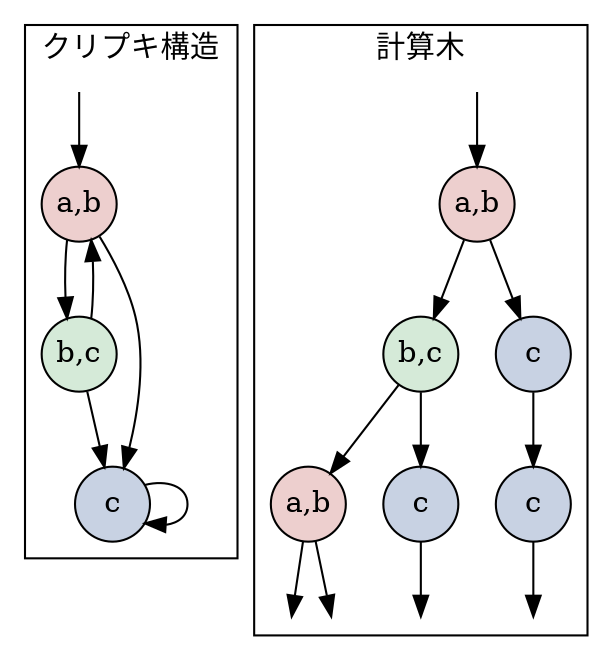
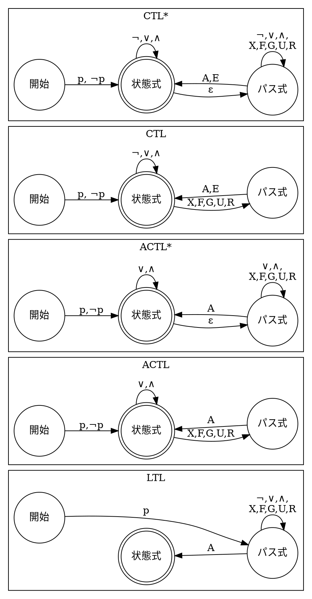
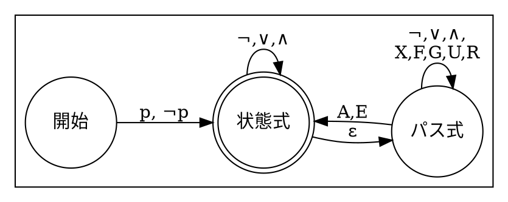
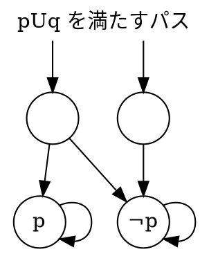
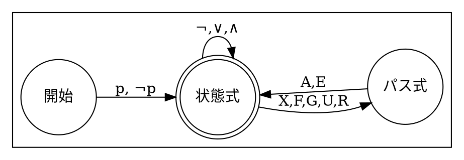
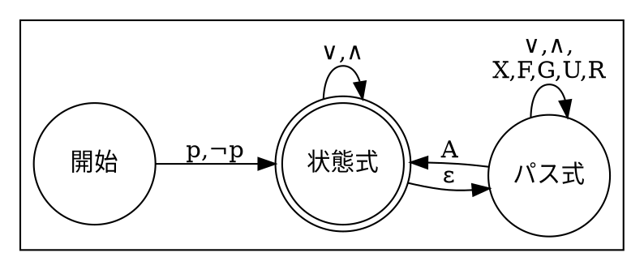
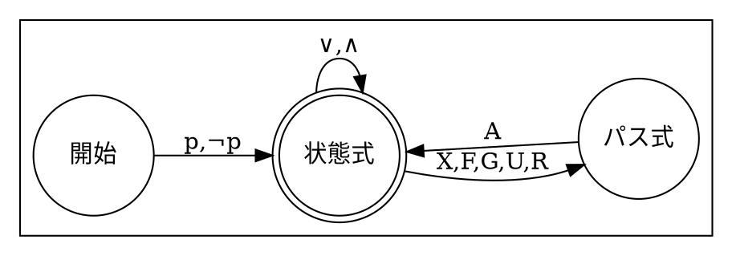
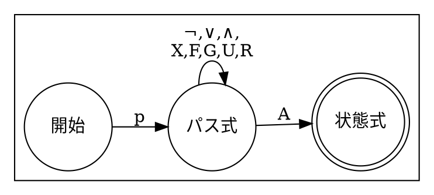
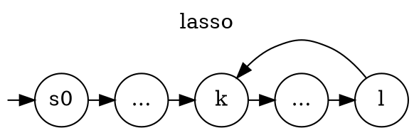

$$
  \gdef\opA{\mathop{\textbf{A}}}
  \gdef\opE{\mathop{\textbf{E}}}
  \gdef\opF{\mathop{\textbf{F}}}
  \gdef\opG{\mathop{\textbf{G}}}
  \gdef\opX{\mathop{\textbf{X}}}
  \gdef\opR{\mathbin{\textbf{R}}}
  \gdef\opU{\mathbin{\textbf{U}}}
  \gdef\opAX{\mathop{\textbf{AX}}}
  \gdef\opAG{\mathop{\textbf{AG}}}
  \gdef\opAF{\mathop{\textbf{AF}}}
  \gdef\opEX{\mathop{\textbf{EX}}}
  \gdef\opEG{\mathop{\textbf{EG}}}
  \gdef\opEF{\mathop{\textbf{EF}}}
  \gdef\opEU{\mathop{\textbf{EU}}}
  \gdef\opAU{\mathop{\textbf{AU}}}
  \gdef\opAR{\mathop{\textbf{AR}}}
  \gdef\opGF{\mathop{\textbf{GF}}}
$$

# MC4 章 時相論理 (Temporal Logic)

本書の目的 : システムがある性質を満たすか、モデル検査で調べたい。

モデル検査の手順 :

1. システムをモデル化する (~3 章)
2. **検証したい性質を記述する (本章)**
3. 検証する (5~章)

性質を記述する方法 :

1. クリプキ構造を**計算木**に変換する。
2. 計算木の性質を**時相論理式**で記述する。

## 計算木 (Computational Tree)

クリプキ構造上の全パスを表した木。

- パスの分岐はあるが、合流はない。
- クリプキ構造から簡単に作れる。
- クリプキ構造には葉ノードがない (left-total) なので、計算木にも葉ノードがない。

例 :



::: {.note}

わざわざ計算木を考える必要性は薄いと思う。<br>
時相理論はクリプキ構造の性質を記述していると考えても問題はない。

:::

## 時相論理

計算木に対して、**複数のパス**や**時間**を考慮した振る舞いを記述できる。

例 :

- 「**全てのパス**で**常に**、`malloc` を呼んだ**直後に**返り値が非ゼロなことを確認する。」
- 「**将来**ゼロ除算をする**パスが存在**する。」
- 「電池残量が 5% を切る**まで**通常モードで動く。」

### 時相論理の演算子

まずは直感的な説明を試みる。<br>
形式的な定義は後述。

- 時相作用素 (temporal operator) : 特定のパスに関する性質。

  - $\opX p$ : 次の (neXt) 状態が $p$ を満たす。

    - ```graphviz
      digraph G {
      node [shape=circle, fixedsize=true];
      graph [rankdir = LR];
        X0 [label="¬p"]
        X1 [label="p"];
        X2 [label="*"];
        X3 [label="*"];
        X4 [label="", width=0, color=none];
        X0 -> X1 -> X2 -> X3 -> X4;
      }
      ```

  - $\opF p$ : 未来 (Future) のどこかで $p$ を満たす。

    - ```graphviz
      digraph G {
      node [shape=circle, fixedsize=true];
      graph [rankdir = LR];
        F0 [label="¬p"]
        F1 [label="¬p"];
        F2 [label="p"];
        F3 [label="*"];
        F4 [label="", width=0, color=none];
        F0 -> F1 -> F2 -> F3 -> F4;
      }
      ```

  - $\opG p$ : 常に (Global) $p$ を満たす。

    - ```graphviz
      digraph G {
      node [shape=circle, fixedsize=true];
      graph [rankdir = LR];
        G0 [label="p"]
        G1 [label="p"];
        G2 [label="p"];
        G3 [label="p"];
        G4 [label="", width=0, color=none];
        G0 -> G1 -> G2 -> G3 -> G4;
      }
      ```

  - $p \opU q$ : 未来のどこかで $q$ になり、かつ、そこに到達するまで (Until) $p$ であり続ける。

    - ```graphviz
      digraph G {
      node [shape=circle, fixedsize=true];
      graph [rankdir = LR];
        U0 [label="p,¬q"]
        U1 [label="p,¬q"];
        U2 [label="*,q"];
        U3 [label="*,*"];
        U4 [label="", width=0, color=none];
        U0 -> U1 -> U2 -> U3 -> U4;
      }
      ```

  - $p \opR q$ : $p$ になったら $q$ でなくて良くなる (Release)。 ($p$ になる状態が現れなくても良い。)

    - ```graphviz
      digraph G {
      node [shape=circle, fixedsize=true];
      graph [rankdir = LR];
        R0 [label="q,¬p"]
        R1 [label="q,¬p"];
        R2 [label="q,p"];
        R3 [label="*,*"];
        R4 [label="", width=0, color=none];
        R0 -> R1 -> R2 -> R3 -> R4;
      }
      ```

- パス量化子 (path quantifiers) : ある状態から始まるパス群に関する性質。
  - $\opA p$ : すべて (All) のパスが $p$ を満たす。
  - $\opE p$ : ある (Exist) パスが $p$ を満たす。

例 :

- 「**全てのパス**で**常に**、`malloc` を呼んだ**直後に**返り値が非ゼロなことを確認する。」
  - $\opAG((\text{mallocを呼ぶ}) \implies \opX (\text{返り値を確認}))$
- 「**将来**ゼロ除算をする**パスが存在**する。」
  - $\opEF((\text{ゼロ除算}))$
- 「電池残量が 5% を切る**まで**通常モードで動く。」
  - $(\text{通常モード})\opU(\text{電池残量5\%未満})$

Q. 適当な性質を考えて、それを時相理論式で表してください。

## 時相論理式の種類

時相論理式は**状態式**と**パス式**に分けられる。

- 状態式 (state formula): ある状態の性質をあらわす。
  - ある状態から始まるパス群に言及できる。
  - 例 1 : $\opG f$ 「ある状態から始まる全てのパスは、性質 $f$ を満たす。」
- パス式 (path formula): あるパスの性質をあらわす。
  - ある一つのパスにのみ言及できる。
  - 例 1 : $\opF f$ 「あるパスがいつかは性質 $f$ を満たす。」
  - 例 3 : $\opX f$ 「あるパスの 2 番目の状態が性質 $f$ を満たす。」
  - 例 2 : $f$ 「パスの先頭の状態が性質 $f$ を満たす。」

## 時相論理の種類と関係

「演算子の使い方のルール」に応じて、表現力の異なる多様なな時相論理がある。

<svg width="50%" viewBox="0 0 200 130" xmlns="http://www.w3.org/2000/svg" style="background-color:white">
  <text x="10" y="25" font-family="Verdana" font-size="8">CTL*</text>
  <text x="35" y="65" font-family="Verdana" font-size="8">CTL</text>
  <text x="130" y="30" font-family="Verdana" font-size="8">ACTL*</text>
  <text x="88" y="65" font-family="Verdana" font-size="8">ACTL</text>
  <text x="135" y="65" font-family="Verdana" font-size="8">LTL</text>
  <ellipse cx="100" cy="65" rx="90" ry="60" fill="none" stroke=black />
  <ellipse cx="70"  cy="65" rx="60" ry="50" fill="none" stroke=black />
  <ellipse cx="130" cy="65" rx="60" ry="50" fill="none" stroke=black />
  <path d="M 120 37 C 60 35, 60 95, 120 93" fill="none" stroke=black />
  <ellipse cx="130" cy="65" rx="30" ry="30" fill="none" stroke=black />
</svg>

|                  |                          Branching-Time Logic                          |             Linear-Time Logic              |
| :--------------: | :--------------------------------------------------------------------: | :----------------------------------------: |
|   該当する論理   |                        CTL, CTL\* ACTL\*, ACTL                         |                    LTL                     |
| パス量化子の扱い |                             何回でも使える                             |        式の先頭に 1 度しか使えない         |
|   見ているもの   |                                 木全体                                 | あり得るパスの集合<br>(分岐の情報は落ちる) |
| 部分式が表すもの |                              部分木の性質                              |               部分パスの性質               |
|  書ける性質の例  | 全てのパスで、いつかは「次にどの分岐でも実行が終わる」状態に到達する。 |    全てのパスで、いつかは実行が終わる。    |

### 時相論理式の作り方

時相論理式の目的は、システムの開始状態から始まるパス群の性質を記述すること。<br>
そのため、どの論理も受理するのは状態式だけ。

::: {#compare}



:::

以降では、これら時相論理の体系を見ていく。

## CTL\*

### 文法

記法 : $f$, $g$ は状態式、 $\phi$, $\psi$ はパス式。

- 状態式 (state formula): ある状態の性質をあらわす。
  - A1 : 原子命題 (atomic proposition) $\mathrm{AP}$ の要素
  - A2 : $\neg f$, $f \lor g$, $f \land g$
  - A3 : $\opE \phi$, $\opA \phi$
- パス式 (path formula): あるパスの性質をあらわす。
  - A4 : 状態式すべて (後述)
  - A5 : $\neg \phi$, $\phi \lor \psi$, $\phi \land \psi$, $\opX \phi$, $\opF \phi$, $\opG \phi$, $\phi\opU \psi$, $\phi\opR \psi$
- CTL\* 式
  - 状態式全て。



### 意味論

クリプキ構造 $M$ 上の状態 $s$ とパス $\pi$ について、次のように CTL\* 式の意味を定義する。

記法 :

- $p$ : 原子命題
- $f$, $g$ : 状態式
- $\phi$, $\psi$ : パス式
- $\pi^i$ : `π[i:]` @ Python
- $s_i$ : `π[i]` @ Python
- $M,s \models f$ : クリプキ構造 $M$ の状態 $s$ は、性質 $f$ を充足する ($M, s$ models $f$ と読む) 。
- $S_0$ : 初期状態集合。

---

状態式 :

$$
\begin{align}
  &M, s \models p &\:\stackrel{\mathrm{def}}{=}\: &p \in L(s)\\
  &M, s \models \neg f &\:\stackrel{\mathrm{def}}{=}\: &M, s \not\models f\\
  &M, s \models f \lor g &\:\stackrel{\mathrm{def}}{=}\: &(M, s \models f) \lor (M, s \models g)\\
  &M, s \models f \land g &\:\stackrel{\mathrm{def}}{=}\: &(M, s \models f) \land (M, s \models g)\\
  &M, s \models \opE \phi &\:\stackrel{\mathrm{def}}{=}\: &\exist \pi \:\text{s.t.}\: s_0 = s, M,\pi \models \phi\\
  &M, s \models \opA \phi &\:\stackrel{\mathrm{def}}{=}\: &\forall \pi \:\text{s.t.}\: s_0 = s, M,\pi \models \phi\\
\end{align}
$$

パス式 :

$$
\begin{align}
  &M, \pi \models f &\:\stackrel{\mathrm{def}}{=}\: &M, s_0 \models f\\
  &M, \pi \models \neg \phi &\:\stackrel{\mathrm{def}}{=}\: &M, \pi \not\models \phi\\
  &M, \pi \models \phi \lor \psi &\:\stackrel{\mathrm{def}}{=}\: &(M, \pi \models \phi) \lor (M, \pi \models \psi)\\
  &M, \pi \models \phi \land \psi &\:\stackrel{\mathrm{def}}{=}\: &(M, \pi \models \phi) \land (M, \pi \models \psi)\\
  &M, \pi \models \opX \phi &\:\stackrel{\mathrm{def}}{=}\: &(M, \pi^1 \models \phi)\\
  &M, \pi \models \opF \phi &\:\stackrel{\mathrm{def}}{=}\: &\exist k, M, \pi^k \models \phi\\
  &M, \pi \models \opG \phi &\:\stackrel{\mathrm{def}}{=}\: &\forall k, M, \pi^k \models \phi\\
  &M, \pi \models \phi \opU \psi &\:\stackrel{\mathrm{def}}{=}\: &\exist k, (M, s_k \models \psi) \land (\forall j < k,\: M, s_j \models \phi)\\
  &M, \pi \models \phi \opR \psi &\:\stackrel{\mathrm{def}}{=}\: &\forall k, (\forall j < k, M,s_j \not\models \phi) \implies M,s_k \models \psi
\end{align}
$$

モデル全体 :

$$
\begin{align}
    &M \models f  &\:\stackrel{\mathrm{def}}{=}\: &\forall s \in S_0,\: M,s \models f
\end{align}
$$

### 補足 : $\opU$, $\opR$ の定義について

- $M, \pi \models p \opU q \:\stackrel{\mathrm{def}}{=}\: \exist k, (M, s_k \models q) \land (\forall j < k,\: M, s_j \models p)$

  - いつかは $\psi$ を満たす状態が現れる。
  - かつ、それ以前の状態は全て $\phi$ を満たす。

  - ```graphviz
    digraph G {
    node [shape=circle, fixedsize=true];
    graph [rankdir = LR];
      U0 [label="p,¬q"]
      U1 [label="p,¬q"];
      U2 [label="*,q"];
      U3 [label="*,*"];
      U4 [label="", width=0, color=none];
      U0 -> U1 -> U2 -> U3 -> U4;
    }
    ```

- $M, \pi \models p \opR q \:\stackrel{\mathrm{def}}{=}\: \forall k, (\forall j < k, M,s_j \not\models p) \implies M,s_k \models q$

  - ある状態について、それ以前の状態が全て $\phi$ を満たすなら、その状態は $\psi$ を満たす。

  - ```graphviz
    digraph G {
    node [shape=circle, fixedsize=true];
    graph [rankdir = LR];
      R0 [label="q,¬p"]
      R1 [label="q,¬p"];
      R2 [label="q,p"];
      R3 [label="*,*"];
      R4 [label="", width=0, color=none];
      R0 -> R1 -> R2 -> R3 -> R4;
    }
    ```

### 特異な性質 : $M,s \not\models f$ かつ $M,s \not\models \neg f$ な $M$, $f$ の存在

- $\opEX p$
- $\neg\opEX p$



この様な状況は、開始状態が 1 つの場合には生じない。

### 余談 : 充足可能・有効

- $f$ は充足可能 (satisfiable) : $M \models f$: を満たす $M$ が存在する。
- $f$ は有効 (valid) : すべての $M$ が $M \models f$ を満たす。

充足可能性・有効性の判定は難しい問題だが、モデル検査をする上では不要な概念。<br>
なぜなら、与えられた $M$ と $f$ に対して $M \models f$ を調べれば良いから。

### 正規化 @ 最低限の演算子で

CTL\* 式は ${\lor, \neg, \opX, \opU, \opE }$ だけで書ける。<br>
のこる $\land$, $\opR$, $\opF$, $\opG$, $\opA$ は次のように変形できる。

$$
\begin{align}
  &f \land g &\:\equiv\: &\neg(\neg f \lor \neg g)\\
  &f \opR g &\:\equiv\: &\neg(\neg f \opU \neg g)\\
  &\opF f &\:\equiv\: &\mathrm{true} \opU f\\
  &\opG f &\:\equiv\: &\neg\opF\neg f\\
  &\opA f &\:\equiv\: &\neg\opE\neg f
\end{align}
$$

これら関係の証明は、先述の形式的定義などから証明できる。<br>

なお、$\opU$ と $\opR$ の関係について自然言語による直感的な説明を試みたが、断念した。<br>
自然言語では論理の判定が難しすぎる。

- 「修理するまで壊れている」の否定は「修理をやめるまで壊れてない」
- 「諦めるまでは試合中」の否定は、「試合終了まで諦めない」
- ...?

代わりに $\opU$ と $\opR$ の関係を形式的に証明しておく。

$$
\begin{align*}
  &M, \pi \models \phi \opU \psi &\:\stackrel{\mathrm{def}}{=}\: &\exist k, (M, s_k \models \psi) \land (\forall j < k,\: M, s_j \models \phi)\\
  &M, \pi \models \phi \opR \psi &\:\stackrel{\mathrm{def}}{=}\: &\forall k, (\forall j < k, M,s_j \not\models \phi) \implies M,s_k \models \psi
\end{align*}
$$

$$
\begin{align*}
  \neg(\neg f\opU\neg g)
    &= \neg(\exist k, (M, s_k \models \neg g) \land (\forall j < k,\: M, s_j \models \neg f))\\
    &= \forall k, \neg(M, s_k \models \neg g) \lor \neg(\forall j < k,\: M, s_j \models \neg f))\\
    &= \forall k, (M, s_k \models g) \lor \neg(\forall j < k,\: M, s_j \not\models f))\\
    &= \forall k, (\forall j < k,\: M, s_j \not\models f) \implies (M, s_k \models g)\\
    &= f \opR g
\end{align*}
$$

### 正規化 @ 否定標準形 (NNF : Negation Normal Form)

任意の CTL\* 式は、$\neg$ が原子命題だけにつく否定標準形に変形できる。

$$
\begin{align}
  &\neg\opA p &\:\equiv\: &\opE \neg p\\
  &\neg\opE p &\:\equiv\: &\opA \neg p\\
  &\neg\opG p &\:\equiv\: &\opF \neg p\\
  &\neg\opF p &\:\equiv\: &\opG \neg p\\
  &\neg\opX p &\:\equiv\: &\opX \neg p\\
  &\neg(p \land q) &\:\equiv\: &\neg p \lor \neg q\\
  &\neg(p \lor q) &\:\equiv\: &\neg p \land \neg q\\
  &\neg(p\opU q) &\:\equiv\: &\neg p\opR \neg q\\
  &\neg(p\opR q) &\:\equiv\: &\neg p\opU \neg q
\end{align}
$$

#### NNF と式のサイズ

- 式のサイズ : 式に現れる原子命題の延べ数と、演算子の延べ数。 ([推論元の情報](https://www.sciencedirect.com/science/article/pii/S0004370214000228))
- 主張 : **ほとんどの式のサイズは、変換の前後で定数倍にしかならない**。
- 直感的な説明 :
  - 変換前の式について
    - $\neg$ が 2 つ以上続くことはないとする。
    - 元の式中に出現する原子命題の数を $a$, $\neg$ 以外の演算子の数を $b$, $\neg$ の数を $c$ と置く。
    - $\neg$ は原子命題や演算子に一つまで付けることができるため、 $c \leq a + b$ である。
    - 式のサイズは $a + b + c$ であり、 $a + b$ 以上である。
  - 変換後の式について
    - どの変換規則を用いても、原子命題の数と $\neg$ 以外の演算子の数は変化しない。
    - NNF の制約より、変換後の $\neg$ の数は、式内の原子命題の数 $b$ 以下である。
    - → 変換後の式のサイズは $a + b + b = a + 2b$ 以下である。
    - これは $a + b$ の定数倍のオーダーである。

> It is important to note that the conversion of a CTL\* formula to NNF is linear in the size of the formula.<br>
> This is true for many fragments of CTL\*.

## CTL

制約 : パス量化子と時相作用素を常にペアで使う。

- $\{ \opA , \opE  \} \times \{ \opX , \opF , \opG , \opU , \opR \}$ の十種の操作が可能。

### 文法

- B1 : 原子命題 $p$
- B2 : $\neg f, \opAX f, \opEX f, \opAF f, \opEF f, \opAG f, \opEG f$ (ただし $f$ は CTL 式)
- B3 : $f \land g$, $f \lor g$, $\opA(f \opU g)$, $\opE(f \opU g)$, $\opA(f \opR g)$, $\opE(f \opR g)$ (ただし $f$, $g$ は CTL 式)



### 正規化

CTL 式は $\opEX$, $\opEG$, $\opEU$ の 3 種の操作だけで記述できる。

$$
\begin{align}
    &\opAX f &\:\equiv\: &\neg\opEX \neg f\\
    &\opEF f &\:\equiv\: &\opE(\mathrm{true}\opU f)\\
    &\opAG p &\:\equiv\: &\neg\opEF\neg f\\
    &\opAF p &\:\equiv\: &\neg\opEG\neg f\\
    &\opA(f\opU g) &\:\equiv\: &\neg\opE(\neg g\opU(\neg f\land\neg g))\land\neg\opEG\neg g\\
    &\opA(f\opR g) &\:\equiv\: &\neg\opE(\neg f\opU\neg g)\\
    &\opE(f\opR g) &\:\equiv\: &\neg\opA(\neg f\opU\neg g)
\end{align}
$$

## ACTL\*

制約 : パス量化子は $\opA$ のみで、かつ、 NNF 。<br>
($\opE$ 版の ECTL\* という論理もある)

### 文法

- 状態式 (state formula):
  - C1 : 原子命題とその否定 $p$, $\neg p$
  - C2 : $f \lor g$, $f \land g$ (ただし $f$, $g$ は状態式)
  - C3 : $\opA f$ (ただし $f$ はパス式)
- パス式 (path formula):
  - C4 : 状態式すべて
  - C5 : $f \lor g$, $f \land g$, $\opX f$, $\opF f$, $\opG f$, $f\opU g$, $f\opR g$ (ただし $f$, $g$ はパス式)
- ACTL\* 式:
  - 状態式全て



### 正規化

$\opX$, $\opU$, $\opR$ のみの形に変形可能。

## ACTL

制約 : 作用素は $\{ \opA \} \times \{ \opX, \opF, \opG, \opU, \opR \}$ の 5 種のみ。

### 文法

- 状態式 (state formula):
  - D1 : 原子命題とその否定 $p$, $\neg p$
  - D2 : $\opAX f$, $\opAF f$, $\opAG f$ (ただし $f$ は状態式)
  - D3 : $f \land g$, $f \lor g$, $\opA(f \opU g)$, $\opA(f \opR g)$ (ただし $f$, $g$ は状態式)
- パス式 (path formula):
  - D4 : 状態式すべて
- ACTL 式:
  - 状態式全て



### 正規化

$\opAX$, $\opAU$, $\opAR$ だけで書ける。

## LTL

制約 : $\opA f$ (ただし $f$ は CTL\* のパス式のうち、 $\opA$ と $\opE$ を持たないもの) の形をしている。

### 文法

- パス式:
  - E1 : 原子命題 $p$
  - E2 : $\neg f$, $\opX f$, $\opF f$, $\opG f$ (ただし $f$ はパス式)
  - E3 : $f \lor g$, $f \land g$, $f\opU g$, $f\opR g$ (ただし $f$, $g$ はパス式)
- LTL 式
  - E4 : $\opA f$ (ただし $f$ はパス式のうち、 $\opA$ と $\opE$ を持たないもの)



## 時相論理まとめ

<clone ref="compare"></clone>

## 集合原子命題

より柔軟な記述を可能にするため、 CTL\* に特殊な原子命題を導入する。<br>
なお、これは表現力の拡張ではない。

集合原子命題 (set atomic proposition):

- 状態の集合 $Q \subseteq S$ を原子命題とみなし、集合原子命題と呼ぶ。
- 意味論 : $M,s \models Q := s \in Q$

また、次の記法を導入する。

$$ \llbracket f\rrbracket_M := \{ s \in S \mid M,s \models f\} $$

## 公平性 (Fairness)

3 章で見てきた通り、公平性の考慮は大切である。<br>
公平性を扱うために、**公平パス**を導入する。

### 公平パス (Fair Path)

パス $\pi$ が公平性制約 $F$ のもとで公平 (fair) であるとは、次を満たすことである。

$$ \forall P \in F, P \cap \mathop{\mathrm{inf}}(\pi) \neq \{\}$$

ただし、

- $F \subset 2^{S}$ は公平性制約 (Fairness Constraints)
- $\mathop{\mathrm{inf}}(\pi) \stackrel{\mathrm{def}}{=} \{s \in S \mid s \text{ が } \pi \text{ 上に無限回出現}\}$

である。

例えば $F = \{\{ a, b\}, \{ c \}\}$ のとき、 $\pi$ が公平である条件は :

- $\pi$ 上に $a$, $b$ のいずれかが無限に現れる。
- $\pi$ 上に $c$ が無限に現れる。

### CTL\* での公平性の扱い

CTL\* 式 $\mathrm{fpath}$ を考える。

$$ \mathrm{fpath} := \bigwedge_{P \in F} \bigvee_{s \in P} \opGF s $$

- $\opE(\mathrm{fpath} \land \phi)$ : 公平で $\phi$ を満たすパスが存在
- $\opA(\mathrm{fpath} \implies \phi)$ : 公平なパスはすべて $\phi$ を満たす。
  - 一般のクリプキ構造上には、不公平なパスが存在する。
  - 知りたいのは公平パスに関する性質なので、 $\implies$ で不公平なパスを除外する。
  - 公平パスが存在しない場合は $\phi$ によらず恒真。

### CTL での公平性の扱い

- 文法的に $\bigwedge_{P \in F} \bigvee_{s\in P} \opGF s$ は非文。
- → 公平クリプキ構造 (fair Kripke structure) を使い、$\opE$, $\opA$ の意味論を変える。

公平クリプキ構造 $M = (S, S_0, R, L, \mathrm{AP}, F)$ :

- クリプキ構造に公平性制約 $F \subset 2^{S}$ を加えたもの。

公平意味論 (fair semantics):

- $M,s \models_F \opE \phi$ :
  - $M$ 上の $s$ で始まる公平パスで、 $\phi$ が成り立つものが存在する。
  - $M,s \models \opE_F \phi$ とも書く。
- $M,s \models_F \opA \phi$ : $\forall \pi \text{s.t.} s_0 = s \land \pi \text{は公平パス}, \pi \models_F = \phi$
  - $M$ 上の $s$ で始まる全ての公平パスで、 $\phi$ が成り立つ。
  - $M,s \models \opA_F \phi$ とも書く。
  - 公平パスが存在しない場合は $\phi$ によらず恒真。

$p$, $\opE p$, $\opA p$ は同じ意味。<br>
 $p$, $\opE_F p$, $\opA_F p$ は違う意味。

---

Q. $F = \{ S \}$ が表している制約は？

## 反例 (Counterexamples)

モデル検査の基本 :

- 仕様を満たさないパス (反例) を探す。

反例パスの要件 :

- 表現が有限長 (例 : $s_0 s_1 (s_2 s_3)^\omega$) であること。

ここでは、任意の反例が有限長で表せるかを議論する。<br>
以下では、状態数が有限なクリプキ構造 (finite Kripke structure) を仮定する。

### 反例は有限の情報で表現できるか？

- $\opAX p$ の反例 : $\opX \neg p$ なパス
  - → 頭 2 状態だけあれば十分。
- $\opAG p$ の反例 : $\opF \neg p$ なパス
  - → $\neg p$ になる状態までの部分パス (有限長) で十分。
- $\opAF p$ の反例 : $\opG \neg p$ なパス
  - → ...?

主張 :

- $\opG \neg p$ なパスには、 $a \cdots c (d \cdots e)^\omega$ の形式で書けるものが存在する。

証明 :

- まず、反例 $\pi$ を適当に選ぶ。
- $\pi$ は無限長だが状態数は有限なので、$\pi$ 上に 2 回以上現れる状態 $k$ が存在する。
- つまり、 $\pi$ は $s_0 \stackrel{a}{\cdots} k \stackrel{b}{\cdots} k \cdots$ と書ける。
- このとき、 $\pi' := s_0 \stackrel{a}{\cdots} (k\stackrel{b}{\cdots})^\omega$ は $\opG\neg p$ を満たす、表現が有限長なパスである。

こうした構造は lasso (投げ縄) と呼ばれる。



一般には公平性等も考える必要があるが、詳しい議論は 7 章で行う。

## Safety, Liveness

- Safety : 「悪いことは起きない」
  - 例 : Use-after-error が起きない。
  - 例 : $\opAG \neg\text{(悪いこと)}$
- Liveness 「いつかは良いことが起こる」
  - 例 : 開いたファイルはいつか閉じられる。
  - 例 : $\opAF \text{(良いこと)}$ や $\opA(p \opU \text{(良いこと)})$

Safety か liveness かの見分け方 : 反例を考える。

- Safety の反例は「悪いことが起きる」 → ループのない有限長パス。
- Liveness の反例は「良いことが起きない」 → 無限長パス。

## まとめ

- 時相論理は、計算木に対して、<quiz>複数のパスや時間</quiz>を考慮した振る舞いを記述できる。
- 時相論理には、表現能力の異なる論理がたくさんあり、 CTL\*, CTL, ATL\*, ATL, LTL の中で最も表現力が高いのは<quiz>CTL\*</quiz>である。
- CTL\* で公平性を扱うには、公平性制約 $F \subset 2^{S}$ を用意して、式 $\mathrm{fpath} := \bigwedge_{P \in F} \bigvee_{s \in P} \opGF s$ を考える。
- Safety は「<quiz>悪いことは起きない</quiz>」という類の性質である。
- Liveness は「<quiz>いつかは良いことが起きる</quiz>」という類の性質である。

## Bibliographic Notes

- 時相論理を拡張・一般化する方法は様々ある。
- past 演算子の導入
  - LTL の表現能力は上がらなかった
  - しかし、 modular な仕様の記述や式の単純化に役立った。
- 正規表現の導入
  - dynamic logic が著名。
  - 実践的なものとして、 PSL や ForSpec などがある。
- μ-計算 (16 章)。
- Propositional quantification と first-order temporal logic を区別する。
  - > Here, we distinguish propositional quantification — where the quantifier ranges over labelings of the Kripke structure or the computation tree — and first-order temporal logic, where the states are logical structures and the first-order quantifiers range over domain elements in these structures.
- 一階述語論理、二階述語論理として研究する。
