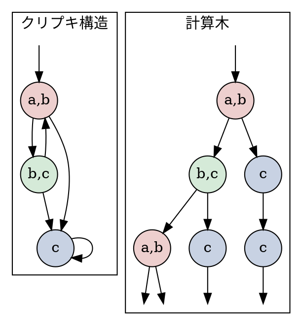
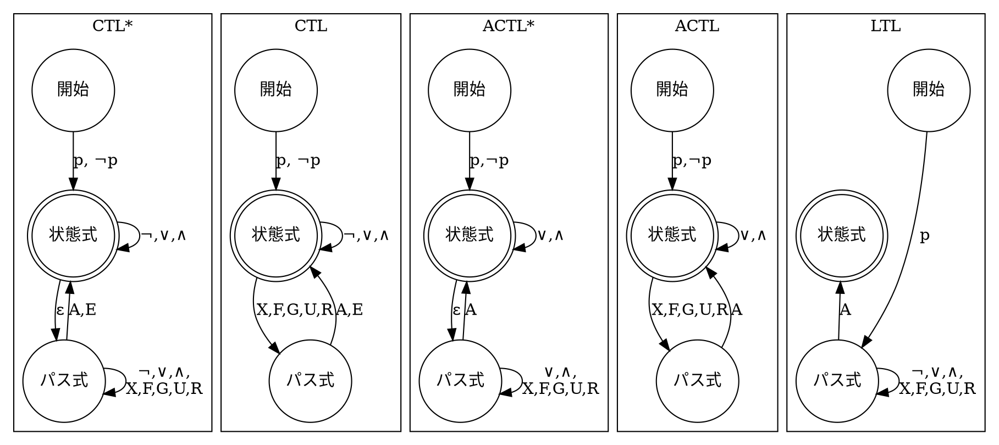
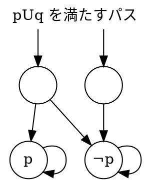
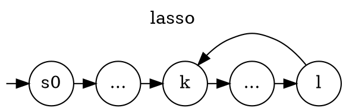

$$
    \gdef\opA{\mathop{\textbf{A}}}
    \gdef\opE{\mathop{\textbf{E}}}
    \gdef\opF{\mathop{\textbf{F}}}
    \gdef\opG{\mathop{\textbf{G}}}
    \gdef\opX{\mathop{\textbf{X}}}
    \gdef\opR{\mathbin{\textbf{R}}}
    \gdef\opU{\mathbin{\textbf{U}}}
    \gdef\opAX{\mathop{\textbf{AX}}}
    \gdef\opAG{\mathop{\textbf{AG}}}
    \gdef\opAF{\mathop{\textbf{AF}}}
    \gdef\opEX{\mathop{\textbf{EX}}}
    \gdef\opEG{\mathop{\textbf{EG}}}
    \gdef\opEF{\mathop{\textbf{EF}}}
    \gdef\opEU{\mathop{\textbf{EU}}}
    \gdef\opAU{\mathop{\textbf{AU}}}
    \gdef\opAR{\mathop{\textbf{AR}}}
    \gdef\opGF{\mathop{\textbf{GF}}}
$$

# MC4 章 時相論理 (Temporal Logic)

本書の目的 : システムがある性質を満たすか調べたい。

手順 :

1. システムをモデル化する (~3 章)
2. **検証したい性質を記述する (本章)**
3. 検証する (5~章)

性質を記述する方法 :

1. クリプキ構造を*計算木*に変換する。
2. 計算木に対し、*時相論理式*を用いて性質を記述する。

## 計算木 (Computational Tree)

クリプキ構造上のパスを全て表した木構造。

- パスの分岐はあるが、合流はない。
- クリプキ構造から簡単に作れる。
- クリプキ構造は left-total (全てのノードが子を持つ) なので、計算木も left-total である。

例 :



## 時相論理

計算木の**時間的な**振る舞いを記述できる論理。

例 :

- 「**全ての**パスにおいて**常に**、`malloc` を呼んだら、**次に**返り値が非ゼロなことを確認する。」
- 「**全ての**パスにおいて**常に**、メモリを確保したら、**いつかは**それを開放する。」
- 「**常に** root 権限を持っているパスが**存在**する。」
- 「電池残量が 5%を切る**まで**通常モードで動く。」
- 「電源ボタンが押されるまでスリープし続ける。」

### 時相論理の演算子

- パス量化子 (path quantifiers) : ある状態から始まるパス群に関する性質。
  - $\opA p$ : すべて (All) のパスが $p$ を満たす。
  - $\opE p$ : ある (Exist) パスが $p$ を満たす。
- 時相作用素 (temporal operator) : 特定のパスに関する性質。

  - $\opX p$ : 次の (neXt) 状態が $p$ を満たす。

    - ```graphviz
      digraph G {
      node [shape=circle, fixedsize=true];
      graph [rankdir = LR];
        X0 [label="¬p"]
        X1 [label="p"];
        X2 [label="*"];
        X3 [label="*"];
        X4 [label="", width=0, color=none];
        X0 -> X1 -> X2 -> X3 -> X4;
      }
      ```

  - $\opF p$ : 未来 (Future) のどこかで $p$ を満たす。

    - ```graphviz
      digraph G {
      node [shape=circle, fixedsize=true];
      graph [rankdir = LR];
        F0 [label="¬p"]
        F1 [label="¬p"];
        F2 [label="p"];
        F3 [label="*"];
        F4 [label="", width=0, color=none];
        F0 -> F1 -> F2 -> F3 -> F4;
      }
      ```

  - $\opG p$ : 常に (Global) $p$ を満たす。

    - ```graphviz
      digraph G {
      node [shape=circle, fixedsize=true];
      graph [rankdir = LR];
        G0 [label="p"]
        G1 [label="p"];
        G2 [label="p"];
        G3 [label="p"];
        G4 [label="", width=0, color=none];
        G0 -> G1 -> G2 -> G3 -> G4;
      }
      ```

  - $p \opU q$ : 未来のどこかで $q$ になり、かつ、そこに到達するまで (Until) $p$ であり続ける。

    - ```graphviz
      digraph G {
      node [shape=circle, fixedsize=true];
      graph [rankdir = LR];
        U0 [label="p,¬q"]
        U1 [label="p,¬q"];
        U2 [label="*,q"];
        U3 [label="*,*"];
        U4 [label="", width=0, color=none];
        U0 -> U1 -> U2 -> U3 -> U4;
      }
      ```

  - $p \opR q$ : $p$ になるまで $q$ であり続ける。 ($p$ になる状態が現れなくても良い。)

    - ```graphviz
      digraph G {
      node [shape=circle, fixedsize=true];
      graph [rankdir = LR];
        R0 [label="q,¬p"]
        R1 [label="q,¬p"];
        R2 [label="q,p"];
        R3 [label="*,*"];
        R4 [label="", width=0, color=none];
        R0 -> R1 -> R2 -> R3 -> R4;
      }
      ```

例 :

- 「**全ての**パスにおいて**常に**、`malloc` を呼んだら、**次に**返り値が非ゼロなことを確認する。」
  - → $\opAG(\text{mallocを呼んだ} \implies \opX \text{返り値を確認})$
- 「**全ての**パスにおいて**常に**、メモリを確保したら、**いつかは**それを開放する。」
  - → $\opAG(\text{メモリaを確保した} \implies \opF \text{aを開放})$
- 「**常に** root 権限を持っているパスが**存在**する。」
  - → $\opEG(\text{root権限})$

## 時相論理の種類と関係

「演算子を使う上での制約」に応じて、表現力の異なる様々な時相論理がある。
<svg width="100%" viewBox="0 0 200 130" xmlns="http://www.w3.org/2000/svg" style="background-color:white">
<text x="10" y="25" font-family="Verdana" font-size="8">CTL*</text>
<text x="35" y="65" font-family="Verdana" font-size="8">CTL</text>
<text x="130" y="30" font-family="Verdana" font-size="8">ACTL*</text>
<text x="88" y="65" font-family="Verdana" font-size="8">ACTL</text>
<text x="135" y="65" font-family="Verdana" font-size="8">LTL</text>
<ellipse cx="100" cy="65" rx="90" ry="60" fill="none" stroke=black />
<ellipse cx="70"  cy="65" rx="60" ry="50" fill="none" stroke=black />
<ellipse cx="130" cy="65" rx="60" ry="50" fill="none" stroke=black />
<path d="M 120 37 C 60 35, 60 95, 120 93" fill="none" stroke=black />
<ellipse cx="130" cy="65" rx="30" ry="30" fill="none" stroke=black />
</svg>

|                  |                          Branching-Time Logic                          |             Linear-Time Logic              |
| :--------------: | :--------------------------------------------------------------------: | :----------------------------------------: |
|   該当する論理   |                           CTL, ACTL\*, ACTL                            |                    LTL                     |
| パス量化子の扱い |                             何回でも使える                             |        式の先頭に 1 度しか使えない         |
|   見ているもの   |                                 木全体                                 | あり得るパスの集合<br>(分岐の情報は落ちる) |
| 部分式が表すもの |                              部分木の性質                              |               部分パスの性質               |
|  書ける性質の例  | 全てのパスで、いつかは「次にどの分岐でも実行が終わる」状態に到達する。 |    全てのパスで、いつかは実行が終わる。    |

### 時相論理式の作り方



以降では、これら時相論理の体系を見ていく。

## CTL\*

### 文法

- 状態式 (state formula): ある状態の性質をあらわす。
  - A1 : Atomic proposition $\mathrm{AP}$ の要素
  - A2 : $\neg f$, $f \lor g$, $f \land g$ (ただし $f$, $g$ は状態式)
  - A3 : $\opE f$, $\opA f$ (ただし $f$ はパス式)
- パス式 (path formula): あるパスの性質をあらわす。
  - A4 : 状態式すべて (パスの先頭状態が状態式を満たしているか否か)
  - A5 : $\neg f$, $f \lor g$, $f \land g$, $\opX f$, $\opF f$, $\opG f$, $f\opU g$, $f\opR g$ (ただし $f$, $g$ はパス式)
- CTL\* 式
  - 状態式全て。

### 意味論

クリプキ構造 $M$ 上の状態 $s$ とパス $\pi$ について、次のように CTL\* 式の意味を定義する。

- $p$ : 原子命題
- $f_1$, $f_2$ : 状態式
- $g_1$, $g_2$ : パス式
- $\pi^i$ : Python でいう `π[i:]`
- $s_i$ : Python でいう `π[i]`

状態式 :

$$
\begin{align}
    &M, s \models p &\:\stackrel{\mathrm{def}}{=}\: &p \in L(s)\\
    &M, s \models \neg f_1 &\:\stackrel{\mathrm{def}}{=}\: &M, s \not\models f_1\\
    &M, s \models f_1 \lor f_2 &\:\stackrel{\mathrm{def}}{=}\: &(M, s \models f_1) \lor (M, s \models f_2)\\
    &M, s \models f_1 \land f_2 &\:\stackrel{\mathrm{def}}{=}\: &(M, s \models f) \land (M, s \models f_2)\\
    &M, s \models \opE g_1 &\:\stackrel{\mathrm{def}}{=}\: &\exist \pi \:\text{s.t.}\: s_0 = s, M,\pi \models g_1\\
    &M, s \models \opA g_1 &\:\stackrel{\mathrm{def}}{=}\: &\forall \pi \:\text{s.t.}\: s_0 = s, M,\pi \models g_1\\
\end{align}
$$

パス式 :

$$
\begin{align}
    &M, \pi \models f_1 &\:\stackrel{\mathrm{def}}{=}\: &M, s_0 \models f_1\\
    &M, \pi \models \neg g_1 &\:\stackrel{\mathrm{def}}{=}\: &M, \pi \not\models g_1\\
    &M, \pi \models g_1 \lor g_2 &\:\stackrel{\mathrm{def}}{=}\: &(M, \pi \models g_1) \lor (M, \pi \models g_2)\\
    &M, \pi \models g_1 \land g_2 &\:\stackrel{\mathrm{def}}{=}\: &(M, \pi \models g_1) \land (M, \pi \models g_2)\\
    &M, \pi \models \opX g_1 &\:\stackrel{\mathrm{def}}{=}\: &(M, \pi^1 \models g_1)\\
    &M, \pi \models \opF g_1 &\:\stackrel{\mathrm{def}}{=}\: &\exist k, M, \pi^k \models g_1\\
    &M, \pi \models \opG g_1 &\:\stackrel{\mathrm{def}}{=}\: &\forall k, M, \pi^k \models g_1\\
    &M, \pi \models g_1 \opU g_2 &\:\stackrel{\mathrm{def}}{=}\: &(\exist k, M, \pi^k \models g_2) \land (\forall j \leq k,\: M, \pi^i \models g_1)\\
    &M, \pi \models g_1 \opR g_2 &\:\stackrel{\mathrm{def}}{=}\: &\forall j, (\forall i < j, M,\pi^i \not\models g_1) \implies M,\pi^j \models g_2
\end{align}
$$

モデル全体 :

$$
\begin{align}
    &M \models f_1  &\:\stackrel{\mathrm{def}}{=}\: &\forall s \in S_0,\: M,s \models f_1
\end{align}
$$

### 用語

- $f$ は充足可能 (satisfiable) : $M \models f$: を満たす $M$ が存在する。
- $f$ は有効 (valid) : すべての $M$ が $M \models f$ を満たす。

充足可能性・有効性の判定は難しい問題だが、モデル検査をする上では不要な概念。<br>
なぜなら、与えられた $M$ と $f$ に対して $M \models f$ を調べれば良いから。

### 正規化 @ 最低限の演算子で

CTL\* 式は ${\lor, \neg, \opX, \opU, \opE }$ だけで書ける。<br>
のこる $\land$, $\opR$, $\opF$, $\opG$, $\opA$ は次のように変形できる。

$$
\begin{align}
    &f \land g &\:\equiv\: &\neg(\neg f \lor \neg g)\\
    &f \opR g &\:\equiv\: &\neg(\neg f \opU \neg g)\\
    &\opF f &\:\equiv\: &\mathrm{true} \opU f\\
    &\opG f &\:\equiv\: &\neg\opF\neg f\\
    &\opA f &\:\equiv\: &\neg\opE\neg f
\end{align}
$$

これら関係の証明は、先述の形式的定義などから証明できる。<br>

なお、$\opU$ と $\opR$ の関係について自然言語による直感的な説明を試みたが、断念した。<br>
自然言語では論理の判定が難しすぎる。

- 「修理するまで壊れている」の否定は「修理をやめるまで壊れてない」
- 「諦めるまでは試合中」の否定は、「試合終了まで諦めない」

### 正規化 @ 否定標準形 (NNF : Negation Normal Form)

任意の CTL\* 式は、$\neg$ が原子命題だけにつく否定標準形に変形できる。

$$
\begin{align}
    &\neg\opA p &\:\equiv\: &\opE \neg p\\
    &\neg\opE p &\:\equiv\: &\opA \neg p\\
    &\neg\opG p &\:\equiv\: &\opF \neg p\\
    &\neg\opF p &\:\equiv\: &\opG \neg p\\
    &\neg\opX p &\:\equiv\: &\opX \neg p\\
    &\neg(p \land q) &\:\equiv\: &\neg p \lor \neg q\\
    &\neg(p \lor q) &\:\equiv\: &\neg p \land \neg q\\
    &\neg(p\opU q) &\:\equiv\: &\neg p\opR \neg q\\
    &\neg(p\opR q) &\:\equiv\: &\neg p\opU \neg q
\end{align}
$$

#### NNF と式のサイズ

- 式のサイズ : 式に現れる原子命題の延べ数と、演算子の延べ数。 ([推論元の情報](https://www.sciencedirect.com/science/article/pii/S0004370214000228))
- 主張 : ほとんどの式のサイズは、変換の前後で定数倍にしかならない。
- 直感的な説明 :
  - 元の式中に出現する原子命題の数を $a$, $\neg$ 以外の演算子の数を $b$, $\neg$ の数を $c$ と置く。
  - $\neg$ は原子命題や演算子に一つまで付けることができるため、 $c \leq a + b$ である。
  - 式のサイズは $a + b + c$ であり、 $a + b$ 以上である。
  - どの変換規則を用いても、原子命題の数と $\neg$ 以外の演算子の数は変化しない。
  - NNF の制約より、変換後の $\neg$ の数は、式内の原子命題の数 $b$ 以下である。
  - → 変換後の式のサイズは $a + b + b = a + 2b$ 以下である。
  - これは $a + b$ の定数倍のオーダーである。

> It is important to note that the conversion of a CTL*formula to NNF is linear in the size of the formula. This is true for many fragments of CTL*.

### 特異な性質 : $M,s \not\models f$ かつ $M,s \not\models \neg f$ な $M$, $f$ の存在

- $\opEX p$
- $\neg\opEX p$



この様な状況は、開始状態が 1 つの場合には生じない。

## CTL

制約 : パス量化子と時相作用素を常にペアで使う。

- $\{ \opA , \opE  \} \times \{ \opX , \opF , \opG , \opU , \opR \}$ の十種の操作が可能。

### 文法

- B1 : 原子命題 $p$
- B2 : $\neg f, \opAX f, \opEX f, \opAF f, \opEF f, \opAG f, \opEG f$ (ただし $f$ は CTL 式)
- B3 : $f \land g$, $f \lor g$, $\opA(f \opU g)$, $\opE(f \opU g)$, $\opA(f \opR g)$, $\opE(f \opR g)$ (ただし $f$, $g$ は CTL 式)

### 正規化

CTL 式は $\opEX$, $\opEG$, $\opEU$ の 3 種の操作だけで記述できる。

$$
\begin{align}
    &\opAX f &\:\equiv\: &\neg\opEX \neg f\\
    &\opEF f &\:\equiv\: &\opE(\mathrm{true}\opU f)\\
    &\opAG p &\:\equiv\: &\neg\opEF\neg f\\
    &\opAF p &\:\equiv\: &\neg\opEG\neg f\\
    &\opA(f\opU g) &\:\equiv\: &\neg\opE(\neg g\opU(\neg f\land\neg g))\land\neg\opEG\neg g\\
    &\opA(f\opR g) &\:\equiv\: &\neg\opE(\neg f\opU\neg g)\\
    &\opE(f\opR g) &\:\equiv\: &\neg\opA(\neg f\opU\neg g)
\end{align}
$$

## ACTL\*

制約 : パス量化子は $\opA$ のみで、かつ、 NNF 。<br>
($\opE$ 版の ECTL\* という論理もある)

### 文法

- 状態式 (state formula):
  - C1 : 原子命題とその否定 $p$, $\neg p$
  - C2 : $f \lor g$, $f \land g$ (ただし $f$, $g$ は状態式)
  - C3 : $\opA f$ (ただし $f$ はパス式)
- パス式 (path formula):
  - C4 : 状態式すべて
  - C5 : $f \lor g$, $f \land g$, $\opX f$, $\opF f$, $\opG f$, $f\opU g$, $f\opR g$ (ただし $f$, $g$ はパス式)
- ACTL\* 式:
  - 状態式全て

### 正規化

$\opX$, $\opU$, $\opR$ のみの形に変形可能。

## ACTL

制約 : 作用素は $\{ \opA \} \times \{ \opX, \opF, \opG, \opU, \opR \}$ の 5 種のみ。

### 文法

- 状態式 (state formula):
  - D1 : 原子命題とその否定 $p$, $\neg p$
  - D2 : $\opAX f$, $\opAF f$, $\opAG f$ (ただし $f$ は状態式)
  - D3 : $f \land g$, $f \lor g$, $\opA(f \opU g)$, $\opA(f \opR g)$ (ただし $f$, $g$ は状態式)
- パス式 (path formula):
  - D4 : 状態式すべて
- ACTL 式:
  - 状態式全て

### 正規化

$\opAX$, $\opAU$, $\opAR$ だけで書ける。

## LTL

制約 : $\opA f$ (ただし $f$ は CTL\* のパス式のうち、 $\opA$ と $\opE$ を持たないもの) の形をしている。

### 文法

- パス式:
  - E1 : 原子命題 $p$
  - E2 : $\neg f$, $\opX f$, $\opF f$, $\opG f$ (ただし $f$ はパス式)
  - E3 : $f \lor g$, $f \land g$, $f\opU g$, $f\opR g$ (ただし $f$, $g$ はパス式)
- LTL 式
  - E4 : $\opA f$ (ただし $f$ はパス式のうち、 $\opA$ と $\opE$ を持たないもの)

## 集合原子命題

より柔軟な記述を可能にするため、 CTL\* に特殊な原子命題を導入する。<br>
なお、これは表現力の拡張ではない。

集合原子命題 (set atomic proposition):

- 状態の集合 $Q \subseteq S$ を原子命題とみなし、集合原子命題と呼ぶ。
- 意味論 : $M,s \models Q := s \in Q$

また、次の記法を導入する。

$$ \llbracket f\rrbracket_M := \{ s \in S \mid M,s \models f\} $$

## 公平性 (Fairness) TODO 4.5

公平クリプキ構造 (fair Kripke structure) を使い、$\opE$, $\opA$ の意味論を変える。

### 公平性制約 (Fairness Constraints)

$F \subset 2^{S}$ ($S$ : 状態集合)

- 例 : $F = \{\{s_0, s_1\}, \{s_2\}\}$

### 公平パス (Fair Path)

パス $\pi$ が公平 (fair) であるとは、次を満たすことである。

$$ \forall P \in F, P \cap \mathop{\mathrm{inf}}(\pi) \neq \{\}$$

ただし、

$$ \mathop{\mathrm{inf}}(\pi) \stackrel{\mathrm{def}}{=} \{s \in S \mid s \text{ が } \pi \text{ 上に無限回出現}\} $$

飢餓状態にはならないが、出現率の公平性は言及できない。

### CTL\* での表現

$$ \mathrm{fpath} := \bigwedge_{P \in F} \bigvee \opGF s $$

- $\opE(\mathrm{fpath} \land \phi)$
  - 公平で $\phi$ を満たすパスが存在。
- $\opA(\mathrm{fpath} \implies \phi)$
  - 公平なパスはすべて $\phi$ を満たす。
  - クリプキ構造上の状態遷移は非決定的。したがって、一般には不公平なパスが存在する。
  - そのため、 $\opA(\mathrm{fpath} \land \phi)$ は都合が悪い。
  - $\implies$ によって不公平なパスを除外する。

### CTL での表現

- 文法的に $\bigwedge_{P \in F} \bigvee \opGF s$ は非文。
- → 公平クリプキ構造 (fair Kripke structure) を使い、$\opE$, $\opA$ の意味論を変える。


公平クリプキ構造 $M = \{ S, S_0, R, \mathrm{AP}, L, F \}$

公平意味論 (fair semantics):
- $M, s \models_F g$ : 式 $g$ が公平クリプキ構造 $M$ の状態 $s$ で成り立つ。
- $M,s \models_F \opE \phi$ : $\exists \pi \text{s.t.} s_0 = s \land \pi \text{は公平パス}, \pi \models_F = \phi$
    - $M,s \models \opE_F \phi$ とも書く。
- $M,s \models_F \opA \phi$ : $\forall \pi \text{s.t.} s_0 = s \land \pi \text{は公平パス}, \pi \models_F = \phi$
    - $M,s \models \opA_F \phi$ とも書く。
    - $s$ で始まる公平パスがないなら、 $M,s \models \opA_F \phi$ は常に成立。


公平性を考えない場合、 $p$, $\opE p$, $\opA p$ は同じ意味。
しかし、 $p$, $\opE_F p$, $\opA_F p$ は違う意味。

- $F = \{ S \}$ の意味は？

## 反例 (Counterexamples)

反例 : 仕様に違反するパス

入手法 :

1. システムをモデル化
2. 仕様を記述
3. モデルチェック
4. 仕様を満たさない例外を得る

要件 :

- 表現が有限長 (例 : $s_0 s_1 (s_2 s_3)^\omega$)

以下では、状態数が有限なクリプキ構造 (finite Kripke structure) を仮定する。

### 反例は有限の情報で表現できるか？

- $\opAX p$ の反例 : $\opX \neg p$ なパス
  - → 頭 2 状態だけあれば十分。
- $\opAG p$ の反例 : $\opF \neg p$ なパス
  - → $\not p$ になる状態までの部分パスで十分。
- $\opAF p$ の反例 : $\opG \neg p$ なパス
  - → ...?

主張 : $\opG \neg p$ なパスには、 $a \cdots c (d \cdots e)^\omega$ の形式で書けるものが存在する。

証明 :

- まず、反例 $\pi$ を適当に選ぶ。
- $\pi$ は無限長だが状態数は有限なので、$\pi$ 上に 2 回以上現れる状態 $k$ が存在する。
- つまり、 $\pi$ は $s_0 \stackrel{a}{\cdots} k \stackrel{b}{\cdots} k \cdots$ という状態である。
  - ただし、$\stackrel{a}{\cdots}$ と $\stackrel{b}{\cdots}$ は有限長。
- このとき、 $\pi' := s_0 \stackrel{a}{\cdots} (k\stackrel{b}{\cdots})^\omega$ は $\opG\neg p$ を満たし、表現が有限長なパスである。


こうした構造は lasso (投げ縄) と呼ばれる。



一般には、公平性等も考える必要があるが、そうした詳しい議論は 7 章で行う。

## Safety, Liveness

- Safety : 「悪いことは起きない」
  - 例 : Use-after-error が起きない。
  - 例 : $\opAG \neg\text{(悪いこと)}$
- Liveness 「いつかは良いことが起こる」
  - 例 : 開いたファイルはいつか閉じられる。
  - 例 : $\opAF \text{(良いこと)}$ や $\opA(p \opU \text{(良いこと)})$

Safety か liveness かの見分け方 :

- Safety の反例は「悪いことが起きる」 → ループのない有限長パス。
- Liveness の反例は「良いことが起きない」 → 無限長パス。

## Bibliographic Notes

- 時相論理を拡張・一般化する方法は様々ある。
- past 演算子の導入
  - LTL の表現能力は上がらなかった
  - しかし、 modular な仕様の記述や式の単純化に役立った。
- 正規表現の導入
  - dynamic logic が著名。
  - 実践的なものとして、 PSL や ForSpec などがある。
- μ-計算 (16 章)。
- Propositional quantification と first-order temporal logic を区別する。
  - > Here, we distinguish propositional quantification — where the quantifier ranges over labelings of the Kripke structure or the computation tree — and first-order temporal logic, where the states are logical structures and the first-order quantifiers range over domain elements in these structures.
- 一階述語論理、二階述語論理として研究する。
