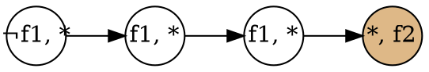
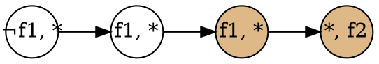
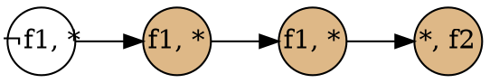
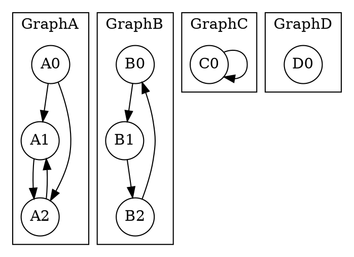
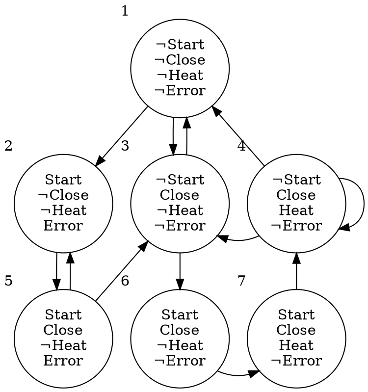

# 5.1 Explicit-State CTL Model Checking
この節の目的:
: クリプキ構造の explicit representation  を検査するのアルゴリズムを示す。

## アルゴリズム概要
### 入出力
- 入力 : クリプキ構造 $M$, CTL式 $f$
- 出力 : ${\llbracket f \rrbracket}_M \ (= \{s \in S\ | \ M,s \vDash f\})$

### 背景
CTL式は、¬, ∧, ∨, EX, EU, EG だけの形に変形(正規化)できる。<br>
よって、変形後の式について ${\llbracket f \rrbracket}_M$ が得られれば十分。

### 方針
状態 $s$ に貼られたラベルの集合を、$\textit{label}(s)$ とおく。<br>

方針は次の通り :
1. $\textit{label}(s)$に、状態 $s$ が満たすCTL式を加えていく。
2. 最終的に $f \in \textit{label}(s)$ であれば、$s \in \llbracket f \rrbracket_M$ である。

### 疑似コード
$f$ の部分式について、ネストの浅いものから順に、それを満たす全状態にラベルを貼っていく。

ここでは「ネスト = ASTの深さ」とする。<br>
例えば、$f, g, u \in \textbf{AP}$ のとき:
- $f$ のネストは0
- $f \land g$ のネストは1
- $(f \land g) \lor u$ のネストは2

```py {caption="<span class='math inline'>{\llbracket f \rrbracket}_M</span> を得るアルゴリズム"}
def set_of_state_which_sat_f(M, f):
    f.normalize() # f を正規化
    for sub_f in f.sub_formulas().sort_asc_by_nest_depth():
        switch sub_f:
            atom       => ,# Do nothing.
            ¬f1       => CheckNot(f1),
            (f1 ∧ f2) => CheckAnd(f1, f2),
            (f1 ∨ f2) => CheckOr(f1, f2),
            E(f1 U f2) => CheckEU(f1, f2),
            EG(f1)     => CheckEG(f1),

    return {s ∈ S | f ∈ label(s)}
```

- `CheckXX` は、`f1`, `f2` のラベル付けが終わっている前提で、`XX` についてラベル付けする関数。
- `f1`, `f2` は `sub_f` よりネストが浅いので、この時点で処理済み。

以降では、各`CheckXX`について見ていく。

## 簡単なケース (Not, And, Or, EX)
::: {.flex55}
:::::: {.flex-left}
```py {caption=CheckNot}
# O(|S|)
def CheckNot(f1):
    for s in S:
        if f1 ∉ label(s):
            label(s) += ¬f1
```

```py {caption=CheckAnd}
# O(|S|)
def CheckAnd(f1, f2):
    for s in S:
        if f1 ∈ label(s) and f2 ∈ label(s)
            label(s) += (f1 ∧ f2)
```
::::::
:::::: {.flex-right}
```py {caption=CheckOr}
# O(|S|)
def CheckOr(f1, f2):
    for s in S:
        if f1 ∈ label(s) or f2 ∈ label(s):
            label(s) += (f1 ∨ f2)
```


```py {caption=CheckEX}
# O(|R|)
def CheckEX(f):
    for (parent, child) in R:
        if f ∈ label(child):
            parent += EX(f)
```
::::::
:::

## EUの処理
::: {.flex64}
:::::: {.flex-left}
```py {caption=CheckEU}
# O(|S| + |R|)
def CheckEU(f1, f2):
  # f2 を満たすなら、 E(f1 U f2) を満たす。
  T := {s | f2 ∈ label(s)}
  for s in T:
    label(s) += E(f1 U f2)

  # E(f1 U f2) を満たすノードの親が f1 を満たすなら、
  # その(親)ノードも E(f1 U f2) を満たす。
  while T != ∅:
    s = T.pop()
    for t in s.parents():
      if f1 ∈ label(t) and E(f1 U f2) ∉ label(t) :
        label(t) += E(f1 U f2)
        T.push(t)
```
::::::
:::::: {.flex-right}
### 動作
色付きはラベルが貼られたことを表す。






::::::
:::

### 計算量
前半部分は $O(|S|)$ で計算できる。
```py {caption=前半部分}
T := {s | f2 ∈ label(s)}
for s in T:
    label(s) += E(f1 U f2)
```
<br>

後半部分は $O(|R|)$ で計算できる。
- `s.parents()` の総和は $|R|$。
- → `for` は合計 $|R|$ 回まわる。

```py {caption=後半部分}
while T != ∅:
    s = T.pop()
    for t in s.parents():
        if f1 ∈ label(t) and E(f1 U f2) ∉ label(t) :
            label(t) += E(f1 U f2)
            T.push(t)
```

なお、`s.parents()` は $O(|R|)$ で事前に計算しておける。
```py { caption="<code>s.parents()</code>を求める処理"}
for (parent, child) in R:
    child.parents() += parent
```

よって、全体の計算量は $O(|S| + |R|)$

## EGの処理
### 用語
SCC (Strongly Connected Component):
: 任意の2頂点について、それを結ぶパスがある有向グラフ。

MSCC (Maximal SCC):
: SCCのうち、他のSCCに包含されないもの。

nontrivial SCC:
: 頂点が2つ以上のSCC or 頂点が一つで自己ループがあるSCC。


#### Q. 以下よりグラフ全体が nontrivial SSC なものを選べ


答え : <quiz>GraphB, GraphC</quiz>

### 記法
クリプキ構造$M$のうち、$f_1$を満たすノードのみを残したクリプキ構造を、$M'$と呼ぶ。
$$
    \begin{align*}
        M' = &(S', R', L')\ \ \text{ where}\\
             &S' = \{s\in S\ |\ M,s\vDash f_1\},\\
             &R' = R|_{S'\times S'},\\
             &L' = L|_{S'}
    \end{align*}
$$

### Lemma 5.1
$M,s \vDash \text{EG}f_1$ は、次の2条件の両立と同値である。
1. $s \in S'$
2. $M'$ 上に、$s$ から グラフ $(S', R')$ の nontrivial MSCC上のノード $t$ までのパスが存在

<details class="filled-box">
<summary>証明</summary>

**($\Longrightarrow$)**<br>
::: {.indent}
仮定 $M,s \vDash \text{EG}f_1$ より、次が言える。
- $s \in S'$ である。
- $s$ で始まり、$\text{EG}f_1$ を満たす$M$上の無限長パス $\pi$ が存在。

パス $\pi$ について、次が言える。
- $\pi$ の要素は全て $f_1$ を満たす。
- → $\pi$ は $S'$ 上のパスである。

$|S|$ は有限なので、$\pi$ は次を満たす $\pi_1$ を用いて、$\pi = \pi_0\pi_1$ と書ける。
- $\pi_1$ 上の任意の状態は、$\pi_1$ 上に無限にしばしば現れる。

ここで、$\pi_1$ 上に現れる状態の集合を $C$ とおく。<br>
このとき、$\pi_1$ から適当な(有限長の)部分パスを取れば、 $C$ 上の任意の2状態を結べる。

よって、
- $C$ は SCC である。
- → $C$ を内包する MSCC $C'$ が存在。<br>

以上より、条件1, 2ともに満たされる。
:::

<hr>

**($\Longleftarrow$)**<br>
::: {.indent}
以下の条件1, 2の成立を仮定する。<br>
1. $s \in S'$
2. $M'$上に、$s$ から グラフ$(S', R')$の nontrivial MSCC上のノード $t$ までのパスが存在

仮定より、次が言える。
- $s$ から $t$ へのパス $\pi_0$ が存在。
- $t$ から $t$ への長さ1以上のパス $\pi_1$ が nontrivial MSCC 上に存在。

このとき、 パス $\pi_0(\pi_1)^\infty$ 上の全状態は $f_1$ を満たすので、$M,s \vDash \text{EG}f_1$ が成立する。
:::

以上より、$\Rightarrow$, $\Leftarrow$ の両方が示されたので、これらは同値である。<br>
$\square$

</details>

### アルゴリズム
Lemma 5.1 をもとに、EGを処理するアルゴリズムを作る。
```py {caption="CheckEG"}
def CheckEG(f1):
    # M' 上の MSCC に含まれる状態の集合 T を得る。
    S’= { s ∈ S | f1 ∈ label(s) }
    R’= { (p, c) ∈ S | p, c ∈ S’}
    MSCCs = get_all_mscc(S’, R’)
    T = ∪MSCCs

    # 常に f1 を満たしながら T 内の状態へ到達できる状態を探す。
    while T != ∅:
        s = T.pop()
        for t in s.parents():
            if (f1 ∈ label(t)) and (EG f1 ∉ label(t))
                label(t) += EG f1
                T += t
```

### 計算量
- $S'$, $R'$ は、$O(|S| + |R|)$ で求まる。
- MSCCは $O(|S| + |R|)$ で[求まる](https://manabitimes.jp/math/1250)。<br>
- `for` 文は合計 $|R|$ 回回る。<br>

→ `CheckEG` の計算量は $O(|S| + |R|)$ である。

## ${\llbracket f \rrbracket}_M$ を求めるアルゴリズム全体の計算量
- `CheckXX`はすべて $O(|S|+|R|)$ 。
- 処理する部分式の数は高々 $|f|$ 個。
- $f$ の正規化前後において、部分式の数の増加は線形。

よって、全体の計算量は $O(|f|\cdot(|S|+|R|))$ である。
```py {caption="<span class='math inline'>\llbracket f \rrbracket_M</span>を得るアルゴリズム(再掲)"}
def set_of_state_which_sat_f(M, f):
    f.normalize() # f を正規化
    for sub_f in f.sub_formulas().sort_asc_by_nest_depth():
        switch sub_f:
            atom       => ,# Do nothing.
            ¬f1       => CheckNot(f1),
            (f1 ∧ f2) => CheckAnd(f1, f2),
            (f1 ∨ f2) => CheckOr(f1, f2),
            E(f1 U f2) => CheckEU(f1, f2),
            EG(f1)     => CheckEG(f1),

    return {s ∈ S | f ∈ label(s)}
```

## 具体例
::: {.flex64}
:::::: {.flex-left}
右のクリプキ構造について、$\textbf{AG}(\textit{Start} \rightarrow \textbf{AF}\textit{Heat})$ を調べる。

### 考察
$\textbf{AG}(\textit{Start} \rightarrow \textbf{AF}\textit{Heat})$ は<br>
<span class=indent>「スタートしたら、いつかは温め終わる」<br></span>
という性質を表す。

ここで、パス $\pi = 1, (2, 5)^\infty$ に着目する。<br>
このパスは状態2で $\textit{Start}$ になるが、その後 $\textit{Heat}$ になることは無い。

よって、$\textbf{AG}(\textit{Start} \rightarrow \textit{Heat}) = \emptyset$ である。

### ステップ1 : 正規化
$$
\begin{align*}
    \textbf{AG}&(\textit{Start} \rightarrow \textbf{AF}\textit{Heat}) \\
    &= \textbf{AG}(\neg \textit{Start} \lor \textbf{AF}\textit{Heat}) \\
    &= \neg \textbf{EF}(\textit{Start} \land \neg \textbf{AF}\textit{Heat}) \\
    &= \neg \textbf{EF}(\textit{Start} \land  \textbf{EG}\neg\textit{Heat}) \\
    &= \neg \textbf{E}(\textit{true} \textbf{U} (\textit{Start} \land \textbf{EG}\neg\textit{Heat}))
\end{align*}
$$

### ステップ2 : 部分式の列挙
Q. $\neg \textbf{E}(\textit{true} \textbf{U} (\textit{Start} \land \textbf{EG}\neg\textit{Heat}))$ の部分式を列挙せよ。
- $\textit{true}$
- $\textit{Start}$
- $\textit{Heat}$
- <quiz>$\neg\textit{Heat}$</quiz>
- <quiz>$\textbf{EG}\neg\textit{Heat}$</quiz>
- <quiz>$\textit{Start} \land \textbf{EG}\neg\textit{Heat}$</quiz>
- <quiz>$\textbf{E}(\textit{true} \textbf{U} (\textit{Start} \land \textbf{EG}\neg\textit{Heat}))$</quiz>
- <quiz>$\neg\textbf{E}(\textit{true} \textbf{U} (\textit{Start} \land \textbf{EG}\neg\textit{Heat}))$</quiz>

### ステップ3 : ネストの浅い部分式から順に調べる
- $\llbracket\textit{true}\rrbracket = \{1, 2, 3, 4, 5, 6, 7\}$
- $\llbracket\textit{Start}\rrbracket = \{2, 5, 6, 7\}$
- $\llbracket\textit{Heat}\rrbracket = \{4, 7\}$
- $\llbracket\neg\textit{Heat}\rrbracket = \{1, 2, 3, 5, 6\}$

#### $\llbracket\textbf{EG}\neg\textit{Heat}\rrbracket$ について
$S' = \llbracket \neg\textit{Heat} \rrbracket = \{1, 2, 3, 5, 6\}$と置く。<br>
いま、$S'$上の(nontrivialな)MSCCは、$\{1, 2, 3, 5\}$ のみである。<br>
また、$S'$上の状態で、このMSCCへのパスがある状態は$\{1, 2, 3, 5\}$のみである。<br>
よって、$\llbracket\textbf{EG}\neg\textit{Heat}\rrbracket = \{1, 2, 3, 5\}$である。

#### $\llbracket\textit{Start} \land \textbf{EG}\neg\textit{Heat}\rrbracket$ について
$\llbracket\textit{Start}\rrbracket = \{2, 5, 6, 7\}$, $\llbracket\textbf{EG}\neg\textit{Heat}\rrbracket = \{1, 2, 3, 5\}$である。<br>
よって、$\llbracket\textit{Start} \land \textbf{EG}\neg\textit{Heat}\rrbracket = \{2, 5\}$

####  $\llbracket\textbf{E}(\textit{true} \textbf{U} (\textit{Start} \land \textbf{EG}\neg\textit{Heat}))\rrbracket$ について
1. $T = \llbracket\textit{Start} \land \textbf{EG}\neg\textit{Heat}\rrbracket = \{2, 5\}$ と置く。
2. $T$ 内の状態の親のうち、$\textit{true}$ を満たすものを $T$ に加えていく。
3. $T$ の要素がこれ以上増えなくなるまで続ける。

- $\{2, 5\}$ の先祖をたどると、全状態に到達できる。
- よって、$\llbracket\textbf{E}(\textit{true} \textbf{U} (\textit{Start} \land \textbf{EG}\neg\textit{Heat}))\rrbracket = \{1, 2, 3, 4, 5, 6, 7\}$


#### $\llbracket\neg\textbf{E}(\textit{true} \textbf{U} (\textit{Start} \land \textbf{EG}\neg\textit{Heat}))\rrbracket$ について
- $\llbracket\textbf{E}(\textit{true} \textbf{U} (\textit{Start} \land \textbf{EG}\neg\textit{Heat}))\rrbracket = \{1, 2, 3, 4, 5, 6, 7\}$である
- よって、$\llbracket\neg\textbf{E}(\textit{true} \textbf{U} (\textit{Start} \land \textbf{EG}\neg\textit{Heat}))\rrbracket = \emptyset$

::::::
:::::: {.flex-right}
::::::::: {.sticky style="transform: scale(0.65, 0.65);"}

:::::::::
::::::
:::


## まとめ
### Theorem 5.2
クリプキ構造$M$, CTL式 $f$ について、$\llbracket f \rrbracket_M$ を $O(|f|\cdot(|S| + |R|))$ で求めるアルゴリズムが存在する。

#### 証明
CTL式 $f$ を正規化した式を $f'$ とおく。<br>
$\llbracket f' \rrbracket_M$ を $O(|f'|\cdot(|S| + |R|))$ で求めるアルゴリズムは上で示した。<br>
いま、$|f'|$ は $|f|$ のたかだか整数倍であるから、$f$ についても $O(|f'|\cdot(|S| + |R|))$ で処理ができる。

### したがって...
$S \subseteq \llbracket f \rrbracket_M$ を調べることで $M \vDash f$ を $O(|f|\cdot(|S| + |R|))$ で判定できる。

---
次節 : [公平性の導入](mc5.2.html)
