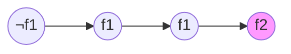
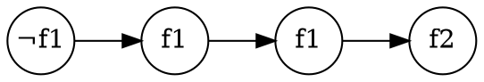
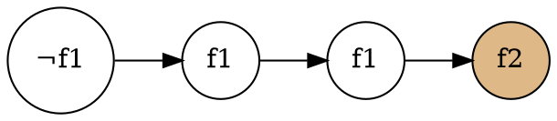
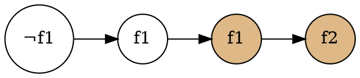
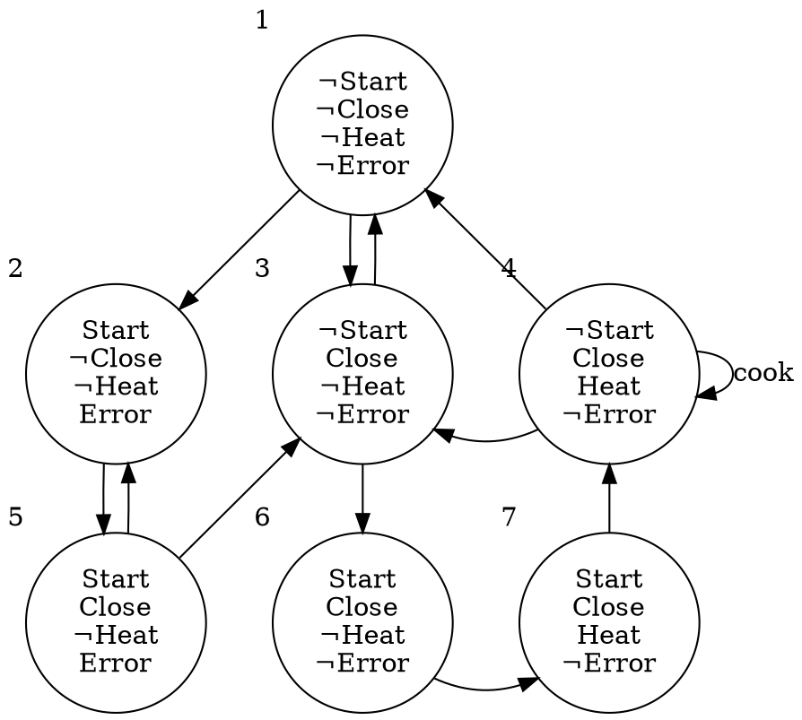

# 5.1 Explicit-State CTL Model Checking
この節の目的:
: クリプキ構造の陽な表示 (explicit representation)について、モデルチェックのアルゴリズムを示す。

## アルゴリズム概要
### 入出力
- 入力 : クリプキ構造$M$、CTL式$f$
- 出力 : ${\llbracket f \rrbracket}_M \ (= \{s \in S\ | \ M,s \vDash f\})$

### 前提
- CTL式は、¬, ∧, ∨, EX, EU, EG のみの形に変形(正規化)できる
- よって、変形後の式について${\llbracket f \rrbracket}_M \ (= \{s \in S\ | \ M,s \vDash f\})$がわかれば十分

### 方針
まず、${\llbracket f_1 \rrbracket}_M, {\llbracket f_2 \rrbracket}_M$がわかっている時に、
- $\neg f_1$
- $f_1 \land f_2$
- $f_1 \lor f_2$
- $\textbf{EX}(f_1)$
- $\textbf{E}(f_1 \textbf{U} f_2)$
- $\textbf{E}(f_1 \textbf{G} f_2)$

について${\llbracket \cdot \rrbracket}_M$を求めるアルゴリズム群を考えておく。


そのアルゴリズム群を用いて、次のように処理して、${\llbracket f \rrbracket}_M$を得る。
```py {caption=アルゴリズム全体}
def set_of_state_which_sat_f(M: Kripke, f: Formula):
    # 式 f のネストの深さ (後述の例を参照) を得る
    nest_depth = f.nest_depth()

    for i in range(0, nest_depth+1):
        sub_formulas = f.get_sub_formulas(nest_depth=i)

        for sub_f in sub_formulas:
            match sub_f:
                f1         => CheckAtomic(f1),
                ¬f1       => CheckNot(f1, f2),
                (f1 ∧ f2) => CheckAnd(f1, f2),
                (f1 ∨ f2) => CheckOr(f1, f2),
                E(f1 U f2) => CheckEU(f1, f2),
                EG(f1)     => CheckEG(f1),

    return {s ∈ S | f ∈ label(s)}
```

- `label(s)`は、状態$s$が満たすことが判明したCTL式の集合
- `CheckXX`は、その式を満たす状態すべてにラベルを貼る関数。
- ネストの浅いものから順に処理する。
- → 各caseにおいて、`f1`, `f2`のラベル付けは済んで[いる/いない]状態にある。

以降は、各`CheckXX`を見ていく。

## 簡単なケース (Not, And, Or, EX)
```py {caption=CheckNot}
# O(|S|)
def CheckNot(f1):
    T := {s | f1 ∉ label(s)}
    for s in T:
        label(s) += ¬f1
```

```py {caption=CheckAnd}
# O(|S|)
def CheckAnd(f1, f2):
    T := {s | f1 ∈ label(s) and f2 ∈ label(s)}
    for s in T:
        label(s) += f1 ∧ f2
```

```py {caption=CheckOr}
# O(|S|)
def CheckOr(f1, f2):
    T := {s | f1 ∈ label(s) or f2 ∈ label(s)}
    for s in T:
        label(s) += f1 ∨ f2
```

```py {caption=CheckEX}
# O(|R|)
def CheckEX(f):
    for (parent, child) in R:
        if f ∈ label(child):
            parent += EX(f)
```

## EUの処理

```py {caption=CheckEU}
# O(|S| + |R|)
# labelはグローバルな辞書的なもの
# f1, f2についてのラベル付けは終わっていると仮定する
def CheckEU(f1, f2):
    T := {s | f2 ∈ label(s)}
    for s in T:
        label(s) += E(f1 U f2)

    while not T != ∅:
        s = T.pop()
        for t in s.parents():
            if f1 ∈ label(t) and E(f1 U f2) ∉ label(t) :
                label(t) += E(f1 U f2)
                T.push(t)n
```

### 動作







### 計算量
前半部分は$O(|S|)$で計算できる。
```py {caption=前半部分}
T := {s | f2 ∈ label(s)}
for s in T:
    label(s) += E(f1 U f2)
```
<br>

後半部分は$O(|R|)$で計算できる。
```py {caption=後半部分}
while not T != ∅:
    s = T.pop()
    for t in s.parents():
        if f1 ∈ label(t) and E(f1 U f2) ∉ label(t) :
            label(t) += E(f1 U f2)
            T.push(t)n
```

ちなみに、MC本のアルゴリズムは次のようになっている :
```algorithm
\begin{algorithm}
\begin{algorithmic}
\While{$T \neq \emptyset$}
    \State $\textbf{choose}\ s \in T$
    \State $T = T \backslash \{s\}$
    \ForAll{$t\ \textbf{s.t.}\ t \in S'$ \And $R(t, s)$}
        \State $\cdots$
    \EndFor
\EndWhile
\end{algorithmic}
\end{algorithm}
```

このコードは直感的には、
- 4行目の`for`文が$O(|R|)$
- よって1行目の`while`を踏まえると全体で$O(|S||R|)$

のように見える。<br>

しかし、前処理で`R`から次のようなデータ構造を作っておくと、$O(|R|)$で処理できる。<br>
(このデータ構造自体は$O(|R|)$で作れる。)
```
    Array of states
    +---+
    |   |
    |   |      Array of parents of s
    +---+      +-----+-----+-----+---
  s | o-+----> | 親1 | 親2 | 親3 |
    +---+      +-----+-----+-----+---
    |   |
    |   |
    +---+
```

## EGの処理
SCC (Strongly Connected Component):
: 任意の2頂点について、それを結ぶパスがある有向グラフ。

MSCC (Maximal SCC):
: SCCのうち、他のSCCに包含されないもの。

nontrivial SCC:
: 頂点が2つ以上のグラフ or ある頂点からその頂点への辺があるグラフ。

### Lemma 5.1
$M,s \vDash \text{EG}f_1$と、次の2条件を両方満たすことは同値
1. $s \in S'$
2. $M'$上に、$s$からグラフ$(S', R')$のMSCC上のノード$t$までのパスが存在

#### 証明の準備
クリプキ構造$M$のうち、$f_1$を満たすノードのみを残したクリプキ構造を、$M'$と呼ぶ。

$$
    M' = (S', R', L') \;\;\;\text{where}\;\;\;S' = \{s\in S | M,s\vDash f_1\}, R' = R|_{S'\times S'}, L' = L|_{S'}
$$

#### 証明 ($\Longrightarrow$)
- $M,s \vDash \text{EG}f_1$を仮定し、$\text{EG}f_1$を満たす無限長パスを$\pi$と呼ぶ。
- このとき、$s \in S'$であり、また$\pi$は$S'$上のパスである。

- また、$\pi$は、次を満たす$\pi_1$を用いて、$\pi = \pi_0\pi_1$と書ける。
    - $\pi_1$上の全要素は$\pi_1$上に無限にしばしば(infinitely often)現れる。

```py {caption="CheckEG"}
def CheckEG(f1):
    Sd = { s ∈ S | f1 ∈ label(s) }
    MSCCs = get_all_mscc(Sd)
    T = (全MSCCの状態の和集合)

    while not T != ∅:
        s = T.pop()
        for t in s.parents():
            if EG f1 ∉ label(t)
                label(T) += EG f1
```

## アルゴリズム全体の計算量
- `CheckXX`はすべて$O(|S|+|R|)$
- 処理する部分式の数は高々$|f|$

なので、全体の計算量は$O(|f|(|S|+|R|))$である。

```py {caption=アルゴリズム全体 (再掲)}
def set_of_state_which_sat_f(M: Kripke, f: Formula):
    # 式 f のネストの深さ (後述の例を参照) を得る
    nest_depth = f.nest_depth()

    for i in range(0, nest_depth+1):
        sub_formulas = f.get_sub_formulas(nest_depth=i)

        for sub_f in sub_formulas:
            match sub_f:
                f1         => CheckAtomic(f1),
                ¬f1       => CheckNot(f1, f2),
                (f1 ∧ f2) => CheckAnd(f1, f2),
                (f1 ∨ f2) => CheckOr(f1, f2),
                E(f1 U f2) => CheckEU(f1, f2),
                EG(f1)     => CheckEG(f1),

    return {s ∈ S | f ∈ label(s)}
```

## 具体例
次のクリプキ構造について、$\textbf{AG}(\textit{Start} \rightarrow \textbf{AF}\textit{Heat})$を調べる。



### 考察
$\textbf{AG}(\textit{Start} \rightarrow \textbf{AF}\textit{Heat})$は「スタートボタンを押したら、絶対いつかは温めが完了する」という性質を表す。

ここで、パス $\pi = 1, 2, 5, 2, 5, \cdots$ に着目する。<br>
状態$2$で $\textit{Start}$ を満たすが、このパスが$\textit{Heat}$に到達することはない。

したがって、$\textbf{AG}(\textit{Start} \rightarrow \textit{Heat}) = \emptyset$となるはずである。

### ステップ1 : 正規化
$$
\begin{align*}
    &\textbf{AG}(\textit{Start} \rightarrow \textbf{AF}\textit{Heat}) \\
    &= \textbf{AG}(\neg \textit{Start} \lor \textbf{AF}\textit{Heat}) \\
    &= \neg \textbf{EF}(\textit{Start} \land \neg \textbf{AF}\textit{Heat}) \\
    &= \neg \textbf{EF}(\textit{Start} \land  \textbf{EG}\neg\textit{Heat}) \\
    &= \neg \textbf{E}(\textit{true} \textbf{U} (\textit{Start} \land \textbf{EG}\neg\textit{Heat}))
\end{align*}
$$

### ステップ2 : 部分式の列挙
Q. 部分式を列挙せよ。
- <quiz>$\textit{true}$</quiz>
- <quiz>$\textit{Start}$</quiz>
- <quiz>$\textit{Heat}$</quiz>
- <quiz>$\neg\textit{Heat}$</quiz>
- <quiz>$\textbf{EG}\neg\textit{Heat}$</quiz>
- <quiz>$\textit{Start} \land \textbf{EG}\neg\textit{Heat}$</quiz>
- <quiz>$\textbf{E}(\textit{true} \textbf{U} (\textit{Start} \land \textbf{EG}\neg\textit{Heat}))$</quiz>
- <quiz>$\neg\textbf{E}(\textit{true} \textbf{U} (\textit{Start} \land \textbf{EG}\neg\textit{Heat}))$</quiz>

### ステップ3 : ネストの浅い部分式から順に調べる
- $\llbracket\textit{true}\rrbracket = \{1, 2, 3, 4, 5, 6, 7\}$
- $\llbracket\textit{Start}\rrbracket = \{2, 5, 6, 7\}$
- $\llbracket\textit{Heat}\rrbracket = \{4, 7\}$
- $\llbracket\neg\textit{Heat}\rrbracket = \{1, 2, 3, 5, 6\}$

#### $\llbracket\textbf{EG}\neg\textit{Heat}\rrbracket$ について
1. $S' = \llbracket \neg\textit{Heat} \rrbracket = \{1, 2, 3, 5, 6\}$と置く
2. $S'$内のMSCCを見つける
3. $S'$内の状態のうち、MSCC内の状態への経路がある状態を見つける
4. 見つけた状態の集合が$\llbracket\textbf{EG}\neg\textit{Heat}\rrbracket$である

- いま、$\textbf{MSCC} = \{\{1, 2, 3, 5\}\}$ である
- よって状態1, 2, 3, 5は$\neg\textit{Heat}$を満た<quiz>す　　</quiz>
- また、残った状態6からMSCCへの経路は存在しないので、6は$\neg\textit{Heat}$を満た<quiz>さない</quiz>
- よって、$\llbracket\textbf{EG}\neg\textit{Heat}\rrbracket =$<quiz>$\{1, 2, 3, 5\}$</quiz>

#### $\llbracket\textit{Start} \land \textbf{EG}\neg\textit{Heat}\rrbracket$ について
- $\llbracket\textit{Start}\rrbracket = \{2, 5, 6, 7\}$
- $\llbracket\textbf{EG}\neg\textit{Heat}\rrbracket = \{1, 2, 3, 5\}$
- よって、$\llbracket\textit{Start} \land \textbf{EG}\neg\textit{Heat}\rrbracket = \{2, 5\}$

####  $\llbracket\textbf{E}(\textit{true} \textbf{U} (\textit{Start} \land \textbf{EG}\neg\textit{Heat}))\rrbracket$ について
1. $T = \llbracket\textit{Start} \land \textbf{EG}\neg\textit{Heat}\rrbracket = \{2, 5\}$ と置く
2. $T$内の状態の親のうち、$\textit{true}$を満たすものを$T$に加えていく
3. $T$の要素がこれ以上増えなくなったとき、$T = \llbracket\textbf{E}(\textit{true} \textbf{U} (\textit{Start} \land \textbf{EG}\neg\textit{Heat}))\rrbracket$である

- $\{2, 5\}$から親を辿っていくと全ての状態に到達できる
- よって、$\llbracket\textbf{E}(\textit{true} \textbf{U} (\textit{Start} \land \textbf{EG}\neg\textit{Heat}))\rrbracket = \{1, 2, 3, 4, 5, 6, 7\}$


#### $\llbracket\neg\textbf{E}(\textit{true} \textbf{U} (\textit{Start} \land \textbf{EG}\neg\textit{Heat}))\rrbracket$ について
- $\llbracket\textbf{E}(\textit{true} \textbf{U} (\textit{Start} \land \textbf{EG}\neg\textit{Heat}))\rrbracket = \{1, 2, 3, 4, 5, 6, 7\}$である
- よって、$\llbracket\neg\textbf{E}(\textit{true} \textbf{U} (\textit{Start} \land \textbf{EG}\neg\textit{Heat}))\rrbracket = \emptyset$
