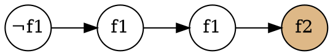
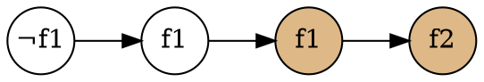
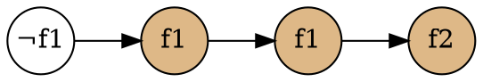

# 5.1 Explicit-State CTL Model Checking
この節の目的:
: クリプキ構造の explicit representation を検査するアルゴリズムの説明。

## アルゴリズム概要
### 入出力
- 入力 : クリプキ構造$M$, CTL式 $f$
- 出力 : ${\llbracket f \rrbracket}_M \ (= \{s \in S\ | \ M,s \vDash f\})$

### 背景
CTL式は、¬, ∧, ∨, EX, EU, EG のみの形に変形(正規化)できる。<br>
よって、変形後の式について ${\llbracket f \rrbracket}_M$ が得られれば十分。

なお、正規化による式の大きさの増加は線形である。

### 方針
状態 $s$ に付いているラベルの集合を、$\textit{label}(s)$ とおく。<br>
$\textit{label}(s)$に、状態 $s$ が満たすCTL式を加えていく。<br>
最終的に $f \in \textit{label}(s)$ であれば、$s \in \llbracket f \rrbracket_M$ である。

具体的には、次のアルゴリズムを使う。<br>
このアルゴリズムは、$f$ の部分式について、ネストの浅い (構造が単純な) ものから順に、それを満たす全状態にラベルを貼っていく。

```py {caption=${\llbracket f \rrbracket}_M$を得るアルゴリズム}
def set_of_state_which_sat_f(M, f):
    f = f.normalize()

    # ネストの浅い (構造が単純な) 部分式から処理する
    for sub_f in f.sub_formulas().sort_asc_by_nest_depth():
        switch sub_f:
            f1         => CheckAtomic(f1), # Do nothing.
            ¬f1       => CheckNot(f1),
            (f1 ∧ f2) => CheckAnd(f1, f2),
            (f1 ∨ f2) => CheckOr(f1, f2),
            E(f1 U f2) => CheckEU(f1, f2),
            EG(f1)     => CheckEG(f1),

    return {s ∈ S | f ∈ label(s)}
```

ここで、`CheckXX` は、$f_1$, $f_2$ のラベル付けが終わっている前提で、`XX` についてラベル付けする関数である。

以降では、各`CheckXX`について見ていく。

## 簡単なケース (Not, And, Or, EX)
```py {caption=CheckNot}
# O(|S|)
def CheckNot(f1):
    T := {s | f1 ∉ label(s)}
    for s in T:
        label(s) += ¬f1
```

```py {caption=CheckAnd}
# O(|S|)
def CheckAnd(f1, f2):
    T := {s | f1 ∈ label(s) and f2 ∈ label(s)}
    for s in T:
        label(s) += f1 ∧ f2
```

```py {caption=CheckOr}
# O(|S|)
def CheckOr(f1, f2):
    T := {s | f1 ∈ label(s) or f2 ∈ label(s)}
    for s in T:
        label(s) += f1 ∨ f2
```

```py {caption=CheckEX}
# O(|R|)
def CheckEX(f):
    for (parent, child) in R:
        if f ∈ label(child):
            parent += EX(f)
```

## EUの処理

```py {caption=CheckEU}
# O(|S| + |R|)
def CheckEU(f1, f2):
    T := {s | f2 ∈ label(s)}
    for s in T:
        label(s) += E(f1 U f2)

    while T != ∅:
        s = T.pop()
        for t in s.parents():
            if f1 ∈ label(t) and E(f1 U f2) ∉ label(t) :
                label(t) += E(f1 U f2)
                T.push(t)n
```

### 動作
色付きはラベルが貼られたことを表す。







### 計算量
前半部分は$O(|S|)$で計算できる。
```py {caption=前半部分}
T := {s | f2 ∈ label(s)}
for s in T:
    label(s) += E(f1 U f2)
```
<br>

後半部分は$O(|R|)$で計算できる。<br>
(`s.parents()` の総和は $|R|$ なので、`for` は合計$|R|$回まわる。)
```py {caption=後半部分}
while T != ∅:
    s = T.pop()
    for t in s.parents():
        if f1 ∈ label(t) and E(f1 U f2) ∉ label(t) :
            label(t) += E(f1 U f2)
            T.push(t)n
```

なお、`s.parents()`は $O(|R|)$ で事前に計算しておける。
```py { caption="<code>s.parents()</code>を求める処理"}
for (parent, child) in R:
    child.parents() += parent
```

## EGの処理
### 用語
SCC (Strongly Connected Component):
: 任意の2頂点について、それを結ぶパスがある有向グラフ。

MSCC (Maximal SCC):
: SCCのうち、他のSCCに包含されないもの。

nontrivial SCC:
: 頂点が2つ以上のSCC or ある頂点からその頂点への辺があるSCC。

逆に、trivial SCC はノードが<quiz> 0 </quiz>個でエッジが<quiz> 0 </quiz>本なグラフ。

### 記法
クリプキ構造$M$のうち、$f_1$を満たすノードのみを残したクリプキ構造を、$M'$と呼ぶ。
$$
    \begin{align*}
        M' = &(S', R', L')\ \ \text{ where}\\
             &S' = \{s\in S\ |\ M,s\vDash f_1\},\\
             &R' = R|_{S'\times S'},\\
             &L' = L|_{S'}
    \end{align*}
$$

### Lemma 5.1
$M,s \vDash \text{EG}f_1$ は、次の2条件を両方満たすことと同値である。
1. $s \in S'$
2. $M'$上に、$s$ から グラフ$(S', R')$の nontrivial MSCC上のノード $t$ までのパスが存在

<details>
<summary>証明</summary>

#### ($\Longrightarrow$)
$M,s \vDash \text{EG}f_1$ を仮定する。<br>
$s$ で始まり、$\text{EG}f_1$ を満たす$M$上の無限長パス $\pi$ に着目する。<br>
このとき、$\pi$ の要素は全て $f_1$ を満たすので、次が言える。
- $s \in S'$
- $\pi$ は $S'$上のパス

また、$\pi$は次を満たす$\pi_1$を用いて、$\pi = \pi_0\pi_1$と書ける。
- $\pi_1$上の任意の要素は、$\pi_1$上に無限にしばしば(infinitely often)現れる。

$\pi$上に現れる状態の集合を$C$とおく。<br>
このとき、$\pi_1$ から適当な(有限長の)部分パスを取ってくれば、 $C$ 上の任意の2状態を結ぶことができる。<br>
よって、$C$はSCCであり、したがって何らかのMSCC $C'$ に内包される。<br>
よって、条件1, 2ともに満たされる。

#### ($\Longleftarrow$)
以下の条件1, 2の成立を仮定する。<br>
1. $s \in S'$
2. $M'$上に、$s$ から グラフ$(S', R')$の nontrivial MSCC上のノード $t$ までのパスが存在

$s$ から $t$ へのパスを $\pi_0$ とおく。<br>
またnontrivial MSCC上にある、$t$ から $t$ への長さ1以上のパスを取り、$\pi_1$ とおく。<br>
このとき、 パス $\pi_0\pi_1$ 上の全状態は $f_1$ を満たすので、$M,s \vDash \text{EG}f_1$ が成立する。

</details>

### アルゴリズム
```py {caption="CheckEG"}
def CheckEG(f1):
    S’ = { s ∈ S | f1 ∈ label(s) }
    MSCCs = get_all_mscc(S’)
    T = ∪MSCCs

    while T != ∅:
        s = T.pop()
        for t in s.parents():
            if (t ∈ S’) and (EG f1 ∉ label(t))
                label(t) += EG f1
                T += t
```

### 計算量
MSCCは$O(|S| + |R|)$で求まる。<br>
また、`for`文は合計$|R|$回回る。<br>
よって、`CheckEG`の計算量は$O(|S| + |R|)$である。

## アルゴリズム全体の計算量
- `CheckXX`はすべて$O(|S|+|R|)$
- 処理する部分式の数は高々$|f|$

よって、全体の計算量は$O(|f|\cdot(|S|+|R|))$である。
```py {caption=${\llbracket f \rrbracket}_M$を得るアルゴリズム(再掲)}
def set_of_state_which_sat_f(M, f):
    f = f.normalize()

    # ネストの浅い (構造が単純な) 部分式から処理する
    for sub_f in f.sub_formulas().sort_asc_by_nest_depth():
        switch sub_f:
            f1         => CheckAtomic(f1), # Do nothing.
            ¬f1       => CheckNot(f1),
            (f1 ∧ f2) => CheckAnd(f1, f2),
            (f1 ∨ f2) => CheckOr(f1, f2),
            E(f1 U f2) => CheckEU(f1, f2),
            EG(f1)     => CheckEG(f1),

    return {s ∈ S | f ∈ label(s)}
```

## 具体例
次のクリプキ構造について、$\textbf{AG}(\textit{Start} \rightarrow \textbf{AF}\textit{Heat})$を調べる。


### 考察
$\textbf{AG}(\textit{Start} \rightarrow \textbf{AF}\textit{Heat})$は「スタートボタンを押したら、絶対いつかは温めが完了する」という性質を表す。

ここで、パス $\pi = 1, 2, 5, 2, 5, \cdots$ に着目する。<br>
状態$2$で $\textit{Start}$ を満たすが、このパスが$\textit{Heat}$に到達することはない。

したがって、$\textbf{AG}(\textit{Start} \rightarrow \textit{Heat}) =$ <quiz>$\emptyset$</quiz>となるはずである。

### ステップ1 : 正規化
$$
\begin{align*}
    \textbf{AG}&(\textit{Start} \rightarrow \textbf{AF}\textit{Heat}) \\
    &= \textbf{AG}(\neg \textit{Start} \lor \textbf{AF}\textit{Heat}) \\
    &= \neg \textbf{EF}(\textit{Start} \land \neg \textbf{AF}\textit{Heat}) \\
    &= \neg \textbf{EF}(\textit{Start} \land  \textbf{EG}\neg\textit{Heat}) \\
    &= \neg \textbf{E}(\textit{true} \textbf{U} (\textit{Start} \land \textbf{EG}\neg\textit{Heat}))
\end{align*}
$$

### ステップ2 : 部分式の列挙
Q. $\neg \textbf{E}(\textit{true} \textbf{U} (\textit{Start} \land \textbf{EG}\neg\textit{Heat}))$ の部分式を列挙せよ。
- $\textit{true}$
- $\textit{Start}$
- $\textit{Heat}$
- <quiz>$\neg\textit{Heat}$</quiz>
- <quiz>$\textbf{EG}\neg\textit{Heat}$</quiz>
- <quiz>$\textit{Start} \land \textbf{EG}\neg\textit{Heat}$</quiz>
- <quiz>$\textbf{E}(\textit{true} \textbf{U} (\textit{Start} \land \textbf{EG}\neg\textit{Heat}))$</quiz>
- <quiz>$\neg\textbf{E}(\textit{true} \textbf{U} (\textit{Start} \land \textbf{EG}\neg\textit{Heat}))$</quiz>

### ステップ3 : ネストの浅い部分式から順に調べる
- $\llbracket\textit{true}\rrbracket = \{1, 2, 3, 4, 5, 6, 7\}$
- $\llbracket\textit{Start}\rrbracket = \{2, 5, 6, 7\}$
- $\llbracket\textit{Heat}\rrbracket = \{4, 7\}$
- $\llbracket\neg\textit{Heat}\rrbracket = \{1, 2, 3, 5, 6\}$

#### $\llbracket\textbf{EG}\neg\textit{Heat}\rrbracket$ について
$S' = \llbracket \neg\textit{Heat} \rrbracket = \{1, 2, 3, 5, 6\}$と置く。<br>
いま、$S'$上の(nontrivialな)MSCCは、$\{1, 2, 3, 5\}$ のみである。<br>
また、$S'$上の状態で、このMSCCへのパスがある状態は$\{1, 2, 3, 5\}$のみである。<br>
よって、$\llbracket\textbf{EG}\neg\textit{Heat}\rrbracket = \{1, 2, 3, 5\}$である。

#### $\llbracket\textit{Start} \land \textbf{EG}\neg\textit{Heat}\rrbracket$ について
$\llbracket\textit{Start}\rrbracket = \{2, 5, 6, 7\}$, $\llbracket\textbf{EG}\neg\textit{Heat}\rrbracket = \{1, 2, 3, 5\}$である。<br>
よって、$\llbracket\textit{Start} \land \textbf{EG}\neg\textit{Heat}\rrbracket = \{2, 5\}$

####  $\llbracket\textbf{E}(\textit{true} \textbf{U} (\textit{Start} \land \textbf{EG}\neg\textit{Heat}))\rrbracket$ について
1. $T = \llbracket\textit{Start} \land \textbf{EG}\neg\textit{Heat}\rrbracket = \{2, 5\}$ と置く
2. $T$内の状態の親のうち、$\textit{true}$を満たすものを$T$に加えていく
3. $T$の要素がこれ以上増えなくなったとき、$T = \llbracket\textbf{E}(\textit{true} \textbf{U} (\textit{Start} \land \textbf{EG}\neg\textit{Heat}))\rrbracket$である

- $\{2, 5\}$から親を辿っていくと全ての状態に到達できる
- よって、$\llbracket\textbf{E}(\textit{true} \textbf{U} (\textit{Start} \land \textbf{EG}\neg\textit{Heat}))\rrbracket = \{1, 2, 3, 4, 5, 6, 7\}$


#### $\llbracket\neg\textbf{E}(\textit{true} \textbf{U} (\textit{Start} \land \textbf{EG}\neg\textit{Heat}))\rrbracket$ について
- $\llbracket\textbf{E}(\textit{true} \textbf{U} (\textit{Start} \land \textbf{EG}\neg\textit{Heat}))\rrbracket = \{1, 2, 3, 4, 5, 6, 7\}$である
- よって、$\llbracket\neg\textbf{E}(\textit{true} \textbf{U} (\textit{Start} \land \textbf{EG}\neg\textit{Heat}))\rrbracket = \emptyset$

## まとめ
### Theorem 5.2
クリプキ構造$M$, CTL式 $f$ について、$\llbracket f \rrbracket_M$ を $O(|f|\cdot(|S| + |R|))$で求めるアルゴリズムが存在する。

### したがって...
$S \subseteq \llbracket f \rrbracket_M$ を調べることで $M \vDash f$ を $O(|f|\cdot(|S| + |R|))$ で判定できる。

---
次節 : [公平性の導入](mc5.2.html)
