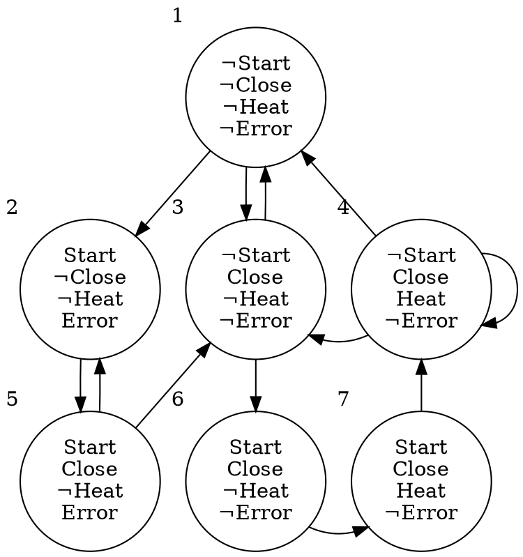

# 5.2 Model-Checking CTL with Fairness Constraints
この節の目的:
: Fairness constraints を扱えるよう、5.1節の手法を拡張すること。

以降では、Fiarness constraints を $F = \{ P_1, \cdots, P_k\}$ と書く。

## 概要
CTL式は、¬, ∧, ∨, EG, EX, EU のみの形に変形(正規化)できる。<br>
よって、5.1節と同じく、これらを処理する関数を設計すれば良い。

このうち、¬, ∧, ∨ については5.1節で設計した関数を流用できる。

この節では、残るEG, EX, EUについて考える。

## $\textbf{E}_f\textbf{G}$ の処理
## 用語 : 公平なSCC
クリプキ構造$M$上のSCC $C$ が次を満たすとき、 $C$ は $F$ について公平である。
$$ \forall P_i \in F,\ \exist t_i \in (C \cup P_i) $$

## 記法
クリプキ構造$M$のうち、$f_1$を公平に満たすノードのみを残したクリプキ構造を、$M'$と呼ぶ。
$$
    \begin{align*}
        M' = &(S', R', L', F') \ \ \text{ where}\\
             &S' = \{s\in S | M,s\vDash_F f_1\},\\
             &S' = R' = R|_{S'\times S'},\\
             &S' = L' = L|_{S'},\\
             &S' = F' = \{P_i \cup S' \ |\ P_i \in F\}
    \end{align*}
$$

## Lemma 5.3
$M,s \vDash_F \textbf{E}_F\textbf{G} f_1$と、次の2条件を両方満たすことは同値
1. $s \in S'$
2. $M'$上に、$s$からグラフ$(S', R')$の公平なMSCC上のノード$t$までのパスが存在

(証明は Lemma 5.1 と同様のため省略。)

## アルゴリズム
Lemma 5.3 を使うことで、`CheckFairEG`を作成できる。<br>
`CheckEG`との違いは、MSCCを用いるか、Fair MSCC を用いるかだけである。

```py {caption="CheckFairEG"}
def CheckFairEG(f1):
    S’ = { s ∈ S | f1 ∈ label(s) }
    FairMSCCs = get_all_fair_mscc(S’)
    T = ∪FiarMSCCs

    while T != ∅:
        s = T.pop()
        for t in s.parents():
            if (t ∈ S’) and (EG f1 ∉ label(t))
                label(t) += EG f1
                T += t
```

## 計算量
Fair MSCCを求める部分は、例えば次のように $O(|F|\cdot|S| + |R|)$ で実装できる。<br>
よって、`CheckFairEG`の計算量は(少し多めに見積もって)  $O((|S| + |R|)\cdot|F|)$。

```py
def get_all_fair_mscc(S):
    FairMSCCs = ∅
    # O(|S| + |R|)
    MSCCs = get_all_mscc(S)

    # key: 状態
    # value: その状態を含む P_i (∈ F) の集合
    d = {}

    # O(|F||S|)
    for P in Fair {
        for s in P {
            d[s] ∪= P # 実際にはベクタへのpush O(1) で良い
        }
    }

    # 2つのMSCCが共通部分を持つことは無いため、
    # 内側のforは、合計|S|回である。
    # よって、O(|S|)
    for m in MSCCs {
        local = ∅
        for s in m:
            local ∪= map[s] # 実際にはベクタへのpush O(1) で良い
        if local.len() == |F|:
            FairMSCCs ∪= m  # 実際にはベクタへのpush O(1) で良い
    }
    return FairMSCCs
```

## $\textbf{E}_f\textbf{X}$, $\textbf{E}_f\textbf{U}$ の処理
### 原子式 $\textit{fair}$ の導入。
特別な原子式 $\textit{fair}$ を定義する。
$$ s \vDash \textit{fair} \iff \text{(There is a fair path starting from } s \text{. )} $$

なお、$\textit{fair} = \textbf{E}_F\textbf{G}\textit{true}$ であるから、`CheckFairEG(true)`で求まる。

### $\textbf{E}_f\textbf{X}$ について
$M,s \vDash_F \textbf{E}_f\textbf{X}f_1$を検査するには、
$M,s \vDash \textbf{EX}(f_1  \land \textit{fair})$を調べれば良い。

### $\textbf{E}_f\textbf{U}$ について
$M,s \vDash_F \textbf{E}_f(f_1 \textbf{U} f_2)$を検査するには、
$M,s \vDash \textbf{E}(f_1 \textbf{U} (f_2 \land \textit{fair})))$を調べれば良い。


## アルゴリズム全体の計算量
各ステップの計算量は$O((|S| + |R|)\cdot|F|)$ である。<br>
よって、アルゴリズム全体の計算量は $O(|f|\cdot(|S| + |R|)\cdot|F|)$ である。

## 具体例
$F = \{\{ s \ |\  s \vDash \textit{Start} \land \textit{Close} \land \neg\textit{Error}\}\}$とおく。

5.1節の具体例と同じクリプキ構造について、次の式を調べる。
$$ \textbf{A}_f\textbf{G}(\textit{Start} \rightarrow \textbf{A}_f\textbf{F}\textit{Heat}) $$を調べる。



### ステップ1 : 正規化
$$ \textbf{A}_f\textbf{G}(\textit{Start} \rightarrow \textbf{A}_f\textbf{F}\textit{Heat}) = \neg \textbf{E}_f(\textit{true} \textbf{U} (\textit{Start} \land \textbf{E}_f\textbf{G}\neg\textit{Heat}))$$

### ステップ2 : 部分式の列挙
- $\textit{true}$
- $\textit{Start}$
- $\textit{Heat}$
- $\neg\textit{Heat}$
- $\textbf{E}_f\textbf{G}\neg\textit{Heat}$
- $\textit{Start} \land \textbf{E}_f\textbf{G}\neg\textit{Heat}$
- $\textbf{E}_f(\textit{true} \textbf{U} (\textit{Start} \land \textbf{E}_f\textbf{G}\neg\textit{Heat}))$
- $\neg\textbf{E}_f(\textit{true} \textbf{U} (\textit{Start} \land \textbf{E}_f\textbf{G}\neg\textit{Heat}))$

### ステップ3 : ネストの浅い部分式から順に調べる
- $\llbracket\textit{true}\rrbracket = \{1, 2, 3, 4, 5, 6, 7\}$
- $\llbracket\textit{Start}\rrbracket = \{2, 5, 6, 7\}$
- $\llbracket\textit{Heat}\rrbracket = \{4, 7\}$
- $\llbracket\neg\textit{Heat}\rrbracket = \{1, 2, 3, 5, 6\}$

#### $\llbracket\textbf{E}_f\textbf{G}\neg\textit{Heat}\rrbracket$ について
$S' = \llbracket \neg\textit{Heat} \rrbracket = \{1, 2, 3, 5, 6\}$と置く。<br>
いま、$S'$上に公平なMSCCは存在しない。<br>
よって、$\llbracket\textbf{E}_f\textbf{G}\neg\textit{Heat}\rrbracket = \emptyset$ である。

#### $\llbracket\textit{Start} \land \textbf{E}_f\textbf{G}\neg\textit{Heat}\rrbracket$, $\llbracket\textbf{E}_f(\textit{true} \textbf{U} (\textit{Start} \land \textbf{E}_f\textbf{G}\neg\textit{Heat}))\rrbracket$ について
$\llbracket\textbf{E}_f\textbf{G}\neg\textit{Heat}\rrbracket = \emptyset$ なので、
$$ \llbracket\textbf{E}_f(\textit{true} \textbf{U} (\textit{Start} \land \textbf{E}_f\textbf{G}\neg\textit{Heat}))\rrbracket = \emptyset $$
である。

#### $\llbracket\neg\textbf{E}_f(\textit{true} \textbf{U} (\textit{Start} \land \textbf{E}_f\textbf{G}\neg\textit{Heat}))\rrbracket$ について
$\llbracket\textbf{E}_f(\textit{true} \textbf{U} (\textit{Start} \land \textbf{E}_f\textbf{G}\neg\textit{Heat}))\rrbracket = \emptyset$ なので、

$$ \llbracket\neg\textbf{E}_f(\textit{true} \textbf{U} (\textit{Start} \land \textbf{E}_f\textbf{G}\neg\textit{Heat}))\rrbracket = S $$
である。

## まとめ
### Theorem 5.4
クリプキ構造$M = (S, R, L, F)$とCTL式$f$ について、$M,s \vDash_F f$ を$O(|f|\cdot(|S| + |R|)\cdot|F|)$ で調べるアルゴリズムが存在する。

### したがって...
$M \vDash_F f$ を $O(|f|\cdot(|S| + |R|))\cdot|F|$ で判定できる。

---
次節 : [不動点を使った方法](mc5.3.html)
