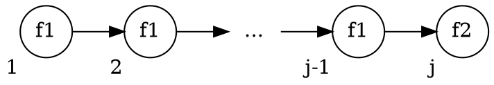

# 5.3 CTL Model Checking via Fixpoint Computation
クリプキ構造$M$, 式$f$について、$M \vDash f$の成立を調べる他の手法として、Fixpoint (不動点) を使ったアルゴリズムを紹介する。

|             | 操作の対象   | 時間計算量        | 空間計算量               |
| ----------: | :----------- | :---------------- | :----------------------- |
| 5.1節の手法 | 各状態・遷移 | $\propto \|M\|$   | 大きい                   |
| 5.3節の手法 | 状態集合     | $\propto \|M\|^2$ | (OBDDと併用すれば)小さい |

## 節の流れ
1. 前準備
   - 不動点の定義
   - 単調, $\cup$-連続, $\cap$-連続 の定義
   - 用語定義
2. 不動点に関する定理・補題について
3. 不動点を用いて$M \vDash f$を調べる方法の説明
4. さらに公平性を考慮した場合の説明

## 前準備
###  不動点 (fixpoint) の定義
不動点は、Complete Partial Order (CPO, 完備半順序)を満たすドメインに対して定義される。

<details>
<summary>完備半順序の定義</summary>

- 最小限がある。
- 任意の単調増加する列$\{ x_i\}_i$ について、上限がある。
- (最大限は無くても良い。)
</details>

**$\mathcal{P}(S)$は完備半順序を持つ。**
<!-- 先取り : P(S)の要素を、ある性質を満たす状態集合とみなし、云々 -->

不動点 :
: 関数$\tau$について、$F$が不動点 $\iff$ $\tau(F) = F$

### 単調, $\cup$-連続, $\cap$-連続 の定義
関数$\tau$が単調 (monotonic) とは:
: $P \subseteq Q \implies \tau(P) \subseteq \tau(Q)$

関数$\tau$が$\cup$-連続 ($\cup$-continuous) とは:
: $P_1 \subseteq P_2 \subseteq \cdots \implies \tau(\cup_i P_i) = \cup_i \tau(P_i)$

関数$\tau$が$\cap$-連続 ($\cap$-continuous) とは:
: $P_1 \supseteq P_2 \supseteq \cdots \implies \tau(\cup_i P_i) = \cup_i \tau(P_i)$

### 用語定義 (predicate, predicate transformer)
$M \vDash f$を調べるうえで、状態集合$S$の冪集合$\mathcal(P)(S)$に着目する。

- $\mathcal(P)$は、latticeとみなせる。

$\mathcal(P)(S)$の要素$S'$は、$S$の *predicate* だとみなせる。
- *predicate* : その集合内の要素のみが満たす性質
- e.g. $\{3, 4\}$を、「状態3, 4のみが満たす性質」とみなす、ということ。


## 不動点に関する定理・補題
### Theorem5.5 (Tarski-Knaster)
Predicate transformer $\tau$について。

#### \[主張1\]
$\tau$が単調ならば、次で定義する{最大, 最小}不動点が存在。
- 最大不動点 : $\nu Z.\tau(Z) = \bigcup\{ Z \ |\ Z \subseteq \tau(Z)\}$
- 最小不動点 : $\mu Z.\tau(Z) = \bigcap\{ Z \ |\ Z \supseteq \tau(Z)\}$

<details>
<summary>証明 (最大不動点について)</summary>

$\Gamma = \{ z \ |\ z \subseteq \tau(Z)\}$, $P = \cup\Gamma$とおく。

ここで、$\Gamma$は、すべての不動点を内包している。<br>
よって、もし$P$が不動点ならば、それは最大不動点である。<br>

$P$が不動点であることを示すには、次の両立を示せば良い。
- (1) $P \subseteq \tau(P)$
- (2) $P \supseteq \tau(P)$

**(1) $P \subseteq \tau(P)$ について:** <br>
$\forall Z \in \Gamma$ について、次が成立する。
$$
\begin{align*}
    \text{(a)}\ \ &Z \subseteq \tau(Z) &(\Gamma \text{の定義より})\\
    \text{(b)}\ \ &Z \subseteq P &(P \text{の定義より})\\
\end{align*}
$$

$\tau$は単調なので、(b)より、
$$ \tau(Z) \subseteq \tau(P) $$

これと(a)より、。
$$ Z \subseteq \tau(P) $$

$\Gamma$の全要素について、この式を考え、両辺の和をとると、
$$ \bigcup_{Z \in \Gamma} Z \ \subseteq\  \bigcup_{Z \in \Gamma} \tau(P) $$

これを整理して、
$$ P \subseteq \tau(P) $$

**(2) $P \supseteq \tau(P)$ について:**<br>
(1)の両辺に$\tau$を適用すると、
- $\tau(P) \subseteq \tau(\tau(P))$

よって$\Gamma$の定義より、
$$ \tau(P) \in \Gamma $$

$P$の定義より、$P$は$\Gamma$の任意の要素より大きいので、
$$ P \supseteq \tau(P) $$

</details>

#### \[主張2\]
- $\tau$が$\cap$-連続ならば、$\nu Z.\tau(Z) = \cap\tau^i(\textit{true})$
- $\tau$が$\cup$-連続ならば、$\mu Z.\tau(Z) = \cup\tau^i(\textit{false})$

<details>
<summary>証明 (最大不動点について)</summary>

$P = \bigcap\tau^i(S)$がであることを示すには、次の両立を示せば良い。
- (1) $P \supseteq \bigcap\tau^i(S)$
- (2) $P \subseteq \bigcap\tau^i(S)$

**(1) $P \supseteq \bigcap\tau^i(S)$について:**<br>
$S$は$\mathcal{P}(S)$の最大元なので、
$$ S \supseteq \tau(S) $$

$\tau$は単調なので、両辺に$\tau$を$i$回適用しても大小は変わらず、
$$ \tau^i(S) \supseteq \tau^{i+1}(S)$$

<!-- TODO 収束値の補足 -->
よって、列 $\{ \tau^i(S)\}_i$ は単調減少する。<br>
このとき、$\tau^i(S) = \bigcap_{k=0}^i \tau^i(S)$が成り立つ。<br>

また、$\mathcal{P}(S)$は下に有界なので、列 $\{ \tau^i(S)\}_i$ は収束する。<br>
その収束値は、$\tau^\infty(S) = \bigcap_{i=0}^\infty \tau^i(S)$である。

ここで、$S \cup \tau(S) = \tau(S)$ を踏まえれば、
$$ \tau\left( \bigcap_{i=0}^\infty \tau^i(S) \right) = \bigcap_{i=1}^\infty \tau^i(S) = \bigcap_{i=0}^\infty \tau^i(S)$$

よって、$\bigcap_{i_0}^\infty \tau^i(S)$は不動点である。

いま、$P$は最大不動点なので、
$$ P \supseteq \bigcap \tau^i(S) $$

**(2) $P \subseteq \bigcap\tau^i(S)$について:**<br>
$S$は$\mathcal{P}(S)$の最大元なので、
$$ P \subseteq \tau(S) $$

$\tau$は単調なので、両辺に$\tau$を$\infty$回適用しても大小は変わらず、
$$ \tau^\infty(P) \subseteq \tau^\infty(S) $$

$P$は不動点なので左辺は$P$であり、また右辺は$\bigcap\tau^i(S)$に等しいので、
$$ P \subseteq \bigcap\tau^i(S) $$

</details>

### Lemma 5.6
$S$が有限で$\tau$が単調ならば、$\tau$は$\cup$-連続であり$\cap$-連続である。

<details>
<summary>証明 (<span class="math inline">\cup</span>-連続について)</summary>

<!-- $P_1 \subseteq P_2 \subseteq \cdots \implies \tau(\cup_i P_i) = \cup_i \tau(P_i)$ -->
列$\{P_i\}_i$は単調増加し、上に有界である($S$が有限なので)から、
$$ \exist j_0 \ \textit{ s.t. }\  \forall j, P_j \subseteq P_{j_0} $$

このとき$\bigcup_i P_i = P_{j_0}$であるから、
$$ \tau\left(\bigcup_i P_i\right) = \tau(P_{j_0}) $$

また、$\tau$は単調なので、$j_0$について次も成り立つ。
$$ \exist j_0 \ \textit{ s.t. }\  \forall j, \tau(P_j) \subseteq \tau(P_{j_0}) $$
したがって、次が成り立つ。
$$ \bigcup_i \tau(P_i) = \tau(P_{j_0}) $$

以上より、次が成立。
$$ \tau\left(\bigcup_i P_i\right) = \bigcup_i \tau(P_i) $$

</details>

### Lemma 5.7
$\tau$が単調ならば、任意の$i$について次が成立。
- $\tau^i(\textit{false}) \subseteq \tau^{i+1}(\textit{false})$
- $\tau^i(\textit{true}) \supseteq \tau^{i+1}(\textit{true})$

証明 : 数学的帰納法を使う。

### Lemma 5.8
$\tau$が単調で$S$が有限なら、次を満たす$i_0$, $j_0$が存在する。
- $\forall k \geq i_0,\ \tau^k(\textit{false}) = \tau^{i_0}(\textit{false})$
- $\forall k \geq j_0,\ \tau^k(\textit{true}) = \tau^{j_0}(\textit{true})$

#### 直感的な意味
$\textit{false}$/$\textit{true}$に$\tau$を適用し続けると、有限回の適用で収束する。

#### 証明 (1つめについて)
Lemma 5.7 より列 $\{\tau^i (false)\}$ は単調増加する。<br>
また$S$が有限であるから、この列は上に有界である。<br>
よって、どこか($i_0$)で収束する。

### Lemma 5.9
$\tau$が単調で$S$が有限なら、次を満たす$i_0$, $j_0$が存在する。
- $\mu Z.\tau(Z) = \tau^{i_0}(\textit{false})$
- $\nu Z.\tau(Z) = \tau^{j_0}(\textit{true})$

#### 直感的な意味
$\textit{false}$/$\textit{true}$に$\tau$を適用し続けて収束したなら、それは最大不動点/最小不動点である。

#### 証明
Theorem5.5の主張2とLemma5.7, Lemma5.8 より示せる。

<!-- これクイズにいいかもね -->

## 不動点を計算するアルゴリズム
上で見てきた定理・補題より、不動点は次のようにして求められる。

```py {caption=最小不動点を求めるアルゴリズム}
def Lfp(tau: PredicateTransformer) -> Predicate:
    prevQ = ∅
    Q = tau(prevQ)
    while prevQ != Q:
        prevQ = Q
        Q = tau(prevQ)
    return Q
```

```py {caption=最大不動点を求めるアルゴリズム}
def Mfp(tau: PredicateTransformer) -> Predicate:
    prevQ = S
    Q = tau(prevQ)
    while prevQ != Q:
        prevQ = Q
        Q = tau(prevQ)
    return Q
```

### アルゴリズムの停止性 (`Lfp`について)
$\tau^i(\emptyset)$と$\tau^{i+1}(\emptyset)$の関係は、次の2通りに分けられる。
1. $\tau^i(\emptyset) \subset \tau^{i+1}(\emptyset)$
2. $\tau^i(\emptyset) = \tau^{i+1}(\emptyset)$

ここで、列$\{ \tau^k(\emptyset) \}_k$について考える。<br>
$\tau^i(\emptyset) = \tau^{i+1}(\emptyset)$が成り立つ最小の$i$を$k$とすると、次が成り立つ。
$$ \emptyset \subset \tau(\emptyset) \subset \cdots \subset \tau^{k-1}(\emptyset) \subset \tau^k(\emptyset) = \tau^{k+1}(\emptyset) = \cdots $$

ここで、$\tau^k(\emptyset) \subseteq S$であることを踏まえると、$k$はたかだか$|S|$である。

したがって、ループは高々$S$周で終わるため、関数`Lfp`は有限時間で停止する。

## Fixpoint-Based Reachability Analysis
Reachability Analysis:
: クリプキ構造$M$について、初期状態から到達可能な状態の集合を求める解析。


不動点を用いて、reachability analysisをおこなう。

まず、状態集合$Q$について、そこから1手で到達できる状態の集合$\textit{post-image}(Q)$を定義する :
$$ \textit{post-image}(Q) = \{s' \ |\ \exist s \in Q\ \text{ s.t. }\ R(s, s')\} $$

これを用いて、$\tau$を定義する :
$$ \tau(Q) = S_0 \cup \textit{post-image}(Q) $$

このとき、最小不動点$\mu Q.\tau(Q)$が、初期状態から到達可能な状態の集合となる。


### Reachability analysis の$M \vDash \textbf{AG}p$の検査への応用
到達可能な状態すべてが$p$を満たすか調べることで、$M \vDash \textbf{AG}p$ を検査できる。

```py {caption=$M \vDash \textbf{AG}p$の検査}
def tau(Q):
    return S0 ∪ post_image(Q)

# モデルMについて次の2つをおこなう:
#   1. M ⊨ AG p を判定する
#   2. AG p を満たす、到達可能な状態集合を求める
def on_the_fly_Reach(M, p):
    prevQ = ∅
    Q = tau(prevQ)
    while Q != prevQ:
        if ∃s ∈ Q s.t. s ⊭ p:
            return ("Model doesn't satisfy AG p", ∅)
        prevQ = Q
        Q = tau(prevQ)
    return ("Model satisfy AG p", Q)
```

## Fixpoint-Based Model-Checking Algorithm for CTL
不動点がCTL式を満たす状態集合になるよう、predicate transformer を設計する。

- $\llbracket \textbf{AF}f_1 \rrbracket_M = \mu Z.(f_1 \lor \textbf{AX}Z)$
- $\llbracket \textbf{EF}f_1 \rrbracket_M = \mu Z.(f_1 \lor \textbf{EX}Z)$
- $\llbracket \textbf{AG}f_1 \rrbracket_M = \nu Z.(f_1 \land \textbf{AX}Z)$
- $\llbracket \textbf{EG}f_1 \rrbracket_M = \nu Z.(f_1 \land \textbf{EX}Z)$
- $\llbracket \textbf{A}(f_1 \textbf{U} f_2) \rrbracket_M = \mu Z.(f_2 \lor (f_1 \land \textbf{AX}Z))$
- $\llbracket \textbf{E}(f_1 \textbf{U} f_2) \rrbracket_M = \mu Z.(f_2 \lor (f_1 \land \textbf{EX}Z))$
- $\llbracket \textbf{A}(f_1 \textbf{R} f_2) \rrbracket_M = \mu Z.(f_2 \land (f_1 \lor \textbf{AX}Z))$
- $\llbracket \textbf{E}(f_1 \textbf{R} f_2) \rrbracket_M = \mu Z.(f_2 \land (f_1 \lor \textbf{EX}Z))$

<details>
<summary>証明 (<span class="math inline">\textbf{EG}</span>について)</summary>

**Lemma 5.10**<br>
$\textbf{E}(f_1 \textbf{U} f_2)$は、次で定義する関数$\tau$の最小不動点である。
$$ \tau(Z) = f_2 \lor (f_1 \land \textbf{EX}Z) $$

これを示す。<br>
この$\tau$は単調なので、Lemma 5.6より、$\cup$-連続である。<br>
また、$\textbf{E}(f_1 \textbf{U} f_2)$は$\tau$の不動点である。<br>

あとは、$\textbf{E}(f_1 \textbf{U} f_2)$が最小不動点であること、つまり次を示せば良い。
$$ \textbf{E}(f_1 \textbf{U} f_2) = \cup_i \tau^i(\textit{false}) $$

まずは$\textbf{E}(f_1 \textbf{U} f_2) \supseteq \cup_i \tau^i(\textit{false})$を示す。<br>
$\textit{false}$は最小元であるから、次が成り立つ。
$$ \textbf{E}(f_1 \textbf{U} f_2) \supseteq \textit{false} $$
両辺に$\tau$を$i$回適用して、次式を得る ($\textbf{E}(f_1 \textbf{U} f_2)$が不動点であることを用いた)。
$$ \textbf{E}(f_1 \textbf{U} f_2) \supseteq \tau^i(\textit{false}) $$
$i = 0, ...$についてこの式を考え、両辺の和集合を取ることで、次を得る。
$$ \textbf{E}(f_1 \textbf{U} f_2) \supseteq \cup_i \tau^i(\textit{false}) $$

次に、$\textbf{E}(f_1 \textbf{U} f_2) \subseteq \cup_i \tau^i(\textit{false})$を示す。<br>
$\textbf{E}(f_1 \textbf{U} f_2)$を満たすパス$\pi$のprefixの長さに関する帰納法を使う。<br>
ここでprefixは、パス$\pi$の始点から、初めて$f_2$を満たす状態までの部分パスを指す。<br>
初めて$f_2$が満たされる状態が、$j$番目であったとする。



prefixの長さが$j$であるパスの始点全体の集合を$S_j$と置き、次を示す。
$$ \forall j,\ S_j \subseteq \tau^j(\textit{false}) $$

$j = 1$のとき、$s \vDash f_2$なので、
$$ s \in (f_2 \lor (f_1 \land \textbf{EX}(\textit{false}))) = \tau(\textit{false}) \subseteq \cup_i \tau^i(\textit{false}) $$
よって成立。

また、$j = k$ のときの成立を仮定する。<br>
prefixの長さが$k+1$なパス$\pi = s_1, s_2, ...$を考える。<br>
$s_2$はprefixの長さが$k$なパスの始点なので、仮定より$s_2 \in \tau^k(false)$である。<br>
したがって、
$$ s_1 \in (f_2 \lor (f_1 \land \textbf{EX}(\tau^k(\textit{false})))) = \tau^{k+1}(\textit{false}) $$
であるから、$j = k+1$ においても成り立つ。

</details>

<details>
<summary>証明 (<span class="math inline">\textbf{EG}</span>について)</summary>

### Lemma 5.11
$\tau(Z) = f_1 \land \textbf{EX}Z$ は単調である。<br>
($P \subseteq Q$のとき、$\textbf{EX}P \subseteq \textbf{EX}Q$であることから示せる。)

### Lemma 5.12
$\tau(Z) = f_1 \land \textbf{EX}Z$, 列$\{ \tau^i(\textit{true}) \}_i$の極限を$\tau^{i_0}(\textit{true})$とおく。<br>
このとき、任意の$s \in S$について、$s \in \tau^{i_0}(\textit{true})$であるとき次が成り立つ。
- $s \vDash f_1$
- $\exist s' \ \text{ s.t. }\ ((s, s') \in R) \land (s' \in \tau^{i_0}(\textit{true}))$

**\[証明\]**<br>
$\tau^{i_0}(\textit{true})$は不動点なので、$\tau^{i_0}(\textit{true}) = \tau^{i_1}(\textit{true})$である。<br>
そのため、$s \in \tau^{i_0}(\textit{true})$ ならば次が成り立つ。
$$s \in \tau^{i_0}(\textit{true}) = \tau^{i_0 + 1}(\textit{true}) = (f_1 \land \textbf{EX}(\tau^{i_0}(\textit{true})))$$
よって、$s \vDash f_1$ であり、$\exist s' \ \text{ s.t. }\ ((s, s') \in R) \land (s' \in \tau^{i_0}(\textit{true}))$ である。

### Lemma 5.13
$\textbf{EG} f_1$ は $\tau(Z) = f_1 \land \textbf{EX}Z$ の不動点である。

**\[証明\]**<br>
$s_0 \vDash \textbf{EG}f_1 \iff s_0 \vDash \textbf{EXEG}f_1$ を示す。

($\Longrightarrow$について)<br>
$s_0 \vDash \textbf{EG}f_1$ のとき、$\textbf{EG}$の定義より次を満たすパス $\pi = s_0, s_1, ...$ が存在する。<br>
$$ \forall k,\ s_k \vDash f_1$$

そのため $s_1 \vDash \textbf{EG} f_1$ であるから、$s_0 \vDash \textbf{EXEG}f_1$である。<br>
よって、
$$ \textbf{EG}f_1 \subseteq (f_1 \land \textbf{EXEG} f_1) $$
である。

($\Longleftarrow$について)<br>
($\Rightarrow$) と同様の考察で示せる。

### Lemma 5.14
$\textbf{EG}f_1$ は $\tau(Z) = f_1 \land \textbf{EX}(Z)$ の最大不動点である。

**\[証明\]**<br>
Lemma 5.11 より $\tau$は単調なので、Lemma 5.6 より $\cap$-連続である。<br>
最大不動点であることを示すには、 $\textbf{EG}f_1 = \cap_i \tau^i(\textit{true})$ を示せば良い。<br>

**($\textbf{EG} f_1 \subseteq \cap_i \tau^i (\textit{true})$について)**<br>
$\forall i,\ \textbf{EG} f_1 \subseteq \tau^i (\textit{true})$ を示せば良い。<br>
$i = 0$ のときは自明である。<br>

$\textbf{EG} f_1 \subseteq \tau^n (\textit{true})$ を仮定する。<br>
$\tau$ は単調なので、$\tau(\textbf{EG} f_1) \subseteq \tau^{n+1}(\textit{true})$である。

Lemma 5.13 より、$\tau (\textbf{EG} f_1) = \textbf{EG} f_1$ なので、
$$ \textbf{EG} f_1 \subseteq \tau^{n+1}(\textit{true}) $$

**($\textbf{EG} f_1 \supseteq \cap_i \tau^i (\textit{true})$について)**<br>
状態 $s \in \cap_i \tau^i (\textit{true})$ を考える。<br>
このとき、$\forall i,\ s \in \tau^i (\textit{true})$であるから、$s$は不動点 $\tau^{i_0}(\textit{true})$に含まれる。<br>
Lemma 5.12 より、$s$ から始まり常に$f_1$を満たすパスが存在するので、$s \vDash \textbf{EG} f_1$ である。

</details>

## Characterizing Fairness with Fixpoints
$F = \{P_1, \cdots, P_n \}$ について、$\textbf{E}_f\textbf{G} f$を考える。<br>
これを満たす状態集合$Z$は、次を満たす。
1. $Z$の要素は$f$を満たす。
2. 任意の公平性条件 $P_k \in F$ と任意の状態 $s \in Z$ について、次をすべて満たすパスが存在する。
   - $s$ で始まる。
   - $P_k$ を満たす $Z$ 内の状態で終わる。
   - 長さ1以上。
   - パス上の状態すべてが$f$を満たす。


$\textbf{E}_f\textbf{G} f$ は不動点を使うと次のように書ける。
$$ \textbf{E}_f\textbf{G} f = \nu Z.(f \land \bigwedge_{k=1}^n \textbf{EXE}(f \textbf{U} (Z \land P_k))) $$
