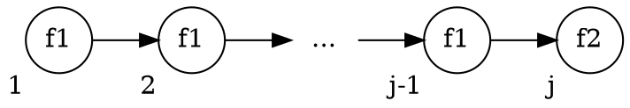

# 5.3 CTL Model Checking via Fixpoint Computation
この節の目的:
: $M \vDash f$, $M \vDash_F f$ を不動点を用いて調べる方法の紹介。


|             | 操作の対象   | 時間計算量        | 空間計算量               |
| ----------: | :----------- | :---------------- | :----------------------- |
| 5.1節の手法 | 各状態・遷移 | $\propto \|S\|$   | 大きい                   |
| 5.3節の手法 | 状態集合     | $\propto \|S\|^2$ | (OBDDと併用すれば)小さい |

## この節の流れ
1. 前準備
   - 不動点の定義
   - 単調, $\cup$-連続, $\cap$-連続 の定義
2. 不動点に関する定理・補題について
3. 不動点を用いて$M \vDash f$を調べる方法の説明
4. さらに公平性を考慮した場合の説明

## 前準備
###  不動点 (fixpoint) の定義
- Complete Partial Order (CPO, 完備半順序) なドメイン $P$
- 関数 $\tau : P \rightarrow P$

について、$p \in P$ が次を満たすなら、$p$ は $\tau$ の不動点である。
$$ \tau(p) = p $$

また、
- 不動点のうち最大であるものを**最大不動点**という。
- 不動点のうち最小であるものを**最小不動点**という。

<details>
<summary>完備半順序の定義</summary>

- 最小限がある。
- 任意の単調増加する列$\{ x_i\}_i$ について、上限がある。
- (最大限は無くても良い。)
</details>

### 不動点を用いたモデル検査の流れ
$\mathcal{P}(S)$ は完備半順序を持つ。<br>
不動点を用いたモデル検査は、ドメインを $\mathcal{P}(S)$ として、次の手順でおこなわれる。

1. 関数 $\tau$ を、その最大 or 最小不動点が $\llbracket f \rrbracket_M$ となるよう設計する。
2. $\tau$ の不動点を求める。

以下では、次の2つを同一視する。
- $\mathcal{P}(S)$ の各要素 $S'$
-  $\llbracket \cdot \rrbracket = S'$ となる条件式 ( *predicate* )

つまり、
- $\textit{true} =$ 集合<quiz>$S$</quiz>
- $\textit{false} =$ 集合<quiz>$\emptyset$</quiz>

である。

また、$\tau$ を *precitate toransformer* と呼ぶ。

### 単調, $\cup$-連続, $\cap$-連続 の定義
<p>

関数 $\tau$ が単調 (monotonic) とは:
: $P \subseteq Q \implies \tau(P) \subseteq \tau(Q)$

</p><p>

関数 $\tau$ が $\cup$-連続 ($\cup$-continuous) とは:
: $P_1 \subseteq P_2 \subseteq \cdots \implies \tau(\cup_i P_i) = \cup_i \tau(P_i)$

</p><p>

関数 $\tau$ が $\cap$-連続 ($\cap$-continuous) とは:
: $P_1 \supseteq P_2 \supseteq \cdots \implies \tau(\cap_i P_i) = \cap_i \tau(P_i)$

</p>

## 不動点に関する定理・補題
説明の都合上、MC本とは順序・証明を一部変えている。

### Lemma 5.7
$\tau$ が単調ならば、任意の $i$ について次が成立。
- $\tau^i(\textit{false}) \subseteq \tau^{i+1}(\textit{false})$
- $\tau^i(\textit{true}) \supseteq \tau^{i+1}(\textit{true})$

証明 : 数学的帰納法を使う。

### Lemma 5.8
$\tau$ が単調で $S$ が有限なら、次を満たす $i$, $j$ が存在する。
- $\forall k \geq i,\ \tau^k(\textit{false}) = \tau^i(\textit{false})$
- $\forall k \geq j,\ \tau^k(\textit{true}) = \tau^j(\textit{true})$

<details class="filled-box">
<summary>証明 (1つ目について)</summary>

示したい式は、次のように変形できる。
$$ \exist i, \forall k, (k \geq i) \Rightarrow \tau^k(\textit{false}) = \tau^i(\textit{false})$$

これは、次と同値である。
$$ \exist i, \forall k, \neg (k \geq i) \land \tau^k(\textit{false}) = \tau^i(\textit{false})$$

背理法を用いて証明する。上の式の否定は次式である。
$$ \forall i, \exist k, (k \geq i) \land  \tau^k(\textit{false}) \neq \tau^i(\textit{false})$$

Lemma 5.7 より、列 $\{\tau^j(\textit{false})\}_j$ は単調増加列なので、上の式は次式と同値である。
$$ \forall i, \exist k, (k \geq i) \land  \tau^k(\textit{false}) \supset \tau^i(\textit{false})$$

この式より、$i = 0$ について次を満たす $l_1$ の存在が言える。
$$ \tau^{l_1}(\textit{false}) \supset \tau^0(\textit{false}) $$

また、同様に $i = l_1$ について次を満たす $l_2$ の存在が言える。
$$ \tau^{l_2}(\textit{false}) \supset \tau^{l_1}(\textit{false}) $$

これを繰り返すことで、狭義単調増加する無限列 $\{ \tau^{l_j}(\textit{false}) \}_j$ を得る ($l_0 = 0$ とした)。

狭義単調なので $|\tau^{l_{|S|}}(\textit{false})| \geq |S|$ であるが、これはドメインが $\mathcal{P}(S)$ であることに矛盾。

よって仮定は誤りであり、示したい式の成立が示された。<br>
$\square$
</details>

### Theorem 5.5 (Tarski-Knaster)
#### 主張1
$\tau$ が単調ならば、次で定義する{最大, 最小}不動点が存在。
- 最大不動点 : $\nu Z.\tau(Z) = \bigcup\{ Z \ |\ Z \subseteq \tau(Z)\}$
- 最小不動点 : $\mu Z.\tau(Z) = \bigcap\{ Z \ |\ Z \supseteq \tau(Z)\}$

<details class="filled-box">
<summary>証明 (最大不動点について)</summary>

$\Gamma = \{ Z \ |\ Z \subseteq \tau(Z)\}$, $P = \cup\Gamma$ とおく。

$\Gamma$ は、すべての不動点を内包している。<br>
よって、もし $P$ が不動点なら $P$ は最大不動点である。<br>

したがって、$P$ が不動点であること、つまり次の両立を示せば良い。
- (1) $P \subseteq \tau(P)$
- (2) $P \supseteq \tau(P)$

**(1) $P \subseteq \tau(P)$ について:** <br>
::: {.indent}
$\forall Z \in \Gamma$ について、次が成立する。
$$
\begin{align*}
    \text{(a)}\ \ &Z \subseteq \tau(Z) &(\Gamma \text{の定義より})\\
    \text{(b)}\ \ &Z \subseteq P &(P \text{の定義より})\\
\end{align*}
$$

$\tau$は単調なので、(b)の両辺に$\tau$を適用して、
$$ \tau(Z) \subseteq \tau(P) $$

これと(a)より、
$$ Z \subseteq \tau(P) $$

$\Gamma$ の全要素について この式を考え、両辺の和をとると、
$$ \bigcup_{Z \in \Gamma} Z \ \subseteq\  \bigcup_{Z \in \Gamma} \tau(P) $$

これを整理して、
$$ P \subseteq \tau(P) $$
:::

**(2) $P \supseteq \tau(P)$ について:**<br>
::: {.indent}
(1)の両辺に$\tau$を適用すると、
$$ \tau(P) \subseteq \tau(\tau(P)) $$

よって $\Gamma$ の定義より、
$$ \tau(P) \in \Gamma $$

$P$ の定義より、$P$ は $\Gamma$ の任意の要素より大きいので、
$$ P \supseteq \tau(P) $$
:::
以上より $P$ は不動点であるから、$P$ は最大不動点である。

</details>

#### 主張2
- $\tau$ が単調で$\cap$-連続ならば、$\nu Z.\tau(Z) = \cap\tau^i(\textit{true})$
- $\tau$ が単調で$\cup$-連続ならば、$\mu Z.\tau(Z) = \cup\tau^i(\textit{false})$

<details class="filled-box">
<summary>証明 (最大不動点について)</summary>

$P = \cap\tau^i(S)$ を示すには、次の両立を示せば良い。
- $P \supseteq \cap\tau^i(S)$
- $P \subseteq \cap\tau^i(S)$

**($P \supseteq \cap\tau^i(S)$について)**<br>
::: {.indent}
Lemma 5.8より、次を満たす $j$ が存在する。
$$ \forall k \geq j,\ \tau^k(S) = \tau^j(S) $$

このとき、$\tau^j(S)$ は不動点である。<br>
また、$\{\tau^j(S)_j\}$ は単調減少する列なので次が成り立つ。
$$ \cap_i \tau^i(S) = \tau^j(S) $$
したがって、$\cap_i \tau^i(S)$ は不動点である。<br>
いま、$P$は最大不動点なので、
$$ P \supseteq \cap \tau^i(S) $$
が成り立つ。
:::

**($P \subseteq \cap\tau^i(S)$について)**<br>
::: {.indent}
$S$は$\mathcal{P}(S)$の最大元なので、
$$ P \subseteq S $$

$\tau$は単調なので、両辺に$\tau$を$\infty$回適用しても大小関係は変わらず、
$$ \tau^\infty(P) \subseteq \tau^\infty(S) $$

$P$は不動点なので左辺は$P$であり、また右辺は$\cap\tau^i(S)$に等しいので、
$$ P \subseteq \cap\tau^i(S) $$
:::

以上より、$\Rightarrow$ と $\Leftarrow$ が示されたので、最大不動点 $P = (\nu Z.\tau(Z))$ は $\cap\tau^i(S)$ に等しい。<br>
$\square$
</details>

### Lemma 5.6
$S$ が有限で $\tau$ が単調ならば、$\tau$ は $\cup$-連続であり $\cap$-連続である。

- $\cup$-連続 : $P_1 \subseteq P_2 \subseteq \cdots \implies \tau(\cup_i P_i) = \cup_i \tau(P_i)$
- $\cap$-連続 : $P_1 \supseteq P_2 \supseteq \cdots \implies \tau(\cup_i P_i) = \cup_i \tau(P_i)$

<details class="filled-box">
<summary>証明 (<span class="math inline">\cup</span>-連続について)</summary>

列 $\{P_i\}_i$ は単調増加し、$S$は有限なので、次を満たす $j$ の存在が示せる。<br>
$$ \cup_i P_i = P_j $$

よって、
$$ \tau\left(\cup_i P_i\right) = \tau(P_j) $$

また、$\tau$は単調なので、列 $\{\tau(P_i)\}_i$ も単調増加列であり、$j$について次も成り立つ。
$$ \cup_i \tau(P_i) = \tau(P_j) $$

以上より、次が成立。
$$ \tau\left(\cup_i P_i\right) = \cup_i \tau(P_i) $$
$\square$

</details>

### Lemma 5.9
$S$が有限で$\tau$が単調なら、次を満たす$i$, $j$が存在する。
- $\mu Z.\tau(Z) = \tau^i(\textit{false})$
- $\nu Z.\tau(Z) = \tau^j(\textit{true})$

#### Q. 最小不動点について証明せよ
**材料 :**

(Lemma 5.6)
: $S$が有限で$\tau$が単調ならば、$\tau$は$\cup$-連続。

(Theorem 5.5)
: $\tau$が単調で$\cup$-連続ならば、$\mu Z.\tau(Z) = \cup\tau^i(\textit{false})$

(Lemma 5.7)
: $\tau$ が単調ならば、$\forall i,\ \tau^i(\textit{false}) \subseteq \tau^{i+1}(\textit{false})$

(Lemma 5.8)
: $\tau$が単調で$S$が有限なら、$\exist i,\ \forall k \geq i,\ \tau^k(\textit{false}) = \tau^i(\textit{false})$

## 不動点を計算するアルゴリズム
上で見てきた定理・補題より、不動点は次のようにして求められる。

```py {caption=最小不動点を求めるアルゴリズム}
def Lfp(tau) -> Predicate:
    (prevQ, Q) = (∅, tau(∅))
    Q = tau(prevQ)
    while prevQ != Q:
        (prevQ, Q) = (Q, tau(prevQ))
    return Q
```

```py {caption=最大不動点を求めるアルゴリズム}
def Mfp(tau) -> Predicate:
    (prevQ, Q) = (S, tau(S))
    Q = tau(prevQ)
    while prevQ != Q:
        (prevQ, Q) = (Q, tau(prevQ))
    return Q
```

### アルゴリズムの停止性 (`Lfp`について)
Lemma 5.8の証明 より、ループは たかだか $|S|$ 回で終わる。<br>
よって関数`Lfp`は有限時間で停止する。

## Fixpoint-Based Reachability Analysis
Reachability Analysis:
: クリプキ構造 $M$ について、初期状態から到達可能な状態の集合を求める解析。

不動点を用いて、reachability analysis をおこなう。<br>
まず、状態集合 $Q$ について、そこから1手で到達できる状態の集合 $\textit{post-image}(Q)$ を定義する :
$$ \textit{post-image}(Q) = \{s' \ |\ \exist s \in Q\ \text{ s.t. }\ R(s, s')\} $$
これを用いて、$\tau$ を定義する :
$$ \tau(Q) = S_0 \cup \textit{post-image}(Q) $$
このとき、最小不動点 $\mu Q.\tau(Q)$ は、初期状態から到達可能な状態の集合である。

### Reachability analysis の $M \vDash \textbf{AG}p$ の検査への応用
到達可能な状態すべてが $p$ を満たすか調べることで、$M \vDash \textbf{AG}p$ を検査できる。

```py {caption=$M \vDash \textbf{AG}p$の検査}
def tau(Q):
    return S0 ∪ post_image(Q)

# モデルMについて次の2つをおこなう:
#   1. M ⊨ AG p を判定する
#   2. AG p を満たす、到達可能な状態集合を求める
def on_the_fly_Reach(M, p):
    (prevQ, Q) = (∅, tau(∅))
    while Q != prevQ:
        if ∃s ∈ Q s.t. s ⊭ p:
            return ("Model doesn't satisfy AG p", ∅)
        (prevQ, Q) = (Q, tau(Q))
    return ("Model satisfy AG p", Q)
```

## Fixpoint-Based Model-Checking Algorithm for CTL
不動点がCTL式を満たす状態集合になるよう、predicate transformer を設計する。

- $\llbracket \textbf{AF}f_1 \rrbracket_M = \mu Z.(f_1 \lor \textbf{AX}Z)$
- $\llbracket \textbf{EF}f_1 \rrbracket_M = \mu Z.(f_1 \lor \textbf{EX}Z)$
- $\llbracket \textbf{AG}f_1 \rrbracket_M = \nu Z.(f_1 \land \textbf{AX}Z)$
- $\llbracket \textbf{EG}f_1 \rrbracket_M = \nu Z.(f_1 \land \textbf{EX}Z)$
- $\llbracket \textbf{A}(f_1 \textbf{U} f_2) \rrbracket_M = \mu Z.(f_2 \lor (f_1 \land \textbf{AX}Z))$
- $\llbracket \textbf{E}(f_1 \textbf{U} f_2) \rrbracket_M = \mu Z.(f_2 \lor (f_1 \land \textbf{EX}Z))$
- $\llbracket \textbf{A}(f_1 \textbf{R} f_2) \rrbracket_M = \mu Z.(f_2 \land (f_1 \lor \textbf{AX}Z))$
- $\llbracket \textbf{E}(f_1 \textbf{R} f_2) \rrbracket_M = \mu Z.(f_2 \land (f_1 \lor \textbf{EX}Z))$

直感的な傾向 :
- 最小不動点は eventuality ($\textbf{F}$, $\textbf{U}$) に対応
- 最大不動点は foreverness ($\textbf{G}$, $\textbf{R}$) に対応

---

EG, EU についてのみ証明する。

### EU について
#### Lemma 5.10
$\textbf{E}(f_1 \textbf{U} f_2)$ は、次で定義する関数 $\tau$ の最小不動点である。
$$ \tau(Z) = f_2 \lor (f_1 \land \textbf{EX}Z) $$

<details class="filled-box">
<summary>証明</summary>

この $\tau$ は単調なので、Lemma 5.6より $\cup$-連続である。<br>
また、$\textbf{E}(f_1 \textbf{U} f_2)$, $\tau(\textbf{E}(f_1 \textbf{U} f_2))$ について $\subseteq$, $\supseteq$ を調べることで、$\textbf{E}(f_1 \textbf{U} f_2)$ は $\tau$ の不動点とわかる。<br>

あとは、$\textbf{E}(f_1 \textbf{U} f_2)$ が最小不動点であること、つまり次を示せば良い。
$$ \textbf{E}(f_1 \textbf{U} f_2) = \cup_i \tau^i(\textit{false}) $$

これは次の両立と同値である。
- $\textbf{E}(f_1 \textbf{U} f_2) \supseteq \cup_i \tau^i(\textit{false})$
- $\textbf{E}(f_1 \textbf{U} f_2) \subseteq \cup_i \tau^i(\textit{false})$

**($\textbf{E}(f_1 \textbf{U} f_2) \supseteq \cup_i \tau^i(\textit{false})$ について)**<br>
::: {.indent}
$\textit{false}$ は最小元であるから、$\textbf{E}(f_1 \textbf{U} f_2) \supseteq \textit{false}$ である。<br>
この両辺に $\tau$ を $i$ 回適用して、次式を得る。<br>
$$ \tau^i(\textbf{E}(f_1 \textbf{U} f_2)) \supseteq \tau^i(\textit{false}) $$
$\textbf{E}(f_1 \textbf{U} f_2)$ は不動点なので、これは次のように変形できる。
$$ \textbf{E}(f_1 \textbf{U} f_2) \supseteq \tau^i(\textit{false}) $$

$i = 0, ...$ についてこの式を考え、両辺の和集合を取って、次を得る。
$$ \textbf{E}(f_1 \textbf{U} f_2) \supseteq \cup_i \tau^i(\textit{false}) $$
:::

**($\textbf{E}(f_1 \textbf{U} f_2) \subseteq \cup_i \tau^i(\textit{false})$ について)**<br>
::: {.indent}
$\textbf{E}(f_1 \textbf{U} f_2)$ を満たすパス $\pi$ の prefix の長さに関する帰納法を使う。<br>
ここで prefix は、パス $\pi$ の始点から、初めて $f_2$ を満たす状態**まで**の部分パスを指す。<br>



prefix の長さが $j$ なパスの始点の集合を $S_j$ と置き、次を帰納法で示す。
$$ \forall j,\ S_j \subseteq \tau^j(\textit{false}) $$

**\[$j = 1$のとき\]**<br>
:::::: {.indent}
$s \vDash f_2$なので、
$$ s \in (f_2 \lor (f_1 \land \textbf{EX}(\textit{false}))) = \tau(\textit{false}) \subseteq \cup_i \tau^i(\textit{false}) $$
よって成立。
::::::

**\[$j = k$ のときの成立を仮定\]**<br>
:::::: {.indent}
prefix の長さが $k+1$ なパス $\pi = s_1, s_2, ...$ を考える。<br>
$s_2$ は prefix の長さが $k$ なパスの始点なので、仮定より $s_2 \in \tau^k(false)$ である。<br>
したがって、
$$ s_1 \in (f_2 \lor (f_1 \land \textbf{EX}(\tau^k(\textit{false})))) = \tau^{k+1}(\textit{false}) $$
であるから、$j = k+1$ においても成り立つ。
::::::
したがって、数学的帰納法によって $\forall j,\ S_j \subseteq \tau^j(\textit{false})$ が成り立つ。<br>
よって $\textbf{E}(f_1 \textbf{U} f_2) \subseteq \cup_i \tau^i(\textit{false})$ が成立。
:::

以上より、$\subseteq$, $\supseteq$ が示せたので、$\textbf{E}(f_1 \textbf{U} f_2)$ は $\tau$ の最小不動点である。<br>
$\square$
</details>

### EGについて
#### Lemma 5.11
$\tau(Z) = f_1 \land \textbf{EX}Z$ は単調である。

($P \subseteq Q$のとき、$\textbf{EX}P \subseteq \textbf{EX}Q$であることから示せる。)

#### Lemma 5.12
$\tau(Z) = f_1 \land \textbf{EX}Z$, 列 $\{ \tau^i(\textit{true}) \}_i$ の極限を $\tau^{i_0}(\textit{true})$ とおく。<br>
このとき、任意の $s \in \tau^{i_0}(\textit{true})$ について次が成り立つ。
- $s \vDash f_1$
- $\exist s' \ \text{ s.t. }\ ((s, s') \in R) \land (s' \in \tau^{i_0}(\textit{true}))$

<details class="filled-box">
<summary>証明</summary>

$\tau^{i_0}(\textit{true})$ は不動点なので、$\tau^{i_0}(\textit{true}) = \tau^{i_0 + 1}(\textit{true})$ である。<br>
そのため、$s \in \tau^{i_0}(\textit{true})$ のとき次が成り立つ。
$$s \in \tau^{i_0}(\textit{true}) = \tau^{i_0 + 1}(\textit{true}) = (f_1 \land \textbf{EX}(\tau^{i_0}(\textit{true})))$$
よって、$s \vDash f_1$ であり、$\exist s' \ \text{ s.t. }\ ((s, s') \in R) \land (s' \in \tau^{i_0}(\textit{true}))$ である。<br>
$\square$
</details>

#### Lemma 5.13
$\textbf{EG} f_1$ は $\tau(Z) = f_1 \land \textbf{EX}Z$ の不動点である。

<details class="filled-box">
<summary>証明</summary>

$s_0 \vDash \textbf{EG}f_1 \iff s_0 \vDash f_1 \land \textbf{EXEG}f_1$ を示す。

**($\Longrightarrow$ について)**<br>
::: {.indent}
$s_0 \vDash \textbf{EG}f_1$ のとき、$\textbf{EG}$の定義より次を満たすパス $\pi = s_0, s_1, ...$ が存在する。<br>
$$ \forall k,\ s_k \vDash f_1$$

そのため $s_1 \vDash \textbf{EG} f_1$ であるから、$s_0 \vDash \textbf{EXEG}f_1$である。<br>
よって、
$$ \textbf{EG}f_1 \subseteq (f_1 \land \textbf{EXEG} f_1) $$
である。
:::

**($\Longleftarrow$ について)**<br>
::: {.indent}
($\Rightarrow$) と同様の考察で示せる。
:::
以上より、$s_0 \vDash \textbf{EG}f_1 \iff s_0 \vDash \textbf{EXEG}f_1$ である。<br>
$\square$
</details>

#### Lemma 5.14
$\textbf{EG}f_1$ は $\tau(Z) = f_1 \land \textbf{EX}(Z)$ の最大不動点である。

<details class="filled-box">
<summary>証明</summary>

最大不動点であることを示すには、 $\textbf{EG}f_1 = \cap_i \tau^i(\textit{true})$ を示せば良い。<br>
いま、Lemma 5.11 より $\tau$は単調なので、Lemma 5.6 より $\cap$-連続である。

**($\textbf{EG} f_1 \subseteq \cap_i \tau^i (\textit{true})$について)**<br>
::: {.indent}
数学的帰納法で示せる。
:::

**($\textbf{EG} f_1 \supseteq \cap_i \tau^i (\textit{true})$について)**<br>
::: {.indent}
状態 $s \in \cap_i \tau^i (\textit{true})$ を考える。<br>
このとき、$s$ は不動点 $\tau^{i_0}(\textit{true})$ に含まれる。<br>
Lemma 5.12 より、$s$ から始まり常に $f_1$ を満たすパスが存在するので、$s \vDash \textbf{EG} f_1$ である。
:::
以上より、$\textbf{EG}f_1$ は $\tau(Z) = f_1 \land \textbf{EX}(Z)$ の最大不動点である。<br>
$\square$
</details>

### 計算量について
- $\llbracket \textbf{AF}f_1 \rrbracket_M = \mu Z.(f_1 \lor \textbf{AX}Z)$
- $\llbracket \textbf{EF}f_1 \rrbracket_M = \mu Z.(f_1 \lor \textbf{EX}Z)$
- $\llbracket \textbf{AG}f_1 \rrbracket_M = \nu Z.(f_1 \land \textbf{AX}Z)$
- $\llbracket \textbf{EG}f_1 \rrbracket_M = \nu Z.(f_1 \land \textbf{EX}Z)$
- $\llbracket \textbf{A}(f_1 \textbf{U} f_2) \rrbracket_M = \mu Z.(f_2 \lor (f_1 \land \textbf{AX}Z))$
- $\llbracket \textbf{E}(f_1 \textbf{U} f_2) \rrbracket_M = \mu Z.(f_2 \lor (f_1 \land \textbf{EX}Z))$
- $\llbracket \textbf{A}(f_1 \textbf{R} f_2) \rrbracket_M = \mu Z.(f_2 \land (f_1 \lor \textbf{AX}Z))$
- $\llbracket \textbf{E}(f_1 \textbf{R} f_2) \rrbracket_M = \mu Z.(f_2 \land (f_1 \lor \textbf{EX}Z))$

各 $\tau$ を計算するためには、$\textbf{AX}$, $\textbf{EX}$, $\lor$, $\land$ を求める必要がある。
- $\textbf{AX}$, $\textbf{EX}$ は $|R|$ で求まる ($|S|$ には依存しない)。
- $\lor$, $\land$ は $|S|$ で求まる。

$\tau$ は最大で $|S|$ 回適用する必要があるので、計算量は $|S|^2$ に依存する。


## Characterizing Fairness with Fixpoints
$\textbf{E}_f\textbf{G}$, $\textbf{E}_f\textbf{X}$, $\textbf{E}_f\textbf{U}$ を不動点を用いて処理する方法を考える。

### $\textbf{E}_f\textbf{G}$ について
$\textbf{E}_f\textbf{G} f$ を満たす状態集合 $Z$ は、次を満たす状態集合のなかで最大のものである。
1. $Z$ の全要素は $f$ を満たす。
2. 任意の公平性制約 $P_k \in F$ と任意の状態 $s \in Z$ について、次をすべて満たすパスが存在する。
   - $s$ で始まる。
   - $P_k$ を満たす $Z$ 内の状態で終わる。
   - 長さ1以上。
   - パス上の状態すべてが $f$ を満たす。

$\textbf{E}_f\textbf{G} f$ は不動点を使うと次のように書ける。
$$ \textbf{E}_f\textbf{G} f = \nu Z.(f \land \bigwedge_{k=1}^n \textbf{EXE}(f\ \textbf{U}\ (Z \land P_k))) $$

### 直感的な説明
例えば...

- $s$ から $P_1$ を満たす状態 $s^1$ まで、常に $f$ を満たしたまま移れるパスがある。
- $s$ から $P_2$ を満たす状態 $s^2$ まで、常に $f$ を満たしたまま移れるパスがある。
- ...
- $s$ から $P_n$ を満たす状態 $s^n$ まで、常に $f$ を満たしたまま移れるパスがある。
- $s$ から $P_1$ を満たす状態 $s^1$ まで、常に $f$ を満たしたまま移れるパスがある。
- ...

→ $s$ は $\textbf{E}_f\textbf{G}$ を満たす。

---
以降ではこれを証明する。

#### Lemma 5.15
$\textbf{E}_f\textbf{G} f$ は $f \land \bigwedge_{k=1}^n \textbf{EXE}(f\ \textbf{U}\ (Z \land P_k))$ の不動点である。

<details class="filled-box">
<summary>証明</summary>

$\tau(Z) = f \land \bigwedge_{k=1}^n \textbf{EXE}(f \textbf{U} (Z \land P_k))$とおく。

$s \in \textbf{E}_f\textbf{G} f$ を仮定すると、$s$ は常に $f$ を満たす公平なパスの始点である。<br>
ここで、$s_i$ を次の条件を満たす このパスで最初の状態とする。
- $s_i \in P_i$
- $s_i \neq s$

このとき $s_i$ は、常に $f$ を満たす公平なパスの始点である。<br>


**($\textbf{E}_f\textbf{G} f \subseteq \tau(\textbf{E}_f\textbf{G} f)$ について)**<br>
::: {.indent}
いま $s_i$ は、常に $f$ を満たす公平なパスの始点である。<br>
よって、$s_i \in \textbf{E}_f\textbf{G} f$ である。<br>
これにより、次式が成り立つ。
$$ \forall k,\  s \vDash f \land \textbf{EXE}(\textbf{E}_f\textbf{G} f \textbf{ U } (f \land P_k)) $$
したがって、次式が成り立つ。
$$ s \vDash f \land \bigwedge_{k=1}^n \textbf{EXE}(\textbf{E}_f\textbf{G} f \textbf{ U } (f \land P_k)) $$

以上より、
$$ \textbf{E}_f\textbf{G} f \subseteq \tau(\textbf{E}_f\textbf{G} f) $$
である。
:::

**($\textbf{E}_f\textbf{G} f \supseteq \tau(\textbf{E}_f\textbf{G} f)$ について)**<br>
::: {.indent}
$s \vDash (f \land \bigwedge_{k=1}^n \textbf{EXE}(f \textbf{ U }(\textbf{E}_f\textbf{G} f \land P_k)))$ とする。<br>
このとき、$s$ で始まり $s' \vDash \textbf{E}_f\textbf{G} f \land P_k$ である $s'$ で終わる有限長のパスが存在する。<br>
さらに、$s$ から $s'$ までの状態は全て $f$ を満たす。<br>
したがって、$s \vDash \textbf{E}_f\textbf{G} f$ である。<br>
以上より、$\textbf{E}_f\textbf{G} f \supseteq \tau(\textbf{E}_f\textbf{G} f)$ である。
:::

これで、$\subseteq$, $\supseteq$ が示せたので、
$$ \textbf{E}_f\textbf{G} f = \tau(\textbf{E}_f\textbf{G} f) $$
であり、$\textbf{E}_f\textbf{G} f$ は $\tau$ の不動点である。<br>
$\square$
</details>

#### Lemma 5.16
$\tau$ の最大不動点は $\textbf{E}_f\textbf{G} f$ に内包される。

<details class="filled-box">
<summary>証明</summary>

$\tau$ の不動点 $Z$ について、$Z \subseteq \textbf{E}_f\textbf{G} f$ を示す。<br>
状態 $s \in Z$ について、次が成り立つ。
- $s$ は $f$ を満たす。
- $s$ の子に、次を満たす $s'$ が存在する。
  - $s'$ から、$Z \land P_1$ を満たす状態 $s_1$ までの、常に $f$ を満たすパスがある。

いま、$s_1 \in Z$ であるから、同様な条件を満たす、$Z \land P_2$ を満たす状態 $s_2$ が存在する。<br>
($s$ にとっての$s_1$ が、$s_1$ にとっての $s_2$ である。)<br>

これを $s_n$ まで考えることで、次を満たすのパスの存在がいえる。
- $s$ で始まる。
- $P_1, \cdots, P_n$ の適当な状態を通る。
- 常に $f$ を満たす。
- $Z$ 内 の状態で終わる。

よって、その終点 ($s_n$) から、$s$ のときと同様にして次を満たすパスの存在がいえる。
- $s_n$ で始まる。
- $P_1, \cdots, P_n$ の適当な状態を通る。
- 常に $f$ を満たす。
- $Z$ 内 の状態で終わる。

これを無限に繰り返すことで、$s$ で始まり常に $f$ を満たす公平なパスの存在がいえる。<br>
よって、$s \vDash \textbf{E}_f\textbf{G} f$ であるから、$Z \subseteq \textbf{E}_f\textbf{G} f$ である。<br>
$\square$

</details>

### $\textbf{E}_f\textbf{X}$, $\textbf{E}_f\textbf{U}$ について
5.2節と同じく、原子式 $\textit{fair} = \textbf{E}_f\textbf{G}\textit{true}$ を導入する。<br>
このとき、
- $\textbf{E}_f\textbf{X}f_1 = \textbf{EX}(f_1  \land \textit{fair})$
- $\textbf{E}_f(f_1 \textbf{U} f_2) = \textbf{E}(f_1 \textbf{U} (f_2 \land \textit{fair})))$

である。

よって、右辺を検査することで $\textbf{E}_f\textbf{X}$, $\textbf{E}_f\textbf{U}$ を検査できる。

## Fxipoint Characterization over Finite Paths
今までは、left-total な (任意のノードが子を持つ) クリプキ構造を仮定していた。<br>
ここでは、left-total でないクリプキ構造について考える。<br>
そのためには、CTL式に対応付けた $\tau$ をいくつか変える必要がある。<br>

まずは、有限パスに関する temporal operator を定義しておく :
$$
  \begin{align*}
    M,\pi \vDash \textbf{F} g_1 &\iff \exist 0 \leq i \leq \textit{length}(\pi)\ \text{ s.t. }\ M,\pi^i \vDash g_1\\
    M,\pi \vDash \textbf{G} g_1 &\iff \forall 0 \leq i \leq \textit{length}(\pi),\ M,\pi^i \vDash g_1
  \end{align*}
$$

以下では代表として、$\llbracket \textbf{AF} f_1 \rrbracket_M$ と $\llbracket \textbf{EG} f_1 \rrbracket_M$ の変化を観察する。

### $\llbracket \textbf{AF} f_1 \rrbracket_M$ について
Left-total では:
- $\mu Z.(f_1 \lor \textbf{AX}Z)$

Non left-total では:
- $\mu Z.(f_1 \lor (\textbf{AX}Z \land \textbf{EX}\textit{true}))$

Left-total でない場合、子ノードが無いノードが存在する。<br>
しかし、$f_1$ を満たさない場合は子ノードが存在する必要がある。<br>
よって、子ノードの存在を保証するべく $\textbf{EX}\textit{true}$ が条件に加わる。

### $\llbracket \textbf{EG} f_1 \rrbracket_M$ について
Left-total では:
- $\nu Z.(f_1 \land \textbf{EX}Z)$

Non left-total では:
- $\nu Z.(f_1 \land (\textbf{EX}Z \lor \textbf{AX}\textit{false})$

Left-total でない場合、パスが終了する可能性も考える必要がある。<br>
よって、子ノードがない場合にのみ満たされる $\textbf{AX}\textit{false}$ が条件に加わる。

---
次節 : [振り返り & Bibriographic Notes](mc5.html)
