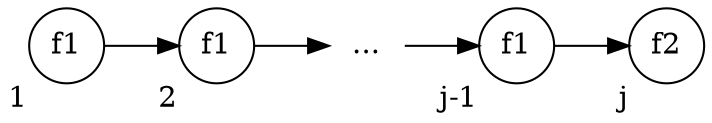

# 5.3 CTL Model Checking via Fixpoint Computation
この節の目的:
: $M \vDash f$, $M \vDash_F f$ を不動点を用いて調べる方法の紹介。


|             | 操作の対象   | 時間計算量        | 空間計算量               |
| ----------: | :----------- | :---------------- | :----------------------- |
| 5.1節の手法 | 各状態・遷移 | $\propto \|S\|$   | 大きい                   |
| 5.3節の手法 | 状態集合     | $\propto \|S\|^2$ | (OBDDと併用すれば)小さい |

## 節の流れ
1. 前準備
   - 不動点の定義
   - 単調, $\cup$-連続, $\cap$-連続 の定義
   - 用語定義
2. 不動点に関する定理・補題について
3. 不動点を用いて$M \vDash f$を調べる方法の説明
4. さらに公平性を考慮した場合の説明

## 前準備
###  不動点 (fixpoint) の定義
- Complete Partial Order (CPO, 完備半順序) なドメイン $P$
- 関数 $\tau : P \rightarrow P$

について、$p \in P$ が次を満たすなら、$p$ は $\tau$ の不動点である。
$$ \tau(p) = p $$

また、
- 不動点のうち最大であるものを**最大不動点**という。
- 不動点のうち最小であるものを**最小不動点**という。

<details>
<summary>完備半順序の定義</summary>

- 最小限がある。
- 任意の単調増加する列$\{ x_i\}_i$ について、上限がある。
- (最大限は無くても良い。)
</details>

### 不動点を用いたモデル検査の流れ
$\mathcal{P}(S)$ は完備半順序を持つ。<br>
不動点を用いたモデル検査は、ドメインを $\mathcal{P}(S)$ として、次の手順でおこなわれる。

1. 関数 $\tau$ を、その(最大/最小)不動点が $\llbracket f \rrbracket_M$ となるよう設計する。
2. $\tau$ の不動点を求める。

以下では、次の2つを同一視する。
- $\mathcal{P}(S)$ の各要素 $S'$
-  $\llbracket \cdot \rrbracket = S'$ となる条件式 ( *predicate* )

つまり、
- $\textit{true} = S$
- $\textit{false} = \emptyset$

である。

また、$\tau$ を*precitate toransformer* と呼ぶ。

### 単調, $\cup$-連続, $\cap$-連続 の定義
<p>

関数$\tau$が単調 (monotonic) とは:
: $P \subseteq Q \implies \tau(P) \subseteq \tau(Q)$

</p><p>

関数$\tau$が$\cup$-連続 ($\cup$-continuous) とは:
: $P_1 \subseteq P_2 \subseteq \cdots \implies \tau(\cup_i P_i) = \cup_i \tau(P_i)$

</p><p>

関数$\tau$が$\cap$-連続 ($\cap$-continuous) とは:
: $P_1 \supseteq P_2 \supseteq \cdots \implies \tau(\cup_i P_i) = \cup_i \tau(P_i)$

</p>

## 不動点に関する定理・補題
MC本とは一部順序を入れ替えている。

### Lemma SP (単調な列の収束)
#### 主張1 : 単調増加する列について
$\mathcal{P}(S)$ 上の 単調増加する列 $\{P_i\}_i$ について、次を全て満たす $k$ が存在する。
$$
    \begin{align*}
        &k \leq |S|\\
        &\forall j < k,\  P_j \subset P_k\\
        &\forall j > k,\  P_j = P_k
    \end{align*}
$$

また、このとき次が成り立つ。
$$ \lim_{i \to \infty} P_i = \bigcup_{i=0}^\infty P_i = P_k $$

<details class="filled-box">
<summary>証明</summary>

$k$ を $P_i = P_{i+1}$ が成り立つ最小の$i$だとすると、次式が成り立つ。。
$$ P_0 \subset P_1 \subset \cdots \subset P_{k-1} \subset P_k = P_{k+1} = \cdots $$

ここで、$P_i \subseteq S$ であることを踏まえると、$k$はたかだか$|S|$である。

したがって、この $k$ は3つの条件全てを満たす。
</details>

#### 主張2 : 単調減少する列について
$\mathcal{P}(S)$ 上の 単調減少する列 $\{P_i\}_i$ について、次を全て満たす $k$ が存在する。
$$
    \begin{align*}
        &k \leq |S|\\
        &\forall j < k,\  P_j \supset P_k\\
        &\forall j > k,\  P_j = P_k
    \end{align*}
$$

また、このとき次が成り立つ。
$$ \lim_{i \to \infty} P_i = \bigcap_{i=0}^\infty P_i = P_k $$

(証明は主張1と同様。)

### Theorem 5.5 (Tarski-Knaster)
#### 主張1
$\tau$が単調ならば、次で定義する{最大, 最小}不動点が存在。
- 最大不動点 : $\nu Z.\tau(Z) = \bigcup\{ Z \ |\ Z \subseteq \tau(Z)\}$
- 最小不動点 : $\mu Z.\tau(Z) = \bigcap\{ Z \ |\ Z \supseteq \tau(Z)\}$

<details class="filled-box">
<summary>証明 (最大不動点について)</summary>

$\Gamma = \{ z \ |\ z \subseteq \tau(Z)\}$, $P = \cup\Gamma$ とおく。

$\Gamma$は、すべての不動点を内包している。<br>
よって、もし $P$ が不動点なら、$p$ は最大不動点である。<br>

よって、$P$ が不動点であること、つまり次の両立を示せば良い。
- (1) $P \subseteq \tau(P)$
- (2) $P \supseteq \tau(P)$

**(1) $P \subseteq \tau(P)$ について:** <br>
::: {.indent}
$\forall Z \in \Gamma$ について、次が成立する。
$$
\begin{align*}
    \text{(a)}\ \ &Z \subseteq \tau(Z) &(\Gamma \text{の定義より})\\
    \text{(b)}\ \ &Z \subseteq P &(P \text{の定義より})\\
\end{align*}
$$

$\tau$は単調なので、(b)の両辺に$\tau$を適用して、
$$ \tau(Z) \subseteq \tau(P) $$

これと(a)より、
$$ Z \subseteq \tau(P) $$

$\Gamma$ の全要素について、この式を考え、両辺の和をとると、
$$ \bigcup_{Z \in \Gamma} Z \ \subseteq\  \bigcup_{Z \in \Gamma} \tau(P) $$

これを整理して、
$$ P \subseteq \tau(P) $$
:::

**(2) $P \supseteq \tau(P)$ について:**<br>
::: {.indent}
(1)の両辺に$\tau$を適用すると、
$$ \tau(P) \subseteq \tau(\tau(P)) $$

よって $\Gamma$ の定義より、
$$ \tau(P) \in \Gamma $$

$P$ の定義より、$P$ は $\Gamma$ の任意の要素より大きいので、
$$ P \supseteq \tau(P) $$
:::

</details>

#### 主張2
- $\tau$が$\cap$-連続ならば、$\nu Z.\tau(Z) = \cap\tau^i(\textit{true})$
- $\tau$が$\cup$-連続ならば、$\mu Z.\tau(Z) = \cup\tau^i(\textit{false})$

<details class="filled-box">
<summary>証明 (最大不動点について)</summary>

$P = \cap\tau^i(S)$ を示すには、次の両立を示せば良い。
- (1) $P \supseteq \cap\tau^i(S)$
- (2) $P \subseteq \cap\tau^i(S)$

**(1) $P \supseteq \cap\tau^i(S)$について:**<br>
::: {.indent}
$S$は$\mathcal{P}(S)$の最大元なので、
$$ S \supseteq \tau(S) $$

$\tau$は単調なので、両辺に$\tau$を$i$回適用しても大小は変わらず、
$$ \tau^i(S) \supseteq \tau^{i+1}(S)$$

よって、列 $\{ \tau^i(S)\}_i$ は単調減少するため、Lemma SP より、次を満たす$k$が存在する。<br>
$$
    \begin{align*}
        (1)\ \ \ \ &\forall j > k,\  P_j = P_k\\
        (2)\ \ \ \ &\cap \tau^i(S) = \tau^k(S)
    \end{align*}
$$

(1)より $\tau^k(S)$ は不動点であるから、(2)より、$\cap \tau^i(S)$は不動点である。

いま、$P$は最大不動点なので、
$$ P \supseteq \cap \tau^i(S) $$
:::

**(2) $P \subseteq \cap\tau^i(S)$について:**<br>
::: {.indent}
$S$は$\mathcal{P}(S)$の最大元なので、
$$ P \subseteq \tau(S) $$

$\tau$は単調なので、両辺に$\tau$を$\infty$回適用しても大小は変わらず、
$$ \tau^\infty(P) \subseteq \tau^\infty(S) $$

$P$は不動点なので左辺は$P$であり、また右辺は$\cap\tau^i(S)$に等しいので、
$$ P \subseteq \cap\tau^i(S) $$
:::

</details>

### Lemma 5.6
$S$が有限で$\tau$が単調ならば、$\tau$は$\cup$-連続であり$\cap$-連続である。

- $\cup$-連続 : $P_1 \subseteq P_2 \subseteq \cdots \implies \tau(\cup_i P_i) = \cup_i \tau(P_i)$
- $\cap$-連続 : $P_1 \supseteq P_2 \supseteq \cdots \implies \tau(\cup_i P_i) = \cup_i \tau(P_i)$

<details class="filled-box">
<summary>証明 (<span class="math inline">\cup</span>-連続について)</summary>

列 $\{P_i\}_i$は 単調増加するので、Lemma SPより、次を満たす $j$ が存在。
$$ \cup_i P_i = P_j $$

よって、
$$ \tau\left(\cup_i P_i\right) = \tau(P_j) $$

また、$\tau$は単調なので、$j$について次も成り立つ。
$$ \cup_i \tau(P_i) = \tau(P_{j_0}) $$

以上より、次が成立。
$$ \tau\left(\cup_i P_i\right) = \cup_i \tau(P_i) $$

</details>

### Lemma 5.7
$\tau$が単調ならば、任意の $i$ について次が成立。
- $\tau^i(\textit{false}) \subseteq \tau^{i+1}(\textit{false})$
- $\tau^i(\textit{true}) \supseteq \tau^{i+1}(\textit{true})$

証明 : 数学的帰納法を使う。

### Lemma 5.8
$\tau$が単調で$S$が有限なら、次を満たす$i_0$, $j_0$が存在する。
- $\forall k \geq i_0,\ \tau^k(\textit{false}) = \tau^{i_0}(\textit{false})$
- $\forall k \geq j_0,\ \tau^k(\textit{true}) = \tau^{j_0}(\textit{true})$

#### 証明
Lemma 5.7 より 列 $\{\tau^i(\textit{false})\}_i$, $\{\tau^i(\textit{true})\}_i$ は単調である。<br>
よって、Lemma SPより条件を満たす $i_0$, $j_0$ が存在する。


### Lemma 5.9
$\tau$が単調で$S$が有限なら、次を満たす$i_0$, $j_0$が存在する。
- $\mu Z.\tau(Z) = \tau^{i_0}(\textit{false})$
- $\nu Z.\tau(Z) = \tau^{j_0}(\textit{true})$

#### 直感的な意味
$\textit{false}$/$\textit{true}$に$\tau$を適用し続けて収束したなら、それは最大不動点/最小不動点である。

#### 証明
Theorem 5.5の主張2とLemma5.7, Lemma5.8 より示せる。

<!-- これクイズにいいかもね -->

## 不動点を計算するアルゴリズム
上で見てきた定理・補題より、不動点は次のようにして求められる。

```py {caption=最小不動点を求めるアルゴリズム}
def Lfp(tau: PredicateTransformer) -> Predicate:
    prevQ = ∅
    Q = tau(prevQ)
    while prevQ != Q:
        prevQ = Q
        Q = tau(prevQ)
    return Q
```

```py {caption=最大不動点を求めるアルゴリズム}
def Mfp(tau: PredicateTransformer) -> Predicate:
    prevQ = S
    Q = tau(prevQ)
    while prevQ != Q:
        prevQ = Q
        Q = tau(prevQ)
    return Q
```

### アルゴリズムの停止性 (`Lfp`について)
Lemma SP より、ループは たかだか $|S|$ 回で終わる。<br>
よって関数`Lfp`は有限時間で停止する。

## Fixpoint-Based Reachability Analysis
Reachability Analysis:
: クリプキ構造$M$について、初期状態から到達可能な状態の集合を求める解析。


不動点を用いて、reachability analysisをおこなう。

まず、状態集合$Q$について、そこから1手で到達できる状態の集合$\textit{post-image}(Q)$を定義する :
$$ \textit{post-image}(Q) = \{s' \ |\ \exist s \in Q\ \text{ s.t. }\ R(s, s')\} $$

これを用いて、$\tau$を定義する :
$$ \tau(Q) = S_0 \cup \textit{post-image}(Q) $$

このとき、最小不動点$\mu Q.\tau(Q)$が、初期状態から到達可能な状態の集合となる。


### Reachability analysis の $M \vDash \textbf{AG}p$ の検査への応用
到達可能な状態すべてが$p$を満たすか調べることで、$M \vDash \textbf{AG}p$ を検査できる。

```py {caption=$M \vDash \textbf{AG}p$の検査}
def tau(Q):
    return S0 ∪ post_image(Q)

# モデルMについて次の2つをおこなう:
#   1. M ⊨ AG p を判定する
#   2. AG p を満たす、到達可能な状態集合を求める
def on_the_fly_Reach(M, p):
    prevQ = ∅
    Q = tau(prevQ)
    while Q != prevQ:
        if ∃s ∈ Q s.t. s ⊭ p:
            return ("Model doesn't satisfy AG p", ∅)
        prevQ = Q
        Q = tau(prevQ)
    return ("Model satisfy AG p", Q)
```

## Fixpoint-Based Model-Checking Algorithm for CTL
不動点がCTL式を満たす状態集合になるよう、predicate transformer を設計する。

- $\llbracket \textbf{AF}f_1 \rrbracket_M = \mu Z.(f_1 \lor \textbf{AX}Z)$
- $\llbracket \textbf{EF}f_1 \rrbracket_M = \mu Z.(f_1 \lor \textbf{EX}Z)$
- $\llbracket \textbf{AG}f_1 \rrbracket_M = \nu Z.(f_1 \land \textbf{AX}Z)$
- $\llbracket \textbf{EG}f_1 \rrbracket_M = \nu Z.(f_1 \land \textbf{EX}Z)$
- $\llbracket \textbf{A}(f_1 \textbf{U} f_2) \rrbracket_M = \mu Z.(f_2 \lor (f_1 \land \textbf{AX}Z))$
- $\llbracket \textbf{E}(f_1 \textbf{U} f_2) \rrbracket_M = \mu Z.(f_2 \lor (f_1 \land \textbf{EX}Z))$
- $\llbracket \textbf{A}(f_1 \textbf{R} f_2) \rrbracket_M = \mu Z.(f_2 \land (f_1 \lor \textbf{AX}Z))$
- $\llbracket \textbf{E}(f_1 \textbf{R} f_2) \rrbracket_M = \mu Z.(f_2 \land (f_1 \lor \textbf{EX}Z))$

EG, EU についてのみ証明する。

### EU について
#### Lemma 5.10
$\textbf{E}(f_1 \textbf{U} f_2)$は、次で定義する関数$\tau$の最小不動点である。
$$ \tau(Z) = f_2 \lor (f_1 \land \textbf{EX}Z) $$

<details class="filled-box">
<summary>証明</summary>

この $\tau$ は単調なので、Lemma 5.6より、$\cup$-連続である。<br>
また、$\textbf{E}(f_1 \textbf{U} f_2)$は$\tau$の不動点である。<br>

あとは、$\textbf{E}(f_1 \textbf{U} f_2)$が最小不動点であること、つまり次を示せば良い。
$$ \textbf{E}(f_1 \textbf{U} f_2) = \cup_i \tau^i(\textit{false}) $$

これは次を示すのと同値である。
1. $\textbf{E}(f_1 \textbf{U} f_2) \supseteq \cup_i \tau^i(\textit{false})$
2. $\textbf{E}(f_1 \textbf{U} f_2) \subseteq \cup_i \tau^i(\textit{false})$

**(1) $\textbf{E}(f_1 \textbf{U} f_2) \supseteq \cup_i \tau^i(\textit{false})$ について**<br>
::: {.indent}
$\textit{false}$ は最小元であるから、$\textbf{E}(f_1 \textbf{U} f_2) \supseteq \textit{false}$ である。<br>
この両辺に $\tau$ を $i$ 回適用して、次式を得る。<br>
($\textbf{E}(f_1 \textbf{U} f_2)$が不動点であることを用いた。)
$$ \textbf{E}(f_1 \textbf{U} f_2) \supseteq \tau^i(\textit{false}) $$

$i = 0, ...$ についてこの式を考え、両辺の和集合を取って、次を得る。
$$ \textbf{E}(f_1 \textbf{U} f_2) \supseteq \cup_i \tau^i(\textit{false}) $$
:::

**(2) $\textbf{E}(f_1 \textbf{U} f_2) \subseteq \cup_i \tau^i(\textit{false})$ について**<br>
::: {.indent}
$\textbf{E}(f_1 \textbf{U} f_2)$ を満たすパス $\pi$ のprefixの長さに関する帰納法を使う。<br>
ここでprefixは、パス$\pi$の始点から、初めて$f_2$を満たす状態までの部分パスを指す。<br>



prefixの長さが $j$ であるパスの始点全体の集合を $S_j$ と置き、次を示す。
$$ \forall j,\ S_j \subseteq \tau^j(\textit{false}) $$

\[$j = 1$のとき\]<br>
$s \vDash f_2$なので、
$$ s \in (f_2 \lor (f_1 \land \textbf{EX}(\textit{false}))) = \tau(\textit{false}) \subseteq \cup_i \tau^i(\textit{false}) $$
よって成立。

\[$j = k$ のときの成立を仮定\]<br>
prefixの長さが$k+1$なパス$\pi = s_1, s_2, ...$を考える。<br>
$s_2$はprefixの長さが$k$なパスの始点なので、仮定より$s_2 \in \tau^k(false)$である。<br>
したがって、
$$ s_1 \in (f_2 \lor (f_1 \land \textbf{EX}(\tau^k(\textit{false})))) = \tau^{k+1}(\textit{false}) $$
であるから、$j = k+1$ においても成り立つ。
:::
</details>

### EGについて
#### Lemma 5.11
$\tau(Z) = f_1 \land \textbf{EX}Z$ は単調である。

($P \subseteq Q$のとき、$\textbf{EX}P \subseteq \textbf{EX}Q$であることから示せる。)

#### Lemma 5.12
$\tau(Z) = f_1 \land \textbf{EX}Z$, 列 $\{ \tau^i(\textit{true}) \}_i$ の極限を $\tau^{i_0}(\textit{true})$ とおく。<br>
このとき、任意の $s \in \tau^{i_0}(\textit{true})$ について次が成り立つ。
- $s \vDash f_1$
- $\exist s' \ \text{ s.t. }\ ((s, s') \in R) \land (s' \in \tau^{i_0}(\textit{true}))$

<details class="filled-box">
<summary>証明</summary>

$\tau^{i_0}(\textit{true})$ は不動点なので、$\tau^{i_0}(\textit{true}) = \tau^{i_1}(\textit{true})$である。<br>
そのため、$s \in \tau^{i_0}(\textit{true})$ のとき次が成り立つ。
$$s \in \tau^{i_0}(\textit{true}) = \tau^{i_0 + 1}(\textit{true}) = (f_1 \land \textbf{EX}(\tau^{i_0}(\textit{true})))$$
よって、$s \vDash f_1$ であり、$\exist s' \ \text{ s.t. }\ ((s, s') \in R) \land (s' \in \tau^{i_0}(\textit{true}))$ である。
</details>

#### Lemma 5.13
$\textbf{EG} f_1$ は $\tau(Z) = f_1 \land \textbf{EX}Z$ の不動点である。

<details class="filled-box">
<summary>証明</summary>

$s_0 \vDash \textbf{EG}f_1 \iff s_0 \vDash \textbf{EXEG}f_1$ を示す。

**($\Longrightarrow$について)**<br>
::: {.indent}
$s_0 \vDash \textbf{EG}f_1$ のとき、$\textbf{EG}$の定義より次を満たすパス $\pi = s_0, s_1, ...$ が存在する。<br>
$$ \forall k,\ s_k \vDash f_1$$

そのため $s_1 \vDash \textbf{EG} f_1$ であるから、$s_0 \vDash \textbf{EXEG}f_1$である。<br>
よって、
$$ \textbf{EG}f_1 \subseteq (f_1 \land \textbf{EXEG} f_1) $$
である。
:::

**($\Longleftarrow$について)**<br>
::: {.indent}
($\Rightarrow$) と同様の考察で示せる。
:::
</details>

#### Lemma 5.14
$\textbf{EG}f_1$ は $\tau(Z) = f_1 \land \textbf{EX}(Z)$ の最大不動点である。

<details class="filled-box">
<summary>証明</summary>

Lemma 5.11 より $\tau$は単調なので、Lemma 5.6 より $\cap$-連続である。<br>
最大不動点であることを示すには、 $\textbf{EG}f_1 = \cap_i \tau^i(\textit{true})$ を示せば良い。<br>

**($\textbf{EG} f_1 \subseteq \cap_i \tau^i (\textit{true})$について)**<br>
::: {.indent}
$\forall i,\ \textbf{EG} f_1 \subseteq \tau^i (\textit{true})$ を数学的帰納法で示す。<br>
**\[$i = 0$ のとき\]**<br>
自明。

**\[$i = n$ での成立を仮定\]**<br>
$\textbf{EG} f_1 \subseteq \tau^n (\textit{true})$ を仮定する。<br>
$\tau$ は単調なので、$\tau(\textbf{EG} f_1) \subseteq \tau^{n+1}(\textit{true})$である。

Lemma 5.13 より、$\tau (\textbf{EG} f_1) = \textbf{EG} f_1$ なので、
$$ \textbf{EG} f_1 \subseteq \tau^{n+1}(\textit{true}) $$
よって $i = n+1$ でも成立。
:::

**($\textbf{EG} f_1 \supseteq \cap_i \tau^i (\textit{true})$について)**<br>
::: {.indent}
状態 $s \in \cap_i \tau^i (\textit{true})$ を考える。<br>
このとき、$s$は不動点 $\tau^{i_0}(\textit{true})$に含まれる。<br>
Lemma 5.12 より、$s$ から始まり常に$f_1$を満たすパスが存在するので、$s \vDash \textbf{EG} f_1$ である。
:::
</details>

## Characterizing Fairness with Fixpoints
$\textbf{E}_f\textbf{G}$, $\textbf{E}_f\textbf{X}$, $\textbf{E}_f\textbf{U}$ を不動点を用いて処理する方法を考える。

### $\textbf{E}_f\textbf{G}$ について
$\textbf{E}_f\textbf{G}$を満たす状態集合$Z$は、次を満たす状態集合のなかで最大のものである。
1. $Z$の要素は $f$ を満たす。
2. 任意の公平性条件 $P_k \in F$ と任意の状態 $s \in Z$ について、次をすべて満たすパスが存在する。
   - $s$ で始まる。
   - $P_k$ を満たす $Z$ 内の状態で終わる。
   - 長さ1以上。
   - パス上の状態すべてが$f$を満たす。


$\textbf{E}_f\textbf{G} f$ は不動点を使うと次のように書ける。
$$ \textbf{E}_f\textbf{G} f = \nu Z.(f \land \bigwedge_{k=1}^n \textbf{EXE}(f \textbf{U} (Z \land P_k))) $$

#### Lemma 5.15
$\textbf{E}_f\textbf{G} f$ は $f \land \bigwedge_{k=1}^n \textbf{EXE}(f \textbf{U} (Z \land P_k))$ の不動点である。

<details class="filled-box">
<summary>証明</summary>

$\tau(Z) = f \land \bigwedge_{k=1}^n \textbf{EXE}(f \textbf{U} (Z \land P_k))$とおく。

$s \in \textbf{E}_f\textbf{G} f$ を仮定すると、$s$ は常に $f$ を満たす公平なパスの始点である。<br>
ここで、$s_i$ を次の条件を満たす このパスで最初の状態とする。
- $s_i \in P_i$
- $s_i \neq s$

**($\textbf{E}_f\textbf{G} f \subseteq \tau(\textbf{E}_f\textbf{G} f)$ について)**<br>
::: {.indent}
このとき、$s_i$ もまた、常に $f$ を満たす公平なパスの始点である。<br>
よって、$s_i \in \textbf{E}_f\textbf{G} f$ である。<br>
これにより、次式が成り立つ。
$$ \forall k,\  s \vDash f \land \textbf{EXE}(\textbf{E}_f\textbf{G} f \textbf{ U } (f \land P_k)) $$
したがって、次式が成り立つ。
$$ s \vDash f \land \bigwedge_{k=1}^n \textbf{EXE}(\textbf{E}_f\textbf{G} f \textbf{ U } (f \land P_k)) $$

以上より、
$$ \textbf{E}_f\textbf{G} f \subseteq \tau(\textbf{E}_f\textbf{G} f) $$
である。
:::

**($\textbf{E}_f\textbf{G} f \supseteq \tau(\textbf{E}_f\textbf{G} f)$ について)**<br>
::: {.indent}
$s \vDash (f \land \land_{k=1}^n \textbf{EXE}(f \textbf{ U }(\textbf{E}_f\textbf{G} f \land P_k)))$ とする。<br>
このとき、$s$ で始まり $s' \vDash \textbf{E}_f\textbf{G} f \land P_k$ である $s'$ で終わる有限長のパスが存在する。<br>
さらに、$s$ から $s'$ までの状態は全て $f$ を満たす。<br>
したがって、$s \vDash \textbf{E}_f\textbf{G} f$ である。<br>
以上より、$\textbf{E}_f\textbf{G} f \supseteq \tau(\textbf{E}_f\textbf{G} f)$ である。
:::

これで、$\subseteq$, $\supseteq$ が示せたので、
$$ \textbf{E}_f\textbf{G} f = \tau(\textbf{E}_f\textbf{G} f) $$
であり、$\textbf{E}_f\textbf{G} f$ は $\tau$ の不動点である。<br>
$\square$
</details>

#### Lemma 5.16
$\tau$ の最大不動点は $\textbf{E}_f\textbf{G} f$ に内包される。

<details class="filled-box">
<summary>証明</summary>

$\tau$ の不動点 $Z$ について、$Z \subseteq \textbf{E}_f\textbf{G} f$ を示す。<br>
状態 $s \in Z$ について、次が成り立つ。
- $s$ は $f$ を満たす。
- $s$ の子に、次を満たす $s'$ が存在する。
  - $s'$ から、$Z \land P_1$ を満たす状態 $s_1$ までの、常に $f$ を満たすパスがある。

いま、$s_1 \in Z$ であるから、同様な条件を満たす、$Z \land P_2$ を満たす状態 $s_2$ が存在する。<br>
($s$ にとっての$s_1$ が、$s_1$ にとっての $s_2$ である。)<br>

これを $s_n$ まで考えることで、次を満たすのパスの存在がいえる。
- $s$ で始まる。
- $P_1, \cdots, P_n$ の適当な状態を通る。
- 常に $f$ を満たす。
- $Z$ 内 の状態で終わる。

よって、その終点 ($s_n$) から、$s$ のときと同様にして次を満たすパスの存在がいえる。
- $s_n$ で始まる。
- $P_1, \cdots, P_n$ の適当な状態を通る。
- 常に $f$ を満たす。
- $Z$ 内 の状態で終わる。

これを無限に繰り返すことで、$s$ で始まり常に $f$ を満たす公平なパスの存在がいえる。<br>
よって、$s \vDash \textbf{E}_f\textbf{G} f$ であるから、$Z \subseteq \textbf{E}_f\textbf{G} f$ である。<br>
$\square$

</details>

### $\textbf{E}_f\textbf{X}$, $\textbf{E}_f\textbf{U}$ について
5.2節と同じく、原子式 $\textit{fair} = \textbf{E}_f\textbf{G}\textit{true}$ を導入する。<br>
このとき、
- $\textbf{E}_f\textbf{X}f_1 = \textbf{EX}(f_1  \land \textit{fair})$
- $\textbf{E}_f(f_1 \textbf{U} f_2) = \textbf{E}(f_1 \textbf{U} (f_2 \land \textit{fair})))$

である。

よって、右辺を検査することで $\textbf{E}_f\textbf{X}$, $\textbf{E}_f\textbf{U}$ を検査できる。

## Fxipoint Characterization over Finite Paths
今まで、クリプキ構造が left-total であることを仮定していた。<br>
この仮定を外すと、CTL式に対応付けた $\tau$ も大きく変える必要がある。<br>

まずは、有限パスに関する temporal operator を定義する :
$$
  \begin{align*}
    M,\pi \vDash \textbf{F} g_1 &\iff \exist 0 \leq i \leq \textit{length}(\pi)\ \text{ s.t. }\ M,\pi^i \vDash g_1\\
    M,\pi \vDash \textbf{G} g_1 &\iff \forall 0 \leq i \leq \textit{length}(\pi),\ M,\pi^i \vDash g_1
  \end{align*}
$$

この元で、$\tau$ は次のように変更される。
$$
  \begin{align*}
    \llbracket \textbf{AF} f_1 \rrbracket_M &= \mu Z.(f_1 \lor (\textbf{AX}Z \land \textbf{EX}\textit{true}))\\
    \llbracket \textbf{EG} f_1 \rrbracket_M &= \nu Z.(f_1 \land (\textbf{EX}Z \lor \textbf{AX}\textit{false}))
  \end{align*}
$$

同様に、他のCTL式についても fixpoint characterization が定義できる。<br>

$\textbf{AF} f_1$ について、もし ある状態が$f_1$を満たさないなら、その状態には子がなくてはならない。
これは left-total なら不要な制約。
