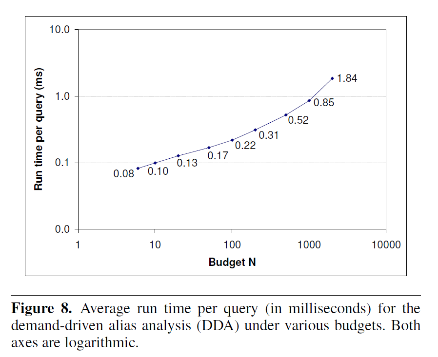
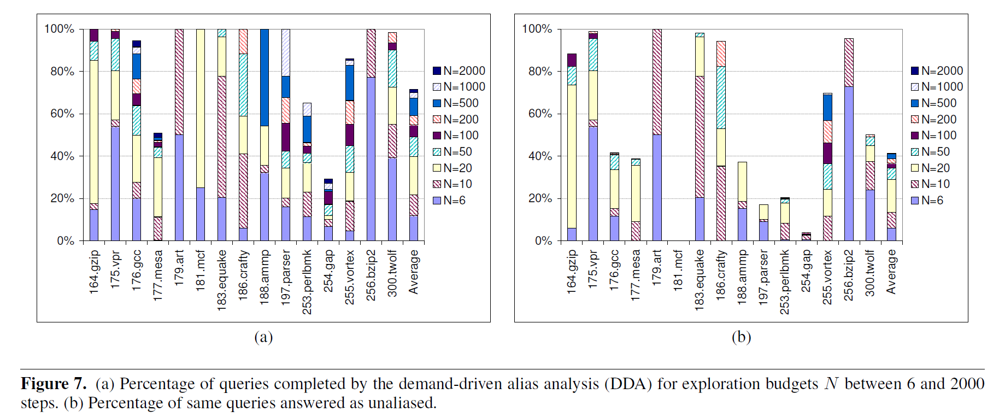
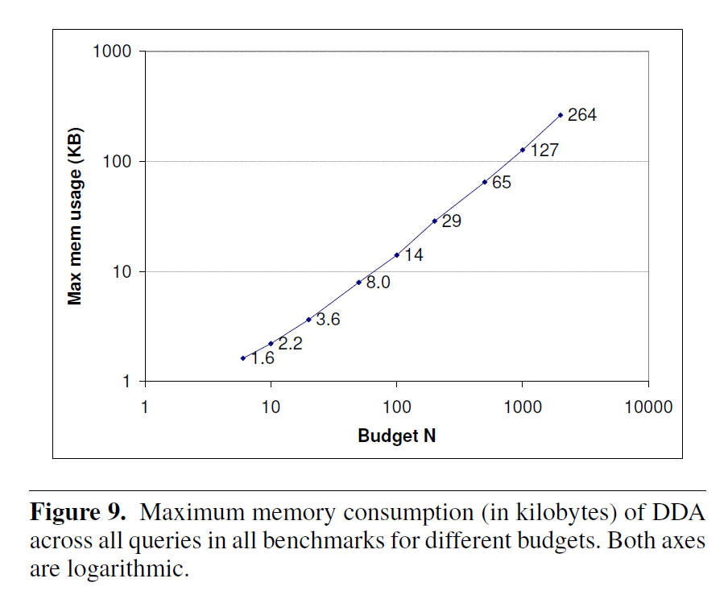
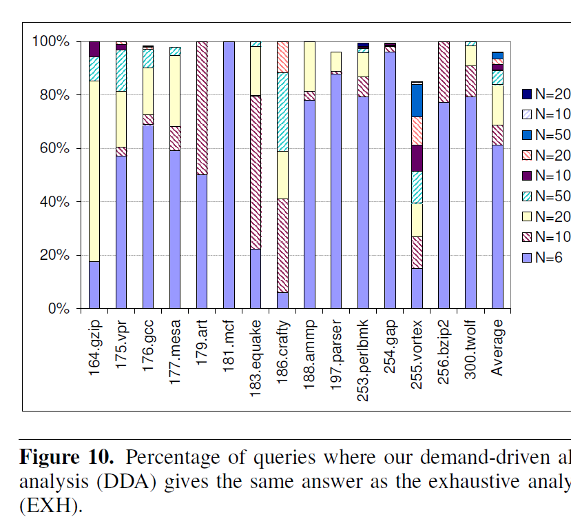

# Demand Driven Alias Analysis for C \[POPL'08\]

- 目的 : C 言語の may-alias 解析
- 既存手法の問題 : 遅い
- 提案手法 : May-alias 解析を CFL-reachability に帰着
  - CFL : Context Free Grammer
- 結果 : 不要な解析が減り、速度改善 (x30)
- 精度 : Andersen 相当 (flow, ctxt, element, field - **in**sensitive)

## Alias 解析

問 : ある 2 つのポインタ `p`, `q` が同じ場所を指しうるか？

## 提案手法概説

1. 変数間の関係をグラフに起こす
   - ノード : 変数, 変数の参照 (多段も可), 変数の参照外し (多段も可)
   - エッジ : 式
   - エッジのラベル : 式の種類
2. ノード間のパスについているラベル列を観察

```txt
Program :       [*x]                  [ z]                  [*s]       [ t]
                 ^                     ^                     ^          ^
s = &t;          |                     |                     |          |
r = &z;         [ x]<------[*y]<------[&z]------>[ r]------>[ s]<------[&t]
y = &r;          ^          ^                     ^          ^
s = r;           |          |                     |          |
x = *y;         [&x]       [ y]<-----------------[&r]       [&s]
                            ^
                            |
                           [&y]


                全ての辺には対応する逆向きの辺も貼られているが、表記上は省略

                縦線 : 参照外し (*), 逆辺は参照 (&)
                横線 : 代入 (→), 逆辺は被代入 (←)
                (カッコ内は辺のラベル)
```

`z` から `*x` までのあるパス :

```txt
      &           →          →          *
[ z]------>[&z]------>[*y]------>[ x]------>[*x]
```

ラベル列 `& → → *` は、次の操作に対応 :

1. 参照を取る
2. その値が伝播
3. その値が伝播
4. 参照を外す

これは `z` と `*x` が may-alias 関係にあるということ。

直感的な観察 :

- ラベル列状で `&` と `*` のバランスが取れていれば良い。

## 提案手法の構築手順

1. プログラムを定式化
2. プログラムをグラフに変換する方法を策定
3. エイリアス関係を表すラベル列を CFL で記述
4. CFL-reachability を求める方法を考案

## プログラムの定式化

仮定 : 変数はすべてポインタである。

- `int a;` は `int *ptr_a = stack_alloc(sizeof(int))` に変えれば良い。

形式的定義 :

- Addresses $a \in \text{Addr}$
- Expressions $e \in \text{Expr}$, $e ::= a | *e$
- Assignments $s \in \text{Stmt}$, $*e1 ::= e2$

| 種別       | Andersen の定式化 | 提案手法の定式化   |
| ---------- | ----------------- | ------------------ |
| Address of | `x = &y`          | `*ptr_x = ptr_y`   |
| Assign     | `x = y`           | `*ptr_x = *ptr_y`  |
| Load       | `x = *y`          | `*ptr_x = **ptr_y` |
| Store      | `*x = y`          | `**ptr_x = *ptr_y` |

## グラフの定義

Program Expression Graph (PEG)

- ノード : 式
- 辺 : Assignment (andersen の Assign ではないことに注意)
- 辺のラベル
  - 参照外し (\*)
  - 代入エッジ (→)

## エイリアス関係を表すラベル列を CFL で記述

2点 `a`, `b` が CFL-reachable :
: ある CFL による言語 $L$ について、`a`, `b` 間のパスのラベル列が $L$ の要素である

### エイリアス関係の分類

Memory alias $M \in (\text{Expr} \times \text{Expr})$ :
: 左辺値 `e1` と `e2` が `&(*e1) == &(*e2)` である

Value alias $V \in (\text{Expr} \times \text{Expr})$ :
: 式 `e1` と `e2` が `e1 == e2` である

### CFL の定義

$$
\begin{align}
  M &::= `\&`\ V\ `*`\\
  V &::= \bar{F}\ M?\ \bar{F} \\
  F &::= (→\ M?)^{*} \\
  \bar{F} &::= (M?\ ←)^{*} \\
\end{align}
$$

#### $F$ の直感的な理解

```txt
      →          M
[*a]----->[*b]- ... ->[*c]
```

- $M$ の定義より、 `*b` と `*c` は同じメモリ位置を指す
- → 式 `*c = *a` を表す

#### $\bar{F}$ の直感的な理解

```txt
      M          ←
[*c]----->[*b]- ... ->[*a]
```

- $F$ から作られるラベル列を逆順にしたもの
- 式 `*c = *a` を表す

#### $M$ の直感的な理解

```txt
       &             V             *
[ a]------->[&a]--- ... --->[ y]------->[*y]
```

- $V$ の定義より `&a == y`
- → `&a == &(*y)` を表す

#### $V$ の直感的な理解

```txt
       _
       F             M             F
[*a]------->[*b]--- ... --->[*c]------->[*d]
```

- $\bar{F}$ の定義より、 `*b = *a`
- $M$ の定義より、`&(*b) == &(*c)` → `*b == *c`
- $F$ の定義より、 `*d = *c`
- → `*a == *d`

(命令順は考えていないことに注意)

### CFL の定義 (再掲)

$$
\begin{align}
  M &::= `\&`\ V\ `*`\\
  V &::= \bar{F}\ M?\ \bar{F} \\
  F &::= (→\ M?)^{*} \\
  \bar{F} &::= (M?\ ←)^{*} \\
\end{align}
$$

整理して、

$$
\begin{align}
  M &::= `\&`\ V\ `*`\\
  V &::= (M?\ ←)^{*}\ M?\ (→\ M?)^{*} \\
\end{align}
$$

## CFL-reachability を求める方法を考案

1. CFL をオートマトンに変換
2. オートマトン上で CFL-reachability を求める

### CFL をオートマトンに変換

$$
\begin{align}
  M &::= `\&`\ V\ `*`\\
  V &::= (M?\ ←)^{*}\ M?\ (→\ M?)^{*} \\
\end{align}
$$


### May-alias 解析

- 入力 : 左辺式 `e1`, `e2`
- 出力 : それらが may-alias 関係にあるか ($M$ の要素か)

```python
#  aassign_to(a) : {b : <a> → <b>}
# assign_from(a) : {b : <a> ← <b>}

# alias_mem[n] : n の memory alias
alias_mem: dict[Expr, list[Expr]] = {}

# {(s, c)} = reach[n] : <s> から始めて <n> に状態 c で到達した
reach: dict[Expr, list[(Expr, State)]]

def may_alias(<e1>: Expr, <e2>: Expr):
    # ワークリスト
    # (<n>, <s>, c) = w.pop()
    #
    # 意味 :
    #      <s> --- V ---> <n>
    #                   状態S1
    #
    w: list[(Expr, Expr, State)] = [(<&e1>, <&e1>, S1)]

    while w.len() != 0:
        (<n>, <s>, c) = w.pop()

        # 終了条件
        if <*s> == e1 and <*n> == e2:
            return True

        # 情報を上方 (参照外し側) へ伝播
        if <*n> != NULL and <*n> not in alias_mem[<*s>]:
            # M(<*s>, <*n>) を新たに発見した
            alias_mem[<*s>].insert(<*n>)
            for (<t>, c) in reach(<*s>):
                if c == S1:
                    #  <t> ----> <*s> --- M ---> <*n>
                    #             S1              S2
                    #
                    # → reach[<*n>].insert((<t>, S2))
                    #   w.insert((<*n>, <t>, S2))
                    #
                    propagete(w, <*n>, <t>, S2)
                elif c == S3:
                    propagate(w, <*n>, <t>, S4)

        # 情報流を考慮して到達可能性を伝播
        if c == S1:
            for <m> in assign_from(<n>):
                propagate(w, <m>, <s>, S1)
            for <m> in alias_mem[<n>]:
                propagate(w, <m>, <s>, S2)
            for <m> in assign_to(<n>):
                propagate(w, <m>, <s>, S3)
        elif c == S2:
            for <m> in assign_from(<n>):
                propagate(w, <m>, <s>, S1)
            for <m> in assign_to(n):
                propagate(w, <m>, <s>, S3)
        elif c == S3:
            for <m> in assign_to(<n>):
                propagate(w, <m>, <s>, S3)
            for <m> in alias_mem[n]:
                propagate(w, <m>, <s>, S4)
        elif c == S4:
            for <m> in assign_to(<n>):
                propagate(w, <m>, <s>, S3)

        # 情報を下方へ伝播
        if <&n> != NULL and (c == S1 or c == S3):
            propagate(w, <&n>, <&n>, S1)

        return false
```

```python
def propagate(w, <n>, <s>, c):
    if (<s>, c) not in reach(<n>):
        reach(<n>).insert((<s>, c))
        w.insert((<n>, <s>, c))
```

### アルゴリズムの最適化

- 伝播順の工夫 (省略)
- 並列化
  - `may_alias(<e1>, <e2>)` と `may_alias(<e2>, <e1>)` を並列実行
  - 高速になったとのこと。
- 解析の切り上げ
  - ワークリストに追加できる回数を制限
  - 制限に到達した場合は may-alias と判定 (健全)
- キャッシュ
  - あるクエリの処理で得た情報を、別のクエリの処理でも使う
  - メモリ消費量が増える (2008 年当時は死活問題だったと思われる)

## points-to 解析への応用

問 : あるポインタ `p` の指し先は何か？

$$
\begin{align}
  R &= \{ (a, a) | a \in \text{Addr} \}\\
  P &= \bar{F}R = (M?\ ←)^{*} R \subseteq \text{Expr} \times _text{Addr}\\
\end{align}
$$

$P$ を調べれば良い。\
本筋でないのでアルゴリズムは省略とのこと。

## 健全性

形式的に証明を与えた (略)

## 評価

実装

- Java 製の C 言語解析インフラ Crystal 上で実装
- 実装は Crystal に取り込まれたらしい

検体

- SPEC2000 の C 言語で書かれた検体

| Program     | Code size (KLOC) | PEG #Node | PEG #Edge | Picked queries |
| ----------- | ---------------: | --------: | --------: | -------------: |
| 164.gzip    |              7.8 |      4767 |      3226 |             34 |
| 175.vpr     |             17.0 |     11242 |      9833 |             91 |
| 176.gcc     |            205.7 |    112341 |    168484 |           1086 |
| 177.mesa    |             50.2 |     51766 |    271863 |            955 |
| 179.art     |              1.3 |      1226 |       659 |              4 |
| 181.mcf     |              1.9 |      1303 |      1040 |              4 |
| 183.equake  |              1.5 |      1716 |       967 |             54 |
| 186.crafty  |             19.5 |     10929 |      7238 |             17 |
| 188.ammp    |             13.3 |     13526 |      9203 |             59 |
| 197.parser  |             10.9 |      9538 |      8753 |             99 |
| 253.perlbmk |             61.8 |     48703 |     52964 |            304 |
| 254.gap     |             59.5 |     58915 |    809665 |            656 |
| 255.vortex  |             52.6 |     50322 |     65125 |            784 |
| 256.bzip2   |              4.6 |      3523 |      1681 |             22 |
| 300.twolf   |             19.7 |     14057 |      9977 |            120 |

環境

- CPU: dual-processor 3.8GHz Pentium 4
- RAM: 2GB
- OS : Windows XP

## PEG の構築時間

15 検体の合計 8 秒

## 精度

X-sensitivity

- Element-insensitive (ポインタ算術の結果は同じノード扱い)
- Field-insensitive (`a->f` も `a` と同じノード扱い)
  - Field-sensitive な定式化も試したが、コストの割に恩恵 (精度向上) は少なかった
- Context-insensitive

その他

- icall 先として、引数の数が同じで address taken な関数の集合を用いた
- メモリ確保のラッパは自動判別
  - 条件1 : 返り値がメモリ確保関数/ラッパの返り値が伝播してきたもの
  - 条件2 : 値が経由した変数は全て address taken でない

## 評価手法

クエリの選定 :

- 部分冗長性削除のための解析 (DFA) を行い、必要になったエイリアス解析を収集

評価するアルゴリズム :

- Demand-Driven Alias Analysis (DDA)
  - 提案手法
- Exhausitive Points-to Analysis (EXH)
  - Andersen の points-to 解析 による alias 解析
  - step1: 全変数の points-to 関係を求める
  - step2: points-to 集合の和が空かどうかを見て alias 判定
- Demand-Driven Points-to Analysis (DDPT)
  - 提案手法を points-to 解析に応用したものによる alias 解析
  - step1: クエリ (e1, e2) の e1 と e2 について points-to 解析
  - step2: points-to 集合の和が空かどうかを見て alias 判定

## DDA 単体の評価

N は 6 ~ 2000 step per query

### 実行時間



- 縦軸は対数軸
- 図はキャッシュ以外の最適化を適用した場合の結果
- キャッシュを有効化した場合、 12% ほど改善

### 精度



- (a) : 予算を使い果たさなかったクエリの割合
  - N = 500 で 67%, N = 2000 で 72%
  - 予算を使い果たしたクエリを EXH (Andersen) で解析したら、多くが may-alias だった
  - → N を 500 より大きくする利益は少ない
- (b) : no-alias が返ったクエリの割合

### メモリ使用量



- Java (GC 言語)のメモリ使用量を見積もるのは難しいので、ヒューリスティクスを用いた (なぜ？)

## EXH との比較



- EXT (提案手法の精度の上限) と結果が一致した割合
- N = 500 で 95%, N = 50 で 90%

## DDPT との比較

| Budget | 解析完了の割合 (DDA/DDPT) | EXH との一致度 (DDA/DDPT) | 実行時間 \[ms\] (DDA/DDPT) |
| -----: | ------------------------- | ------------------------- | -------------------------- |
|      6 | 12% / 8%                  | 61% / 63%                 | 0.08 / 0.08                |
|     10 | 22% / 15%                 | 69% / 69%                 | 0.10 / 0.09                |
|     20 | 40% / 19%                 | 84% / 73%                 | 0.13 / 0.11                |
|     50 | 49% / 27%                 | 89% / 80%                 | 0.17 / 0.18                |
|    100 | 55% / 29%                 | 91% / 82%                 | 0.22 / 0.23                |
|    200 | 59% / 30%                 | 93% / 83%                 | 0.31 / 0.36                |
|    500 | 67% / 31%                 | 96% / 84%                 | 0.52 / 0.75                |
|   1000 | 70% / 31%                 | 96% / 84%                 | 0.85 / 1.63                |
|   2000 | 72% / 31%                 | 96% / 84%                 | 1.84 / 6.32                |

- DDA の方が良い (それはそうだろう)

## まとめ

- 目的 : C 言語の may-alias 解析
- 既存手法の問題 : 遅い
- 提案手法 : May-alias 解析を CFL-reachability に帰着
  - 精度 : Andersen 相当 (flow, ctxt, element, field - **in**sensitive)
- 結果 : 不要な解析が減り、速度改善 (x30)

## 修論との関係

第一に、古い研究なので直接の対決相手として不足。\
ただ、 CFL-reachability ベースのポインタ解析を知るには有用。

['19 MLTA](https://dl.acm.org/doi/10.1145/3319535.3354244) は points-to 解析の流派としてポインタ解析と型解析を挙げていた。\
しかし、 dfa ベースと cfl-reachability ベースでは全く違うので、再分類も要検討。

## 補足

- Ctxt-sensitivity をもたせる
  1. CallGraph をどうにかして作る
  2. 関数 `foo` の call/ret のエッジにラベル $\{*{\text{foo}}$, $\}*{\text{foo}}$ を貼る
  3. CFL の定義時にカッコのバランスを取る (→ Dyck-reachability)
- 関連研究 :
  - ['97 IFDS/IDE](https://www.cs.jhu.edu/~huang/cs624/spring21/readings/program-analysis-graph.pdf) ([新山さんの資料](https://euske.github.io/slides/sem20170606/index.html))
  - ['21 Systemizing Interprocedural Static Analysis of Large-scale Systems Code with Graspan](https://dl.acm.org/doi/10.1145/3466820)
    - 求めた V や M を実際に辺としてグラフに追加して、ビッグデータ解析用の disc-base なグラフアルゴリズムで殴る話？
  - ['21 Modalyzer](https://2021.ecoop.org/details/ecoop-2021-ecoop-research-papers/3/Lossless-Persisted-Summarization-of-Static-Callgraph-Points-To-and-Data-Flow-Analys) ([個別ページ](../modalyzer/modalyzer.html))
