# Modalyzer [Philipp+ ECOOP'21]

原題 : Lossless, Persisted Summarization of Static Callgraph, Points-To and Data-Flow Analysis

**目的 :**

- 高精度でスケールする inter-procedural な静的解析
- 対象は C/C++ (LLVM IR)

**既存手法の問題 :**

- 解析の依存関係を考慮していない
  - 解析を部分的にスケールさせても、依存先の解析がスケールしてなければ効果は薄い
- (C に比べポインタ操作の自由度が低い Java しか扱えない．)

**解決策 :**

- 目的の解析が依存する解析も compositional (≒ サマリベース) にする．

**結果 :**

- 解析精度は保ちつつ，メインコードの解析時間を平均 72% 削減．
- ただし，各モジュールの解析は 3.67 倍掛かる．
- サマリのサイズはコードサイズの5乗のオーダー．

**備考 :**

- PhASAR を改造して実装 (Modalyzer 作者 = PhASAR 作者)．
- 自称オープンソース (見当たらない)．

## WPA vs MWA

プログラム解析手法は WPA と MWA に大別される．<br>

::: {.flex46}
:::::: {.flex-left}
**WPA (Whole Program Analysis)** :

- プログラム全体を一度に解析する．
- 精度良くやろうとするとスケールしない．

**MWA (Module-Wise Analysis)** Modalyzer はこちら:

- モジュール単位でサマリを作る．
- それらを合成してプログラム全体を解析する．
- サマリ生成のコストが掛かる．
- サマリ合成 (メインの解析) は WPA に比べ短時間で済む．
  ::::::
  :::::: {.flex-right}
  
  ::::::
  :::

Q. 解析時間の観点において MWA が WPA より優位になるのはどのような場合か？<br>
A. <quiz>サマリが何回も使い回される場合．</quiz>

## Summary Based vs Compositional

**Summary Based :**

- 解析中に関数の副作用等を要約して(再)利用する手法．

**Compositional (⊂ Summary Based):**

- Summary Based のうち，サマリを永続化して別の解析でも使い回す手法．
- 一つの解析タスクが終わっても，サマリを消去しない．

::: {.box}
**本資料ではこれらを区別しない．<br>
Summary based も compositional の意で用いる．**
:::

## Q. なぜ既存研究はスケールしない？

**A. 解析の依存関係を考えてないから．**

例えば，テイント解析は様々な解析に依存している．

```{caption="テイント解析の依存関係"}
---> : 解析の依存関係

     ┌───────────┐        ┌───────────┐       ┌───────────┐       ┌───────┐
     │ points-to │<------>│ callgraph │<------│ data-flow │<------│ taint │
     └───────────┘        └───────────┘       └───────────┘       └───────┘
                             |
┌────────────────┐           |
│ type hierarchy │<----------+
└────────────────┘
```

既存手法は この内 taint のみをサマライズしていた．<br>
そのため points-to 等の解析で **WPA (Whole Program Analysis) が必要**である．<br>
これはスケールしない．

```{caption="既存手法の解析"}
---> : 解析の依存関係
════ : サマライズした解析
──── : サマライズしてない解析 (WPA が必要)

     ┌───────────┐        ┌───────────┐       ┌───────────┐       ╔═══════╗
     │ points-to │<------>│ callgraph │<------│ data-flow │<------║ taint ║
     └───────────┘        └───────────┘       └───────────┘       ╚═══════╝
                             |
┌────────────────┐           |
│ type hierarchy │<----------+
└────────────────┘
```

**Modalyzer はこれら解析を全てサマライズする**ことで，この問題に対処する．

```{caption="Modalyzer の解析"}
---> : 解析の依存関係
════ : サマライズした解析

     ╔═══════════╗        ╔═══════════╗       ╔═══════════╗       ╔═══════╗
     ║ points-to ║<------>║ callgraph ║<------║ data-flow ║<------║ taint ║
     ╚═══════════╝        ╚═══════════╝       ╚═══════════╝       ╚═══════╝
                             |
╔════════════════╗           |
║ type hierarchy ║<----------+
╚════════════════╝
```

## Modalyzer が扱う解析

次の4種を対象とする．

- Type hierarchy (継承関係)
- Call graph
- Points-to
- IFDS/IDE (後述) で表現された data-flow

## 手法の流れ

1. \[サマリ生成\]
   - モジュールごとに解析のサマリを作る．
2. \[サマリ合成\]
   - 集めた情報を合成する．
   - 合成時に新情報が得られたら適宜更新．

新情報 :

- Call graph の更新時に新たに判明したエッジ (→ points-to に影響)
- Points-to の更新時に新たに判明した指し先 (→ Callgraph 影響)

## モチベ例 : テイント解析

**想定する攻撃 :**

- SQL インジェクション攻撃．

**ソース・シンク :**

- ソース : コマンドライン引数
- シンク : クエリの実行 (`execQuery`)

```cpp {caption="main.cpp"}
#include <iostream>
#include "dbg_sanitizer.hpp"
#include "db.hpp"
using namespace std;

int main(int argc, char **argv) {
  auto *con = (new Driver)->connect(/* props */);
  auto *stmt = con->createStatement();
  string q = "SELECT * FROM ships where id=";
  string input = argv[1];
  string sanin = applySanitizer(input);
  auto *res = stmt->execQuery(q + sanin);
  while (res->next())
    cout << res->getString("name") << '\n';
  delete stmt; delete res; delete con;
  return 0;
}
```

```cpp {caption="sanitizer.hpp"}
struct Sanitizer {
    virtual ~Sanitizer() = default;
    virtual string sanitize(string &in);
    bool isMallicious(string &in);
};
```

```cpp {caption="sanitizer.cpp"}
#include "sanitizer.hpp"
#include "dbg_sanitizer.hpp"
using namespace std;

string Sanitizer::sanitize(string &in) {
  if (isMallicious(in))
    in = "(sanitized query)";
  return in;
}

bool Sanitizer::isMallicious(string &in) {
  return false;
}

string applySanitizer(string &in) {
  Sanitizer *s = getGlobalSan();
  string out = s->sanitize(in);
  return out;
}
```

```cpp {caption="dbg_sanitizer.hpp"}
#pragma once
#include "sanitizer.hpp"

struct DbgSanitizer: Sanitizer {
  bool disable = true;
  ~DbgSanitizer() override = default;
  std::string sanitize(std::string &in) override;
};

Sanitizer *getGlobalSan();
```

```cpp {caption="dbg_sanitizer.cpp"}
#include "dbg_sanitizer.hpp"
using namespace std;

string DbgSanitizer::sanitize(string &in) {
  if (!disable && isMallicious(in))
    throw "malicious input";
  return in;
}

Sanitizer *getGlobalSan() {
  static Sanitizer *s = new DbgSanitizer;
  return s;
}
```

## STEP1 : サマリの生成

以下の情報についてサマリを作っていく．

- 型階層 + vtable
- Points-to 関係
- Call graph
- Data-flow info

### 型階層 + vtable 解析

予備知識 : [c++ の vcall](../../scrap/vcall/vcall.html)

記法 :

- $\tau_t$ : クラス/構造体 $t$ に対応するノード．
- $T_C$ : モジュール C における型階層．


### 関数内 points-to 解析

Pointer-assignment graph (PAG) を作る．

- Andersen か Steensgaard の手法 (ともに flow-insensitive) を使う．

::: {.box}
ふつう PAG は有向グラフだが， Modalyzer は違うようだ．<br>
おそらく alias 関係にあるものを結んでいる．
:::


論文の図はこれとは違うのだが，解釈に苦しむため改変した．

<details>
<summary>論文の図</summary>

なぜ `isMalicious` の返り値 (bool) がノードとして扱われれているのか解釈不能．


</details>

### 関数間 points-to 解析 + call graph 解析

- 関数間 points-to 解析 と call graph 解析は相互に依存しあう．
  - → 同時に解析する．
- 他モジュールの情報が必要な部分には「穴」を空け，覚えておく．



論文の図はこれとは違うのだが，解釈に苦しむため改変した．

<details>
<summary>論文の図</summary>

なぜ `*::sanitize` へのエッジが張れるのか不明．<br>
この段階では変数 `s` の割り当て位置の候補は得られない．<br>
そのため，このようなエッジは張られないはずである．


</details>

<!--

    - 穴の空いた CG を partial な CG と呼ぶ．
記法 :
- $\text{CG}_c$ : モジュール c の partial な CG
-->

<!--  -->

<details>
<summary>アルゴリズム</summary>

```python
def walk(f: Function):
    if f.is_visited():
        return;
    f.set_visited(True);

    for cs in f.static_call_sites():
        cg_c.add_edge(cs, cs.callee())

    for cs in f.dynamic_call_sites():
        for callee in cs.resolve_dyn_call_sites():
            cg_c.add_edge(cs, callee)
            update_ptr_info(f, callee)

def make_call_graph():
    PI_c = CallGraph()
    for f in c.func_defs():
        PI_c.append(f.make_pag())

    for f in c.public_func_defs():
        if not f.is_visited():
            cg_c.insert(f)
            walk(f)
```

```python {caption="resolve dyn call site"}
def resolve_dyn_call_sites():
    callees = {}
    if cs.is_fn_ptr_call():
        fptr = cs.get_called_ptr()
        rfptrs = fptr.get_reachable_ptrs()
        for fp in rfptrs:
            if fp.is_boundary():
                D[cs] += fp
        callees += fptr.reachable_functions()
    else: # vptr
        aptr = cs.get_allocation_ptr()
        raptrs = aptr.get_reachable_ptrs()
        for ap in raptrs:
            if ap.is_boundary():
                D[cs] += ap;

        alloc_sites = aptr.reachable_alloc_sites()
        for alloc_site in alloc_sites:
            alloc_type = alloc_site.allocated_type()
            vtable = get_type_hierarchy().get_vtable(alloc_type)
            if not vtable:
                D[alloc_type] += cs
            else:
                i = cs.vcall_idx()
                callee = vtable[i]
                callees += callee
    return callees
```

```python {caption="update ptr info"}
def update_ptr_info(f, callee):
    cs = (返り値を受け取る変数, 返り値) の集合
    cs += (実引数, 仮引数) の集合
    PI_c = Graph(
        node = PI_c[f].node + PI_c[callee].node,
        edge =  PI_c[f].edge + PI_c[callee].edge + cs,
    )

    modptrs = get_vertices_involved_in_graph_op(stitch, PI_c[f], PI_c[callee], cs)
    for ptr in modptrs:
        if ptr in D:
            fmod = get_function_containing(D[ptr])
            v.remove(fmod)
        walk(callee)
```

</details>

<!--
## グラフ同士の stitch
- 2つのグラフ $G1, G2$ とエッジの集合 $P$ を受け取り，それらの和を取ったグラフを返す．
- $\text{stitch}(G1, G2, P) = (V1 \cup V2, E1 \cup E2 \cup P)$
-->

### Data-Flow Information

- 汎用的なデータフローの定義は困難．
- 解析内容に合わせて求めるデータフロー情報を決める．
- サマリ生成には IFDS/IDE を使う．

#### IFDS/IDE

[元論文](https://www.cs.jhu.edu/~huang/cs624/spring21/readings/program-analysis-graph.pdf)，[参考1](https://euske.github.io/slides/sem20170606/index.html)，[参考2](https://www.csa.iisc.ac.in/~raghavan/CleanedPav2011/idfs.pdf)

- IFDS : Interprocedural Finite Distributive Subset
- IDE : Interprocedural Distributive Environments

関数間データフロー解析をグラフ問題 ([CFL-reachability](../../scrap/cfl-reachability/cfl-reachability.html)) に帰着する手法．<br>

**前提条件 :**

- 伝播関数が dataflow fact に対して distributive であること．
  - distributive : $f(a \cup b) = f(a) \cup f(b)$

**嬉しい性質 :**

- 解析対象は不完全 (リンク前のモジュール) でも良い．
- サマリの生成・合成ができる．
- Context sensitive ． (実際には call-graph の精度が絡むだろう)

**IFDS (Interprocedural Finite Distributive Subset):**

- Gen/Kill の一般化．
- 関数をまたぐデータフロー解析をする．
- グラフ上の到達可能問題に帰着して解く．
- yes/no で答えられる問題を解く．
  - 例1 : 変数 x は未初期化になりうるか？
  - 例2 : ユーザの入力はこの地点に到達するか？
- 計算量 : $O(|\#\text{Node}|\cdot|\text{Domain}|^3)$

**IDE (Interprocedural Distributive Environments):**

- IFDS の一般化．
- より複雑な問題 (例 : 変数の取りうる範囲) が解ける．

#### モチベ例の場合

図の見方 (元論文呼んでないので曖昧です．ごめんなさい．) :

- エッジのラベルは省略している．
- $\Lambda$ は制御フローに対応する特殊な記号．
- 辺の起点が taint されているならば，辺の終点も taint されるという意味．

話を簡単にするために，解析器は `isMalicious` が偽の場合にテイントの伝播を切るものとする．


グラフをそのまま保持するのは大変なので，サマリを作る．

#### 関数のサマリを作る順序

依存の少ない順，つまり call graph を戻りがけ順で DFS した際の訪問順でサマリを作る．

**状況 1/2 : 関数が call graph の葉ノード**<br>
全体のサマリを作る．<br>
`ret` は恐らく返り値を指す特殊変数 (確証はない)．
::: {.flex55}
:::::: {.flex-left}
サマリ前

::::::
:::::: {.flex-right}
サマリ後 (赤線がサマリ)

::::::
:::

**状況 2/2 : 関数が call graph の葉ノードでない**<br>
関数を呼ぶ手前までのサマリと，関数を呼んだ後の部分のサマリを作る．

::: {.flex55}
:::::: {.flex-left}
サマリ前

::::::
:::::: {.flex-right}
サマリ後 (赤線がサマリ，青線は未解決部分)

::::::
:::

## サマリの合成

<details>
<summary>アルゴリズム</summary>

```python
class Summary {
    th: TypeHierarchy,
    cg: CallGraph,
    pag: PointerAssignmentGraph,
    dep: Dependencies,
    dflow: Dataflow,
}

def merge(s1: Summary, s2: Summary):
    Summary merged = s1;
    merged.dep += s2.dep;
    merged.dflow += s2.dflow;
    merged.pag += s2.pag;
    merged.th = contract_same_type_nodes(merged.th, s2.th)
    contracted_types = merged.th & s2.th
    for t in contracted_types:
        if t in merged.dep:
            f = get_fn_containing(d[t])
        pass # TODO
```

</details>

### 型階層

和集合を取る (重複はとり除く)


### Call graph と Points-to

::: {.flex37}
:::::: {.flex-left}
::::::::: {.sticky}
**Call graph :**

- 関数宣言と関数定義を1つのノードに纏めて合成． ([グラフの縮約](<https://ja.wikipedia.org/wiki/%E3%82%B0%E3%83%A9%E3%83%95%E7%90%86%E8%AB%96#:~:text=%E8%BE%BA%E3%81%AE%E4%B8%A1%E7%AB%AF%E7%82%B9%E3%82%92%E4%B8%80%E3%81%A4%E3%81%AE%E9%A0%82%E7%82%B9%E3%81%AB%E3%81%BE%E3%81%A8%E3%82%81%E3%82%8B%E3%81%93%E3%81%A8%E3%82%92(%E8%BE%BA%E3%81%AE)%E7%B8%AE%E7%B4%84%E3%81%A8%E3%81%84%E3%81%84>)的な操作)

**Points-to :**

- (返り値, その受け口)，(仮引数, 実引数) の間を辺で結んで合成．

**合成の流れ :**

1. (赤色) CG 上で `getGlobalSan` の宣言と定義が纏まる．
2. (青色) 1 の更新を反映し，PAG 上で `getGlobalSan` の返り値と受け口をつなぐ．
3. (緑色) 2 の更新が影響する変数 `s` は CG の依存対象なので， CG を再構築．- 上記の `walk` を使う．
   :::::::::
   ::::::
   :::::: {.flex-right}
   


::::::
:::

このように， CG と PAG の更新は互いに影響し合うので fix-point に到達するまで更新を繰り返す．

### データフロー

Call graph の合成の結果を反映し，新たに判明した実引数・仮引数のペアに辺を張る．

#### データフロー解析の最適化

- 副作用がない関数呼び出しは無視する．
- Meet (union) の挙動を踏まえた "短絡評価" する．

**$\hookrightarrow^{id}$ : 副作用がない関数呼び出しを無視**

- データフロー解析における副作用がないと断言できる場合，その関数の解析を回避できる．
- クライアントによって条件は変わる．
  - 例 : 引数が全て値渡しである．

**$\hookrightarrow^{T}$ : Meet (union) の挙動を踏まえた "短絡評価"**

- may-taint 解析を考える．
- else 節を踏まえると，`bar` の実装が不明でも `foo` の返り値は may-taint といえる．

```cpp
extern string bar(string&);
string foo(bool p) {
    string in = userInput();
    if (p) return bar(in);
    else   return in;
}
```

## 実装

- PhASAR をベースに実装．
  - PhASAR : LLVM 対象の静的解析基盤
  - 単調なデータフロー問題を解ける．
  - IFDS/IDE も解ける．
- サマリの保存には LLVM の metadata を用いた．
  - (これバイナリにしたら消えるのでは??)
  - (適当な ELF セクションを作れば良いので重篤な問題ではないが)
- サマリは Boost Graph Library を用いて扱い，フォーマットは Graphviz を使った．

## 評価実験

- RQ1 : MWA の precision は WPA のそれに比べ劣るか？
  - 解析結果の比較
- RQ2 : MWA は WPA に比べどれほど高速か？
  - 解析時間の比較 (ただしサマリは事前に生成しておく)
- RQ3 : サマリ生成時の工夫はどれほど効いているか？
  - 「工夫」が利用された回数を計測

### 実験条件

検体 (比較的 vcall の多い物を用意した)

- GNU Core Utilities (version 8.28)
- PhASAR

環境

- virtual machine (詳細不明)
- CPU : Intel Xeon CPU E5-2695 v3 @ 2.30GHz
- メモリ : 128GB

統計手法

- 5回計測し，最小・最大を除いた3点の平均を取る．

検体の特性 :

- ライブラリ : 複数のアプリで共有されているモジュール

|     Program     | Compilation Units | IR LOC lib / IR LOC app | Statements | Pointers | Allocation Sites |
| :-------------: | ----------------: | ----------------------: | ---------: | -------: | ---------------: |
|       wc        |               252 |                    41.2 |     63,166 |   10,644 |              396 |
|       ls        |               253 |                     5.9 |     71,712 |   13,200 |              438 |
|       cat       |               252 |                    66.3 |     62,588 |   10,584 |              391 |
|       cp        |               256 |                    10.5 |     67,097 |   11,722 |              443 |
|     whoami      |               252 |                   335.7 |     61,860 |   10,433 |              389 |
|       dd        |               252 |                    16.8 |     65,287 |   11,150 |              408 |
|      fold       |               252 |                   105.8 |     62,201 |   10,509 |              390 |
|      join       |               252 |                    24.9 |     64,196 |   11,042 |              402 |
|      kill       |               253 |                    88.2 |     62,304 |   10,527 |              394 |
|      uniq       |               252 |                    60.1 |     62,663 |   10,650 |              396 |
|       MPT       |               156 |                    13.8 |  1,351,735 |  755,567 |          176,540 |
| PhASAR (driver) |               156 |                    56.4 |  1,368,297 |  763,796 |          178,486 |

テイント解析 :

- source : コマンドライン引数と read 系関数 (`fread`, `fgets`, ...) の結果
- sinc : write 系関数 (`fwrite`, `printf`, ...)

| T: Program | WPA [s] | $\sum_{m\in lib}$ [s] | MWA [s] | ∆ runtimes / (∆ reports) | #CG⟳ | #$\hookrightarrow^{id}$ | #$\hookrightarrow^{T}$ |
| :--------: | ------: | --------------------: | ------: | -----------------------: | ---: | ----------------------: | ---------------------: |
|     wc     |     2.3 |                   5.7 |     0.5 |               -1.8 / (0) |   47 |                   8,052 |                     78 |
|     ls     |     4.8 |                   5.7 |     1.3 |               -3.5 / (0) |  166 |                  13,470 |                     11 |
|    cat     |     1.9 |                   5.7 |     0.2 |               -1.7 / (0) |   21 |                   2,117 |                    269 |
|     cp     |     4.4 |                   5.7 |     1.8 |               -2.6 / (0) |  197 |                  19,712 |                   1077 |
|   whoami   |     2.0 |                   5.7 |     0.4 |               -1.6 / (0) |    4 |                   6,065 |                     11 |
|     dd     |     8.1 |                   5.7 |     5.5 |              -2.6 / (-3) |   58 |                  48,747 |                     90 |
|    fold    |     2.1 |                   5.8 |     0.4 |               -1.7 / (0) |   12 |                   6,695 |                     11 |
|    join    |     2.4 |                   5.7 |     0.6 |               -1.8 / (0) |   58 |                   8,979 |                     11 |
|    kill    |     1.9 |                   5.7 |     0.2 |               -1.7 / (0) |   14 |                   2,079 |                     11 |
|    uniq    |     2.2 |                   5.7 |     0.4 |               -1.8 / (0) |   29 |                   7,281 |                     11 |
|    MPT     |   2,306 |                42,847 |   1,516 |               -809 / (0) |   41 |                  29,061 |                      0 |
|   PhASAR   |   7,176 |                42,876 |     598 |              -6578 / (0) |    3 |                  47,736 |                      0 |

未初期化変数解析 :

| U: Program | WPA [s] | $\sum_{m\in lib}$ [s] | MWA [s] | ∆ runtimes / (∆ reports) | #CG⟳ | #$\hookrightarrow^{id}$ | #$\hookrightarrow^{T}$ |
| :--------: | ------: | --------------------: | ------: | -----------------------: | ---: | ----------------------: | ---------------------: |
|     wc     |     2.6 |                   5.9 |     0.6 |               -2.0 / (0) |   47 |                   2,413 |                    162 |
|     ls     |     8.4 |                   6.0 |     3.3 |               -5.1 / (0) |  166 |                   7,173 |                    184 |
|    cat     |     2.0 |                   6.0 |     0.3 |               -1.7 / (0) |   21 |                     845 |                     12 |
|     cp     |     5.2 |                   5.9 |     2.2 |               -3.0 / (0) |  197 |                   6,684 |                   1122 |
|   whoami   |     2.0 |                   5.9 |     0.3 |               -1.7 / (0) |    4 |                     535 |                      0 |
|     dd     |     3.1 |                   5.9 |     0.9 |               -2.2 / (0) |   58 |                   2,522 |                     16 |
|    fold    |     2.1 |                   6.0 |     0.4 |               -1.7 / (0) |   12 |                     895 |                      0 |
|    join    |     2.8 |                   6.0 |     0.5 |               -2.3 / (0) |   58 |                   2,582 |                    171 |
|    kill    |     2.2 |                   6.0 |     0.4 |               -1.8 / (0) |   14 |                     793 |                     12 |
|    uniq    |     2.5 |                   5.9 |     0.5 |               -2.0 / (0) |   29 |                   1,433 |                     17 |
|    MPT     |   3,811 |                53,703 |   2,958 |               -826 / (0) |   41 |                 137,722 |                  8,136 |
|   PhASAR   |  10,160 |                53,348 |     968 |             -9,192 / (0) |    3 |                 210,032 |                 24,446 |

### RQ1 MWA の precision は WPA のそれに比べ劣るか？

劣らない．むしろ MWA の方が高精度な場合があった．

- MWA と WPA の違いは，ファイルスコープを認識できるかどうかである．
- 実例 : 検体 dd の static global function pointer
  - WPA は指し先として，そのポインタ変数がないモジュールの関数も挙げていた．結果 FP となった．
  - MWA はモジュール単位で解析するので，ファイルスコープが考慮され，そのようなことは起こらない．
- ただし， WPA でもファイルスコープを考慮することは可能．

### RQ2 : MWA は WPA に比べどれほど高速か？

プロジェクトを占めるライブラリの比率が高いほど，メインの解析時間は短くなる．

- 平均して 72% の時間削減．
- ただし，各モジュールの解析は 3.67 倍掛かる．

  - これは WPA (PhASAR) と MODALYZER のチューニング度合いの差によるところもある．

- サマリサイズはコードサイズの5乗のオーダー．
  - PhASAR には 2.8GB 必要で， core utils には 30MB 必要だった．

### RQ3 : サマリ生成時の工夫はどれほど効いているか？

- ショートカットはそこそこ発動している．
- (ショートカットしない場合の解析時間が計測されておらず，実際の効果の程は不明．ただ直感的には効いていそう．)

## Limitation

Modalyzer は non-distributive な問題に対する効能が低い．

- ただし， non-distributive であっても call graph 解析や points-to 解析の結果は使える．

現状， points-to 解析の精度が荒い．

- Andersen 等の低精度な解析を用いている．
- ただし Boomerang は flow, context sensitive な解析を distributive かつサマリベースに行う方法を示しており，希望はある (future work) ．

コールバックを多用するプログラムへの効能が低いかも．

- call graph と points-to の更新回数が多いと，時短効果が薄まる．

## 自分の研究 (高精度・高速なサマリベース関数ポインタ解析) との関連

スコープが違う．

- 修論では関数ポインタの指し先解析 (= call graph 生成) をサマリベースにやりたい．
- 本論文はデータフロー解析が主軸にあり， call graph 解析は Andersen/Steensgaard に依存しており，精度が低い．

Boomerang は近そう．

- 対象言語は Java ．
