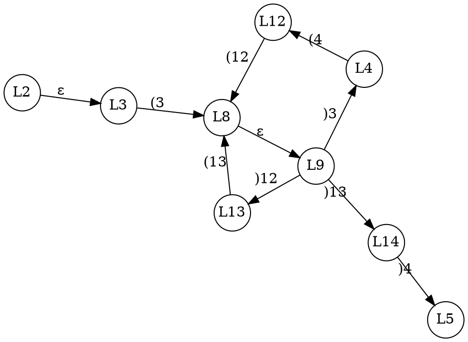

# CFL-reachability
グラフ問題の一つ．

**入力 :**
- 各辺にラベル ($a \in \Lambda$) がついた**グラフ $G$**．
- アルファベットが $\Lambda$ な**文脈自由文法 $H$**

**求めるもの :**
- グラフ上の経路で，ラベルの並びが $H$ の言語に含まれるもの．


## プログラム解析への応用
次の文法を考える :

$$
    S \rightarrow S S \ |\ (_1 S )_1 \ |\ \cdots \ |\ (_n S )_n \ |\ \varepsilon
$$

開き括弧を関数呼び出し，閉じ括弧を関数リターン，それ以外を $\varepsilon$ と考えると，これはプログラムのトレースを表す．

### 例とクイズ
::: {.flex64}
:::::: {.flex-left}
```c
int entry(void) {
    int a = 0;
    x2(&a);
    x4(&a);
}

void x2(int *i) {
    *i *= 2;
}

int x4(&a) {
    x2(&a);
    x2(&a);
}
```



::::::
:::::: {.flex-right}

**Q1. パス L2 → L3 → L8 → L9 → L14 → L5**<br>
- 1-1. このパスが作るラベルの並びは？
    - <quiz>ε (3 ε )14 )4</quiz>
- 1-2. これは上記の文法から生成できるか？
    - <quiz>いいえ．</quiz>
- 1-3. このパスは feasible か？
    - <quiz>いいえ．</quiz>

**Q2. パス L12 → L8 → L9 → L13**<br>
- 1-1. このパスが作るラベルの並びは？
    - <quiz>(12 ε )12</quiz>
- 1-2. これは上記の文法から生成できるか？
    - <quiz>はい．</quiz>
- 1-3. このパスは feasible か？
    - <quiz>はい．</quiz>

**Q3. パス L9 → L14 → L5**<br>
- 1-1. このパスが作るラベルの並びは？
    - <quiz>)13 )4<quiz>
- 1-2. これは上記の文法から生成できるか？
    - <quiz>いいえ．</quiz>
- 1-3. このパスは feasible か？
    - <quiz>はい．</quiz>
- (文法を変えればこの問題には対処できる．)

::::::
:::


