# ゆるふわ C++ の virtual call
目的 :
- vcall のイメージをゆるふわに説明する．

この記事の (ドラスティックな) 主張 :
- C++ のメソッドは糖衣構文である．
- C++ のメソッド呼び出しも糖衣構文である．
- 糖衣を剥がせば vcall の仕組みがわかる．

魔除け :
- 厳密な考証はしていない (が，雰囲気は合っているハズ)．
- 簡単のために...
    - 後方参照を認める．
    - `const` の有無を精査しない．
    - 多重継承や複雑なケースは考えない．

## C++ のメソッド
- C++ では，構造体やクラスにメソッドを持たせられる．

```cpp
struct Foo {
  int member;
  int method() { return this->member; }
};
```

これは，次の糖衣構文とみなせる．

```cpp
struct Foo {
  int member;
};

int foo_method(Foo *this) { return this->member; }
```

## 仮想関数と仮想関数テーブル (vtable)
- メソッドは「仮想関数」と「それ以外」の2種に分けられる．
- vtable は仮想関数へのポインタを集めた表である．
    - 動的ディスパッチ (後述) で使われる．

```cpp
struct Base {
  int base;
  virtual void virt1() { puts("b1"); } // 仮想関数
  virtual void virt2() { puts("b2"); } // 仮想関数
  void non_virt() { puts("bn"); }      // それ以外
};
```

これは，次の糖衣構文とみなせる．

```cpp
void base_virt1(Base *this) { puts("b1"); }
void base_virt2(Base *this) { puts("b2"); }
void base_non_virt(Base *this) { puts("bn"); }

void *BaseVtable[] = { (void*)base_virt1, (void*)base_virt2, };

struct Base {
  void **vptr = BaseVtable;
  int base;
};
```



## 継承と仮想関数テーブル
簡単なケースのみを扱う．<br>
仮想関数が増える場合や多重継承は扱わない．

基本は継承元クラスの vtable と同じものを作る．<br>
ただし，メソッドのオーバーライドがある場合はテーブルのエントリを書き換える．

```cpp
struct Extend: public Base {
  int ext;
  void virt1() { puts("e1"); }
  void non_virt() { puts("en"); }
};
```

これは，次の糖衣構文とみなせる．

```cpp
void extend_virt1(Extend *this) { puts("e1"); }
void extend_non_virt(Extend *this) { puts("en"); }

void *ExtendVtable[] = { (void*)extend_virt1, (void*)base_virt2, };

struct Extend {
  void **vptr = ExtendVtable;
  int base;
  int ext;
};
```



## メソッド呼び出し
```cpp
Base b;
b.virt1();
b.virt2();
b.non_virt();

Extend e;
e.virt1();
e.virt2();
e.non_virt();
```

これは，次の糖衣構文とみなせる．

```cpp
typedef void(*B)(Base*);
typedef void(*E)(Extend*);
                                                // vtable of Base   0: base_virt1
Base b;                                         //                  1: base_virt2
((B)(b.vptr[0]))(&b); // call base_virt1
((B)(b.vptr[1]))(&b); // call base_virt2
base_non_virt(&b);                              // vtable of Extend 0: exntend_virt1
                                                //                  1: base_virt1
Extend e;
(E)(e.vptr[0]))(&e); // call extend_virt1
(E)(e.vptr[1]))(&e); // call base_virt2
extend_non_virt(&b);
```

- Q. base_virt2 の第1引数は `Base*` なので 引数に`Extend*` を渡すのは不正では？
- A. 今回のケースではメモリ配置的に問題ない (次で見る)．

## アップキャストと動的ディスパッチ
以上の性質を踏まえると，アップキャストと動的ディスパッチの仕組みが何となく分かるはず．

```cpp
Extend e;
Base *upcast = &e;
upcast->virt1();
upcast->virt2();
upcast->non_virt();
```

これは次の糖衣構文とみなせる．

```cpp
typedef void(*B)(Base*);
Extend e;
Base *upcast = (Base*)(&e);
((B)(upcast->vptr[0]))(upcast); // Q1. 呼ばれる関数は？
((B)(upcast->vptr[1]))(upcast); // Q2. 呼ばれる関数は？
base_non_virt(upcast);
```



### まとめ & 演習
::: {.flex46}
:::::: {.flex-left}
```cpp
struct Base {
  int base;
  virtual void virt1() { puts("b1"); }
  virtual void virt2() { puts("b2"); }
  void non_virt() { puts("bn"); }
};

struct Extend: public Base {
  int ext;
  void virt1() { puts("e1"); }
  void non_virt() { puts("en"); }
};

int main(void) {
  Base base;
  base.virt1();        // ??
  base.virt2();        // ??
  base.non_virt();     // ??

  Extend ext;
  ext.virt1();         // ??
  ext.virt2();         // ??
  ext.non_virt();      // ??

  Base *upcast = &ext;
  upcast->virt1();     // ??
  upcast->virt2();     // ??
  upcast->non_virt();  // ??
  return 0;
}
```
::::::
:::::: {.flex-right}



Q. ?? の出力は？
- <quiz>b1</quiz>
- <quiz>b2</quiz>
- <quiz>bn</quiz>
- <quiz>e1</quiz>
- <quiz>b2</quiz>
- <quiz>en</quiz>
- <quiz>e1</quiz>
- <quiz>b2</quiz>
- <quiz>bn</quiz>

::::::
:::

## 補足 : 実証
```cpp {caption="vtable の存在を確かめる (clang++ 10 で検証済み)"}
#include <cstdio>
#include <cassert>

struct Base {
  int base;
  virtual void virt1() { puts("b1"); }
  virtual void virt2() { puts("b2"); }
  void non_virt() { puts("bn"); }
};

struct Extend: public Base {
  int ext;
  void virt1() { puts("e1"); }
  void non_virt() { puts("en"); }
};

typedef void(*B)(Base*);
typedef void(*E)(Extend*);
int main(void) {
  Base base;
  void **base_vptr = *(void***)(&base);
  ((B)(base_vptr[0]))(&base); // b1
  ((B)(base_vptr[1]))(&base); // b2

  Extend ext;
  void **ext_vptr = *(void***)(&ext);
  ((E)(ext_vptr[0]))(&ext); // e1
  ((E)(ext_vptr[1]))(&ext); // b2

  Base *upcast = &ext;
  assert((void*)upcast == &ext);
  void **upcast_vptr = *(void***)(upcast);
  ((B)(upcast_vptr[0]))(upcast); // e1
  ((B)(upcast_vptr[1]))(upcast); // b2

  return 0;
}
```

```cpp {caption="糖衣構文を剥がした例"}
#include <cstdio>

struct Base;
void Base_virt1(Base *self) { puts("b1"); }
void Base_virt2(Base *self) { puts("b2"); }
void Base_non_virt(Base *self) { puts("bn"); }
void *base_vtable[] = { (void*)Base_virt1, (void*)Base_virt2 };
struct Base {
    void **vptr = (void**)base_vtable;
    int base;
};

struct Extend;
void Extend_virt1(Extend *self) { puts("e1"); }
void Extend_non_virt(Extend *self) { puts("en"); }
void *extend_vtable[] = { (void*)Extend_virt1, (void*)Base_virt2 };
struct Extend {
    void **vptr = (void**)extend_vtable;
    int ext;
};

typedef void(*B)(Base*);
typedef void(*E)(Extend*);
int main(void) {
  Base base;
  ((B)(base.vptr[0]))(&base); // b1
  ((B)(base.vptr[1]))(&base); // b2
  Base_non_virt(&base);       // bn

  Extend ext;
  Extend_virt1(&ext);         // e1
  ((E)(ext.vptr[1]))(&ext);   // b2
  Extend_non_virt(&ext);      // en

  Base *upcast = (Base*)&ext;
  ((B)(upcast->vptr[0]))(upcast); // e1
  ((B)(upcast->vptr[1]))(upcast); // b2
  Base_non_virt(upcast);          // bn
  return 0;
}
```

